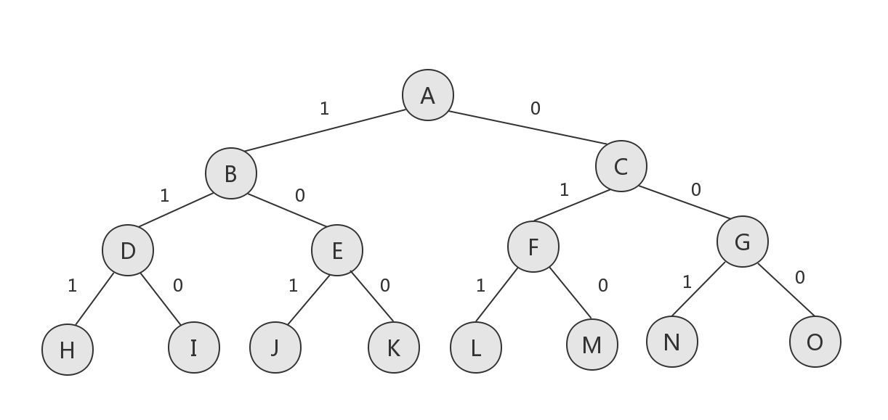

[TOC]


# 算法与数据结构学习笔记

## 分治法

**递归：**为了解决一个给定的问题，算法一次或多次递归地调用其自身以解决紧密相关的若干子问题。

**分治思想：**将原问题**分解**为几个规模较小但类似于原问题的子问题，递归地**求解**这些子问题，然后再**合并**这些子问题的解来建立原问题的解。

分治法在每层递归中应用如下三个步骤：

- **分解(Divide)：**将问题划分为一些子问题，子问题的形式与原问题一样，只是规模更小。
- **解决(Conquer)：**递归地求解出子问题。如果子问题的规模足够小，则停止递归，直接求解。
- **合并(Combine)：**将子问题的解组合成原问题的解。

### 最大子数组问题

问题描述：寻找数组 $A$ 的和最大的非空连续子数组。

暴力法：遍历每一个子数组，求和取最大。运行时间为 $O(n^2)$。 

分治法：假定要寻找的子数组 $A[low..high]$ 的最大子数组。找到子数组的中央位置，如 $mid$，将子数组划分为两个规模尽量相等的子数组。然后考虑求解两个子数组 $A[low..mid]$ 和 $A[mid+1..high]$。那么 $A[low..high]$ 的任何连续子数组 $A[i..j]$ 所处的位置必然是一下三种情况之一：

- 完全位于子数组 $A[low..mid]$ 中， 因此 $low\leq i \leq j \leq mid$。
- 完全位于子数组 $A[mid+1..high]$ 中，因此 $mid<i \leq j \leq high$。
- 跨越了中点，因此 $low \leq i \leq mid \leq j \leq high$。

因此其最大子数组所处的位置必然是这三种情况之一（三者之中和最大者）。可以递归地求解 $A[low..mid]$ 和 $A[mid+1..high]$ 的最大数组。然后寻找跨越重点的最大子数组，然后在三种情况中选取和最大者。运行时间为$O(n\lg  n) $。

求解第三种情况的算法如下：

---

FIND-MAX-CROSSING-SUBARRAY($A,low,mid,high$)

 1	$left$-$sum=-\infty$

 2	$sum=0$

 3	**for** $i=mid$ **downto** $low$

 4		$sum=sum+A[i]$

 5		**if** $sum>left-sum$

 6			$left$-$sum=sum$

 7			$max-left=i$

 8	$right$-$sum=-\infty$

 9	$sum=0$

10	**for** $j=mid+1$ **to** $high$

11		$sum=sum+A[j]$

12		**if** $sum>right$-$sum$

13			$right$-$sum=sum$

14			$max$-$right=j$

15	**return** $(max$-$left,$$max$-$right,$$left$-$sum+right$-$sum)$

---

求解最大子数组问题的分治算法的伪代码如下：

---

FIND-MAXIMUM-SUBARRAY($A,low,high$)

 1	**if** $high==low$

 2		**return** ($low,high,A[low]$)    // base case:only one element

 3	**else** $mid=\lfloor (low+high)/2 \rfloor$

 4		($left$-$low$，$left$-$high$，$left$-$sum $) $=$ FIND-MAXIMUM-SUBARRAY($A,low,mid$)

 5		($right$-$low$，$right$-$high$，$right$-$sum $) $=$ FIND-MAXIMUM-SUBARRAY($A,mid+1,high$)

 6		($cross$-$low$，$cross $-$high$，$ cross $-$sum $) $=$ FIND-MAXIMUM-SUBARRAY($A,low,mid,high  $)

 7	**if** $left$-$sum \geq right$-$sum$ and $left$-$sum \geq cross$-$sum$

 8		 **return** ($left$-$low$，$left$-$high$，$left$-$ sum$)

 9	**else if** $right$-$sum \geq left$-$sum$ and $right$-$sum \geq cross $-$sum$

10		**return** ($right$-$low$，$left$-$right$，$right $-$ sum$)

11	**else** **return** ($cross$-$low$，$cross$-$high$，$cross $-$ sum$)

---

### 其他分治法案例

- 矩阵乘法的Strassen算法
- 归并排序

## 动态规划

适合应用动态规划求解的问题应该具备两个要素：**最优子结构**和**重叠子问题**。

*原问题最优解的代价通常就是子问题最优解的代价再加上由此次选择直接产生的代价。*

<u>动态规划算法对每个子问题只求解一次，将其解保存在一个表格中，从而无需每次求解一个子问题时都重新计算，避免了不必要的计算工作。</u>

- **最优子结构：**一个问题的最优解包含其子问题的最优解。（必须确保考察了最优解中用到的所有子问题）
- **重叠子问题：**问题的递归算法会反复地求解相同的子问题，而不是一直生成新的子问题。
- 子问题无关：同一个原问题的一个子问题的解不影响另一个子问题的解。即子问题间不共享资源。（如**无权最短路径**的子问题无关，可使用动态规划求解，而**无权最长路径**的子问题相关，不可用动态规划求解。）

### 钢条切割问题（参考《算法导论》）

问题描述：给定一段长度为 $n$ 英寸的钢条和一个价格表 $p_i（i=1,2,...,n）$，求切割钢条的方案，使得收益最大。注意，如果长度为 $n$ 英寸的钢条价格 $p_i$ 足够大，最优解可能就是不需要切割。

​	长度为 $n$ 英寸的钢条共有 $2^{n-1} $ 中不同的切割方案，因为在距离钢条左端 $i(i=1,2,...,n-1)$ 英寸处，总是可以选择切割或不切割。

​	如果一个最优解将钢条切割为 $k$ 段（对某个 $1\leq k \leq n$）,那么最优切割方案
$$
n = i_1+i_2+···+i_k
$$
​	将钢条切割为长度为 $i_1,i_2,...,i_k$ 的小段，得到最大收益
$$
r_n=p_{i_1}+p_{i_2}+···+p_{i_k}
$$
​	则对于 $r_n(n\geq1)$ ，可用钢条的最优切割收益来描述它：
$$
r_n=\max(p_n,r_1+r_{n-1},r_2+r_{n-2},···,r_{n-1}+r_1)
$$
​	第一个参数 $p_n$ 对应不切割。其他 $n-1$ 个参数对应另外 $n-1$ 中方案：对每个 $i=1,2,...,n-1$，首先将钢条切割为长度为 $i$ 和 $n-i$ 的两段，接着求解这两段的最优切割收益 $r_i$ 和 $r_{n-i}$。

​	对于上述求解方法，钢条切割问题还存在一种相似但更为简单的递归求解方法：将钢条左边切割下长度为 $i$ 的一段，只对右边剩下的长度为 $n-i$ 的一段继续进行切割（递归求解），对左边的一段则不再进行切割。即问题分解的方式为：将长度为 $n$ 的钢条分解为左边开始一段，以及剩余部分继续分解的结果。于是问题可简化为：
$$
r_n=\max_{1\leq i\leq n}(p_i+r_{n-i})
$$

### 自顶向下递归实现

---

CUT-ROD($p,n$)

1	**if** $n$ == 0

2		**return** 0

3	$q$ = $-\infty$ 

4	**for** $i=1$ **to** $n$

5		$q=\max(q,p[i]+$CUT-ROD$(p,n-i))$

6	**return** $q$

---

上述CUT-ROD递归算法的运行时间为 $n$ 的指数函数。

### 使用动态规划方法求解最优钢条切割问题

#### 子问题图

问题的子问题图表达了涉及的子问题及子问题之间的依赖关系。(n=4时，钢条切割问题的子问题图如下图所示)


子问题图顶点的标号给出了子问题的规模。有向边 $(x,y)$ 表示当求子问题 $x$ 时需要子问题 $y$ 的解。

**带备忘的自顶向下法：**此方法仍按自然的递归形式编写过程，但过程会保存每个子问题的解(通常保存在一个数组或散列表中)。当需要一个子问题的解时，过程首先检查是否已经保存过此解。如果是，则直接返回保存的值，否则按通常方式计算这个子问题。(**深度优先搜索**)

---

MEMOIZED-CUT-ROD($p,n$)

1	let $r[0..n]$ be a new array

2	**for** $i=0$ to $n$	

3		$r[i]=-\infty$	

4	**return** MEMOIZED-CUT-ROD-AUX($p,n,r$)


MEMOIZED-CUT-ROD-AUX($p,n,r$)

1	**if** $r[n]\geq0$

2		**return**  $r[n]$	

3	**if** $n==0$

4		$q=0$

5	**else** $q=-\infty$

6		**for** $i=1$ **to** $n$

7  			$q=\max(q,p[i]+$ MEMOIZED-CUT-ROD-AUX($p,n-i,r$))

8	$r[n]=q$

9	**return** $q$ 

---

**自底向上法（非递归）：**将子问题按规模排序，按由小至大的顺序进行求解。当求解某个子问题时，它所依赖的那些更小的子问题都已求解完毕，结果已经保存。每个子问题只需求解一次，当求解它（也是第一次遇到它）时，它的所有前提子问题都已求解完成。（**逆拓扑序**）

---

BOTTOM-UP-CUT-ROD($p,n$)

1	let $r[0..n]$ be a new array

2	$r[0]=0$

3	**for** $j=1$ **to** $n$

4		$q=-\infty$

5		**for** $i=1$ **to** $j$

6			$q=\max(q,p[i]+r[j-i])$

7		$r[j]=q$

8	**return** $r[n] $

---

### 其他动态规划案例

- 矩阵链乘法
- 最长公共子序列
- 最优二叉搜索树

### 动态规划与分治法的异同

- <u>分治法</u>是指将问题划分成一些独立地子问题，递归地求解各子问题，然后合并子问题的解而得到原问题的解。与此不同，<u>动态规划</u>适用于子问题独立且重叠的情况，也就是各子问题包含公共的子子问题。在这种情况下，若用分治法则会做许多不必要的工作，即重复地求解公共的子问题。动态规划算法对每个子子问题只求解一次，将其结果保存在一张表中，从而避免每次遇到各个子问题时重新计算答案。
-  适合采用动态规划方法的最优化问题中的两个要素：最优子结构和重叠子问题。 
- 分治法：各子问题独立；动态规划：各子问题重叠

## 贪心算法

​	贪心算法做出一系列选择来求出问题的最优解。在每个决策点，它做出在当时看来最佳的选择。这种启发式的策略并不保证总能找到最优解，但对某些问题确实有效。贪心算法已动态规划为基础，在每个可使用贪心算法求解的问题背后，几乎总有一个更繁琐的动态规划算法。

​	贪心算法的两个关键要素：**贪心选择性质**和**最优子结构** 。

### 活动选择问题

​	假定有一个 $n$ 个活动的集合 $S={a_1,a_2,...,a_n}$，这些活动使用同一个资源，而这个资源在某个时刻只能供一个活动使用。每个活动 $a_i$ 都有一个开始时间 $s_i$ 和 一个结束时间 $f_i$ ，其中 $0 \le s_i \le f_i \le \infty $。如果被选中，任务 $a_i$ 发生在半开时间 $[s_i,f_i)$ 期间。如果两个活动 $a_i$ 和 $a_j$ 满足 $[s_i,f_i)$ 和 $[s_j,f_j)$ 不重叠，则称它们是兼容的，在活动选择问题中，需要选出一个最大兼容活动集。假定活动已按结束时间的单调递增顺序排序：
$$
f_1 \le f_2 \le f_3 \le ...\le f_{n-1} \le f_n
$$


考虑下面的活动集合 $S$：

|   $i$   |  1   |  2   |  3   |  4   |  5   |  6   |  7   |  8   |  9   |  10  |  11  |
| :-----: | :--: | :--: | :--: | :--: | :--: | :--: | :--: | :--: | :--: | :--: | :--: |
| $ s_i $ |  1   |  3   |  0   |  5   |  3   |  5   |  6   |  8   |  8   |  2   |  12  |
| $ f_i $ |  4   |  5   |  6   |  7   |  9   |  9   |  10  |  11  |  12  |  14  |  16  |

#### 活动选择问题的最优子结构

​	令 $S_{ij}$ 表示在 $a_i$ 结束之后开始，且在 $a_j$ 开始之前结束的活动集合。$c[i,j]$ 表示集合 $S_{ij}$ 的最优解的大小，有
$$
c[i,j]=
\begin{cases}
0, \qquad\qquad\qquad\qquad\qquad\qquad \quad \ if \quad   S_{ij}=\varnothing \\
\max_{a_k \in S_{ij}}\{c[i,k]+c[k,j]+1\}, \quad if \quad S_{ij} \ne \varnothing
\end{cases}
$$

#### 贪心选择

​	对于活动选择问题，直观上应该选择这样一个活动，选出它后剩下的资源应能被尽量多的其他任务所用。现在考虑可选的活动，必然有一个最先结束。因此贪心选择可以选择 $S$ 中最早结束的活动。由于活动已按结束时间单调递增排序，则贪心选择就是活动 $a_1$。

​	当做出贪心选择后，只剩下一个子问题需要求解：寻找在 $a_1$ 结束后开始的活动。

​	**定理1：**考虑任意非空子问题 $S_k$，令 $a_m$ 是 $S_k$ 中结束时间最早的活动，则 $a_m$ 在 $S_k$ 的某个最大兼容活动子集中。

​	定理1证明了活动选择问题的贪心选择的正确性。

​	贪心算法不同于动态规划那样自底向上进行计算，相反可以自顶向下计算：**做出一个选择，然后求解剩下的那个子问题，而不是自底向上地求解出很多子问题，然后做出选择。**


#### 递归贪心算法

​	过程RECURSIVE-ACTIVITY-SELECTOR的输入为两个数组 $s$ 和 $f$，表示活动的开始和结束时间，下标 $k$ 指出要求解的子问题 $S_k$，以及问题规模 $n$。它返回 $S_k$ 的一个最大兼容活动集。假定输入的 $n$ 个活动已经按结束时间的单调递增顺序排列好。

---

RECURSIVE-ACTIVITY-SELECTOR($s,f,k,n$)

1 	$m=k+1$

2 	**while** $m \le n$ and $s[m] < f[k]$

3 		$m=m+1$

4 	**if** $m \le n$

5 		**return** $\{a_m\} \bigcup$ RECURSIVE-ACTIVITY-SELECTOR($ s,f,k,n $)

6 	**else**

7 		**return** $\varnothing$

---

#### 迭代贪心算法

​	过程RECURSIVE-ACTIVITY-SELECTOR几乎是“尾递归”的形式，很直接地可以转换为迭代形式。

---

GREEDY-ACTIVITY-SELECTOR($s,f$)

1	$n=s.length$

2	$A=\{a_1\}$

3	$k=1$

4	**for** $m=2$ **to** $n$

5		**if** $s[m] \ge f[k]$

6			$A=A \bigcup \{a_m\}$

7	**return** $A$

---

### 贪心算法原理

#### 贪心算法一般设计步骤

1. 将最优化问题转化为这样的形式：对其做出一次选择后，只剩下一个子问题需要求解。
2. 证明做出贪心选择后，原问题总是存在最优解，即贪心选择总是安全的。
3. 证明做出贪心选择后，剩余的子问题满足性质：其最优解与贪心选择组合即可得到原问题的最优解，这样就得到了最优子结构。

#### 贪心选择性质

- 可以通过做出局部最优（贪心）选择来构造全局最优解。即进行选择时，直接做出在当前问题中看来最优的选择，而不必考虑子问题的解。

#### 最优子结构

- 一个问题的最优解包含其子问题的最优解。

#### 贪心与动态规划

- **0-1背包问题（0-1 knapsack problem）**：对于 $n$ 个商品，第 $i$ 个商品的价值为 $v_i$ 美元，重 $w_i$ 榜，$v_i$ 与 $w_i$ 都是整数。现有一个背包最多可容纳 $W$ 磅重的商品，$W$ 是一个整数 ，求如何使得背包中所装商品的价值最高（对于每个商品，只能选择完整拿走或不拿走，即二元（0-1）选择）。

- **分数背包问题（fractional knapsack problem）**：设定与0-1背包问题相同，但对于一个商品，可以选择拿走其一部分。

  ​		两个背包问题都具有最优子结构，但可以使用贪心策略求解分数背包问题，而不能求解0-1背包问题。

  ​		对于分数背包问题，首先计算每个商品的每磅价值 $v_i / w_i$ 。遵循贪心策略，应尽量多地拿走每磅价值最高的商品。如果该商品已全部拿走而背包尚未满，继续尽量多地拿走每磅价值第二高的商品，以此类推，直至达到重量上限 $W$。因此，通过将该商品按每磅价值排序，贪心算法的运行时间为 $O(n\lg n)$。
  
  ​		而对于0-1背包问题，如下实例。此例包含3个商品和一个能容纳50磅重量的背包。可计算出商品1每磅价值为6美元，高于商品2的每磅价值（5美元）和商品3的每磅价值（4美元）。由上述贪心策略会首先拿走商品1，而如图（b）所示，最优解应该拿走商品2和商品3，而留下商品1。
  
  ​		然而如图（c）所示，对于分数背包问题，上述贪心策略是可以生成最优解的。拿走商品1的策略对0-1背包问题无效是因为背包无法被装满，空闲空间降低了方案的有效每磅价值。在0-1背包问题中，当考虑是否将一个商品装入背包时，必须比较包含此商品的子问题的解与不包含它的子问题的解，才能做出选择。这会导致大量的重叠子问题——动态规划的标识。
  
  

#### 贪心算法其他典型应用

- 哈夫曼编码
- 最小生成树算法
- 单源最短路径的Dijkstra算法
- 最小生成树的Prim算法与Kruskal算法

## 回溯法

回溯法在包含问题的所有解的解空间树中，按照**深度优先**的策略，从根节点出发搜索解空间树。算法搜索至解空间树的任一节点时，总是先判断该节点是否肯定不包含问题的解。如果是，则跳过对以该节点为根的子树的系统搜索，逐层向其祖先节点回溯。否则，进入该子树，继续按深度优先的策略进行搜索。回溯法在用来求解问题的所有解时，要回溯到根，且根节点的所有子树都已被搜索完毕才结束。

### 问题的解空间

在应用回溯法解问题时，首先应明确定义问题的解空间。问题的解空间至少包含问题的一个（最优）解。两种典型的解空间树为子集树和排列树。

子集树：当所给的问题是从 $n$ 个元素的集合 $S$ 中找出满足某种性质的子集时，相应的解空间树为子集树。这类子集树通常有 $2^n$ 个叶节点，其节点总个数为 $2^{n+1}-1$。遍历子集树的任何算法均需 $\Omega(2^n)$ 的计算时间。

##### 0-1​背包问题

$0-1$背包问题的解空间树即为一个子集树。对于 $n=3$ 时的 $0-1$ 背包问题，其解空间可用一棵完全二叉树表示。



​														子集树（$0-1$背包问题）的解空间树

排列树：当所给的问题是确定 $n$ 元素满足某种性质的排列时，相应的解空间树称为排列树。排列树通常有 $n!$ 个叶节点。因此遍历排列树需要 $\Omega(n!)$ 的计算时间。

旅行售货商问题的解空间树为一个排列树。

##### 旅行售货商问题（TSP）

某售货员要到若干个城市去推销商品，已知各城市之间的路程（或旅费）。他要选定一条从驻地出发，经过每个城市一遍，最后回到驻地的路线，使总的路程（或总旅费）最小。(NP完全问题)

设 $G=(V,E)$ 是一个带权图。图中各边的费用（权）为一正数。图中的一条周游路线是包括 $V$ 中每个顶点在内的一条回路。一条周游路线的费用就是这条路线上所有边的费用之和。所谓旅行售货员问题就是要在图 $G$ 中找出一条最小费用的周游路线。


​																			4顶点带权图

该问题的排列树为：


​																	    排列树（TSP问题）的解空间树

### 回溯法的基本思想

确定了解空间的组织结构以后，回溯法就从根节点（开始节点）出发，以深度优先的方式搜索整个解空间。这个开始节点就成为一个活节点，同时也成为当前节点的扩展节点。在当前的扩展节点处，搜索向纵深方法移至一个新节点。这个新节点就成为一个新的活节点，并成为当前扩展节点。若在当前扩展节点处不能向纵深方向移动，则当前的扩展节点就成为死节点。此时，应往回移动（回溯）至最近的一个活节点处，并使这个活节点成为当前节点的扩展节点。回溯法即以这种工作方式递归地在解空间中搜索，直至找到所要求的解或解空间中已无活节点时为止。

在用回溯法搜索解空间树时，通常采用两种策略来避免无效搜索，提高回溯法的搜索效率。其一是用约束函数在扩展节点处剪去不满足约束的子树；其二是用限界函数剪去不能得到最优解的子树。这两类函数统称为剪枝函数。

运用回溯法解题通常包含一下三个步骤：

1. 针对所给问题，定义问题的解空间。
2. 确定易于搜索的解空间结构。
3. 以深度优先的方式搜索解空间，并且在搜索过程中用剪枝函数避免无效搜索。

### 递归回溯

回溯法是对解空间的深度优先搜索，一般情况下可用递归函数来实现， 递归思路简单，设计容易，但效率低，代码范式如下：

```C
void Backtrack(int t){
    if (t > n) Output(x);  	// 叶子节点，输出结果，x为可行解
    else{
        for (int i = f(n, t); i <= g(n, t); i++){ 	// 遍历当前节点为搜索过的子树 f(n, t) , g(n, t)为起止编号
            x[t] = h(i);	//每个子节点的值赋值给x
            //满足约束条件和限界条件
            if (Constaint(t) && Bount(t)) 
                Backtrack(t + 1); 	//递归下一层
        }
    }
}
```

### 迭代回溯

若采用树的非递归深度优先遍历算法，也可将回溯法表示为一个迭代过程。 迭代算法设计相对复杂，但效率高。代码范式如下：

```C
void IterativeBacktrack(void){
    int t = 1;
    while (t > 0){
        if (f(n, t) <= g(n, t)){	//当前节点的存在未搜索子节点
            for (int i = f(n, t); i <= g(n, t); i++){	//遍历当前节点的未搜索子节点
                x[t] = h(i);	//每个子节点的值赋值给x
                if (Constaint(t) && Bound(t))	//满足约束条件和限界条件
                    if (Solution(t)) Output(x);		//Solution表示在节点t处得到了一个解，输出
                    else t++;	//没有得到解，继续向下搜索
            }
        }
        else t--;	//不存在未搜索子节点，返回上一层
    }
}
```

用回溯法解题的一个显著特征是问题的解空间是在搜索过程中动态产生的。在任何时刻，算法只保存从根节点到当前扩展节点的路径。若解空间树中从根节点到叶节点的最长路径为 $h(n)$，则回溯法所需的计算空间通常为 $O(h(n))$。而显式地存储整个解空间则需要 $O(2^{h(n)})$ 或 $O(h(n)!)$ 的空间。

### 子集树与排列树

回溯法搜索子集树的算法范式如下：

```C
void BackTrack(int t){
    if (t > n) Output(x);
    else{
        for (int i = 0; i <= 1; i++){ 	// 子集树为一个二叉树
            x[t] = i;
            if (Constraint(t) && Bound(t)) Backtrack(t+1);
        }
    }
}
```

回溯法搜索排列树的算法范式如下：

```C
void BackTrack(int t){
    if (t > n) Output(x);
    else{
        for (int i = t; i <= n; i++){	// 排列树为n个元素的排列
            Swap(x[t], x[i]);
            if (Constraint(t) && Bount(t)) Backtrack(t + 1);
            Swap(x[t], x[i]);
        }
    }
}
```

在调用 Backtrack(1) 执行回溯搜索之前，先将变量数组 x 初始化为单位排列（1,2,3,....,n）。

### 装载问题

#### 问题描述

有一批共 $n$ 个集装箱要装上 $2$ 艘载重量分别为 $c_1$ 和 $c_2$ 的轮船，其中集装箱 $i$ 的重量为 $w_i$，且 $\sum_{i=1}^n w_i \le c_1 + c_2$。问是否有一个合理的装载方案可将这 $n$ 个集装箱装上这 $2$ 艘轮船。若有，找出一种装载方案。

分析：当 $\sum_{i=1}^n w_i=c_1+c_2$ 时，装载问题等价于子集和问题。当 $c_1=c_2$ 且 $\sum_{i=1}^n w_i=2c_1$，则装载问题等价于划分问题。即使限制 $w_i,i=1,...,n$  为整数，$c_1$ 和 $c_2$ 也是整数。子集和问题和划分问题都是NP完全问题。由此可知装载问题也是NP完全问题。容易证明，若有一个给定的装载问题的有解，则采用下面的策略可以得到一个最优装载方案。

1. 首先将第一艘轮船尽可能装满。
2. 然后将剩余的集装箱装到第二艘轮船上。

于是装载问题可等价于以下特殊的 $0-1$ 背包问题：
$$
\max\sum_{i=1}^n w_i x_i \\
\sum_{i=1}^n w_i x_i\le c_1 \\
x \in \{0,1\},1 \le i \le n
$$

#### 算法设计

装载问题的解空间树为子集树，java代码如下：

```java
public class Loading {
    private int n;		// 集装箱数
    private int[] w;		// 集装箱重量数组
    private int c, cw, bestw;	// 分别为第一艘轮船的载重量，当前载重量和当前最优载重量
    private int r; 		// 剩余集装箱重量
    private int x[], bestx[]; 	// 当前解和当前最优解

    private void Backtrack (int i){
        // 搜索第 i 层节点
        if (i >= n) {		// 到达叶节点
            if (cw > bestw) {
                for (int j = 0; j < n; ++j)
                    bestx[j] = x[j];
                bestw = cw;
            }
            return;
        }
        // 搜索子树
        r -= w[i];
        // 搜索左子树
        if (cw + w[i] <= c) {
            x[i] = 1;
            cw += w[i];
            Backtrack(i+1);
            cw -= w[i];
        }
        //	搜索右子树
        if (cw + r > bestw)  	// 上限函数，剪枝 若 cw + r <= w 则不向下搜索
            x[i] = 0;
        Backtrack(i+1);		
        r += w[i];
    }

    public static int maxLoading(int w[], int c, int n, int bestx[]) {
        // 返回最优载重量
        Loading X = new Loading();
        // 初始化X
        X.w = w;
        X.c = c;
        X.n = n;
        X.x = new int[n];
        X.bestx = bestx;
        X.bestw = 0;
        X.cw = 0;
        // 初始化 r
        X.r = 0;
        for (int i = 0; i < n; ++i)
            X.r += w[i];
        // 计算最优载重量
        X.Backtrack(0);
        return X.bestw;
    }

    public static int IterativeMaxLoading(int w[], int c, int n, int bestx[]) {
        /**
		 * 迭代回溯法
		 * 返回最优载重量及其相应解
		 * **/
        // 初始化根节点
        int i = 0;	// 当前层
        int x[] = new int[n];
        int bestw = 0, cw = 0, r = 0;
        for (int j = 0; j < n; ++j)
            r += w[j];
        // 搜索子树
        while(true) {
            while(i < n && cw + w[i] <= c) {
                // 进入左子树
                r -= w[i];
                cw += w[i];
                x[i] = 1;
                i++;
            }
            if (i >= n) {	// 到达叶节点
                for (int j = 0; j < n; ++j)
                    bestx[j] = x[j];
                bestw = cw;
            }
            else {		// 进入右子树
                r -= w[i];
                x[i] = 0;
                i++;
            }
            while (cw + r <= bestw) {
                // 剪枝回溯
                i--;
                while(i > 0 && x[i] == 0) {
                    // 从右子树返回
                    r += w[i];
                    i--;
                }
                if (i == 0)
                    return bestw;
                // 进入右子树
                x[i] = 0;
                cw -= w[i];
                i++;
            }
        }
    }
}
```

### 批处理作业调度

#### 问题描述

给定 $n$ 个作业的集合 $J=(J_1,J_2,...,J_n)$ 。每一个作业 $J$ 都有两项任务要分别在 2 台机器上完成。每一个作业必须先由机器1处理，然后再由机器2处理。作业 $J_i$ 需要机器 $j$ 的处理时间为 $t_{ji},i=1,2,...,n;j=1,2$。对于一个确定的作业调度，设 $F_{ji}$ 是作业 $i$ 在机器 $j$ 上完成处理的时间。则所有作业在机器2上完成处理的时间和 $f=\sum_{i=1}^n F_{2i}$ 称为该作业调度的完成时间和。要求制定一个最佳作业调度方案，使其完成时间和达到最小。

#### 算法设计

```java
public class Flowshop {
	int M[][];	// 各作业所需的处理时间
	int x[], bestx[], f2[], f1; 	// 当前作业调度，当且最优作业调度，机器2完成处理时间，机器1完成处理时间
	int f, bestf, n;	// 完成时间和，当前最优值，作业数
	
    // 递归遍历所有排列
	private void Backtrack(int i) {
		if (i >=  n) {
			for (int j = 0; j < n; j++)
				bestx[j] = x[j];
			bestf = f;
		}
		else {
			for (int j = i; j < n; j++) {
				f1 += M[x[j]][0];
				if (i == 0)
					f2[i] = f1 + M[x[j]][1];
				else 
					f2[i] = (f2[i-1] > f1 ? f2[i-1] : f1) + M[x[j]][1];
				f += f2[i];
				if (f < bestf) {
					Swap(x, i, j);
					Backtrack(i+1);
					Swap(x, i, j);
				}
				f1 -= M[x[j]][0];
				f -= f2[i];
			}
		}
	}
	
	private void Swap(int x[], int i, int j) {
		int tmp = x[i];
		x[i] = x[j];
		x[j] = tmp;
	}
	
	public static int Flow(int M[][], int n, int bestx[]) {
		Flowshop X = new Flowshop();
		X.x = new int[n];
		X.f2 = new int[n];
		X.M = M;
		X.n = n;
		X.bestx = bestx;
		X.bestf = Integer.MAX_VALUE;
		X.f1 = 0;
		X.f = 0;
		for (int i = 0; i < n; i++)
			X.x[i] = i;
		X.Backtrack(0);
		return X.bestf;
	}
}
```

### N皇后问题

#### 问题描述

$n$ 皇后问题要求在一个 $n \times n$ 的棋盘上放置 $n$ 个皇后，使得它们彼此不受攻击。按照国际象棋的规则，一个皇后可以攻击与之处在同一行或同一列或同一斜线上的其他任何棋子。因此，$n$ 皇后问题等价于要求在一个 $n \times n$ 格的棋盘上放置 $n$ 个皇后，使得任何 $2$ 个皇后不能被放在同一行或同一列或同一斜线上。

分析：对于该问题，用 $n$ 元组 $x[1:n]$ 表示它的解。其中，$x[i]$ 表示皇后 $i$ 放在棋盘的第 $i$ 行的第 $x[i]$ 列，且要求解向量中的诸 $x[i]$ 互不相同。 由于任何 $2$ 个皇后不能放在同一斜线上，可将 $n \times n$ 格的棋盘看作一个二维方阵，对于主对角线及其平行线，其元素的两个下标值的差（行号 - 列号）值相等。同理对于副对角线及其平行线，其元素的两个下标值的和（行号 + 列号）值相等。假设两个皇后放置的位置分别为 $(i,j)$ 和 $(k,l)$，且有 $i-j=k-l$ 或 $i+j=k+l$，则说明这两个皇后处在同一斜线上。该约束可简化为 $|i-k|=|j-l|$。

用回溯法解 $n$ 皇后问题时，可以用一棵完全 $n$ 叉树来表示其解空间（排列树）。可用上述约束对其进行剪枝。

#### 算法设计

```java
/**
 * 回溯法之n皇后问题
 * **/

public class NQueen {
	private int n;		// 皇后个数
	private int x[];		// 当前解
	private long sum;		// 当前已找到的可行方案数
	
	private boolean place(int k) {
		for (int j = 1; j < k; j++) {
			if (Math.abs(k-j) == Math.abs(x[j] - x[k]) || x[j] == x[k]) 	// 不能在同一斜线或同一列的约束
				return false;
		}
		return true;
	}
	
	// 递归回溯
	private void Backtrack(int t) {
		if (t > n)
			sum++;
		else {
			for (int i = 1; i <= n; i++) {
				x[t] = i;		// x[i] 表示将皇后 i 放在棋盘的第 i 行的第 x[i] 列。
				if (place(t))	// 若可行，则放置下一个皇后，否则继续尝试下一个位置。
					Backtrack(t+1);
			}
		}
	}
	
	// 迭代回溯
	private void IterativeBacktrack() {
		x[1] = 0;
		int k = 1;
		while (k > 0) {
			x[k] += 1;
			while (x[k] <= n && !place(k))
				x[k] += 1;
			if (x[k] <= n) {
				if (k == n)
					sum++;
				else {
					k++;
					x[k] = 0;
				}
			}
			else
				k--;
		}
	}
	public static long nQueen(int n) {
		NQueen X = new NQueen();
		X.n = n;
		X.sum = 0;
		int p[] = new int[n+1];
		X.x = p;
		X.Backtrack(1);
//		X.IterativeBacktrack();
		return X.sum;
	}
}
```


## 排序

### 插入排序

​	对于小规模输入，插入排序是一种非常快的原址排序。

​	对于数组 $A=\langle5,2,4,6,1,3 \rangle$，插入排序过程如下：

- (a)	<u>5</u>	**2**	4	6	1	3

- (b)	<u>2</u>	<u>5</u>	**4**	6	1	3

- (c)	2	4	<u>5</u>	**6**	1	3

- (d)	<u>2</u>	<u>4</u>	<u>5</u>	<u>6</u>	**1**	3

- (e)	1	<u>2</u>	<u>4</u>	<u>5</u>	<u>6</u>	**3**

- (f)	1	2	3	4	5	6

  

  算法伪代码如下：

---

INSERTION-SORT(A)

1	**for** $j=2$ **to** $A.length$

2		$key=A[j]$

3		// Insert $A[j]$ into the sorted sequence $A[1..j-1]$.

4		$i=j-1$

5		**while** $i>0$ and $A[i]>key$

6			$A[i+1]=A[i]$

7			$i=i-1$

8		$A[i+1]=key$

---

Java代码如下：

```java
	public void insertSort(int[] A) {
		for (int j = 1; j < A.length; j++) {
			int key = A[j];
			int i = j - 1;
			while(i >= 0 && A[i] > key) {
				A[i+1] = A[i];
				i--;
			}
			A[i+1] = key;
		}
	}
```

改进的插入排序：

- 折半插入排序

- 2-路插入排序
  - 表插入排序
- 希尔排序（缩小增量排序）

### 归并排序

​	归并排序算法遵循递归的分治模式，其操作如下：

​	**分解：**分解待排序的 $n$ 个元素的序列成各具 $n/2$ 个元素的两个子序列。

​	**解决：**使用归并排序递归地排序两个子序列。

​	**合并：**合并两个已排序的子序列以产生已排序的答案。

  ​	当待排序的序列长度为 1 时，递归“开始回升”，在这种情况下不要做任何工作，因为长度为 1 的每个序列都已排好序。  

  ​	该算法的关键操作是“合并”步骤中两个已排序序列的合并。通过调用一个辅助过程MERGE$(A,p,q,r)$ 来完成合并，其中 $A$ 是一个数组，$p,q$ 和 $r$ 是数组下标，满足 $p\leq q \leq r$。该过程假设子数组 $A[p..q]$ 和 $A[q+1..r]$ 都已排好序。它合并这两个子数组形成单一的已排好序的子数组并代替当前的子数组 $A[p..r]$。并在每个该归并的子数组底部放置一个**哨兵**，以检查是否有数组为空。

  对于待排序数组 $A=\langle5,2,4,7,1,3,2,6 \rangle $，归并排序过程如下：

  - (a)	初始序列	5	2	4	7	1	3	2	6
- (b)	归并	2,5	4,7	1,3	2,6

- (c)	归并	2,4,5,7	1,2,3,6

- (d)	归并	1,2,2,3,4,5,6,7

  算法伪代码如下：

---

MERGE-SORT$(A,p,r)$

1	**if** $p<r$

2		$q=\lfloor (p+r)/2\rfloor$

3		MERGE-SORT($A,p,q$)

4		MERGE-SORT($A,q+1,r$)

5		MERGE($A,p,q,r$)


MERGE($A,p,q,r $)

  1	$n_1=q-p+1$

  2	$n_2=r-q$

  3	let $L[1..n_1+1]$ and $R[1..n_2+1]$ be new arrays

  4	**for** $i=1$ **to** $n_1$

  5		$L[i]=A[p+i-1]$

  6	**for** $ j=1$ **to** $n_2$

  7		$R[j]=A[q+j]$

  8	$L[n_1+1]=\infty$

  9	$R[n_2+1]=\infty$

10	$i=1 $

11	$j=1 $

12	**for** $k=p$ **to** $r$

13		**if** $L[i]\leq R[j]$

14			$A[k]=L[i]$

15			$i=i+1$

16		**else** $A[k]=R[j]$

17			$j=j+1$

---

Java代码实现如下：

```java
public void mergeSort(int[] A, int p, int r) {
    if (p < r) {
        int q = (p + r) / 2;
        mergeSort(A, p, q);
        mergeSort(A, q+1, r);
        merge(A,p,q,r);
    }
}

public void merge(int[] A, int p, int q, int r) {
    int n1 = q - p + 1;
    int n2 = r - q;
    int[] L = new int[n1+1];
    int[] R = new int[n2+1];

    for (int i = 0; i < n1; i++)
        L[i] = A[p + i];
    for (int i = 0; i < n2; i++)
        R[i] = A[q + i + 1];

    L[n1] = Integer.MAX_VALUE;
    R[n2] = Integer.MAX_VALUE;

    int i = 0, j = 0;
    for (int k = p; k <= r; k++) {
        if (L[i] < R[j]) {
            A[k] = L[i];
            i++;
        }
        else {
            A[k] = R[j];
            j++;
        }
    }
}
```


### 快速排序

​	快速排序也使用了分治思想。快速排序是排序大数组的常用算法。对于子数组 $A[p..r]$ 其操作过程如下：

- **分解：**数组 $A[p..r] $ 被划分为两个（可能为空）子数组 $A[p..q-1]$ 和 $A[q+1..r]$，使得 $A[p..q-1]$ 中的每一个元素都小于等于 $A[q]$ ，而 $A[q]$ 也小于等于 $A[q+1..r] $ 中的每个元素。其中，计算下标 $q$ 也是划分过程的一部分。
- **解决：**通过递归调用快速排序，对子数组 $A[p..q-1] $ 和 $A[q+1..r] $ 进行排序。
- **合并：**因为子数组都是原址排序的，所以不需要合并操作：数组 $A[p..r]$ 已经有序。

伪代码：

---

QUICKSORT($A,p,r$)

1	**if** $p<r $

2		$q=PARTITION(A,p,r)$

3		$QUICKSORT(A,p,q-1)$

4		$QUICKSORT(A,q+1,r)$

---

为排序一个数组 $A$ 的全部元素，初始调用是 $QUICKSORT(A,1,A.length)$。

算法的关键是PARTITION过程，它实现了对子数组 $A[p..r]$ 的原址重排。

---

PARTITION($A,p,r $)

1	$x=A[r]$

2	$i=p-1$

3	**for** $j=p$ **to** $r-1$

4		**if** $A[j]\leq x$

5			$i=i+1 $

6			exchange $A[i]$ with $A[j]$

7	exchange $A[i+1]$ with $A[r]$

8	**return** $i+1$

---

该过程将数组划分为4个（有可能为空的）区域。在3~6行的 **for** 循环的每一轮迭代的开始，每一个区域都满足一定的性质。其中 $x=A[r]$ 称为主元。

在第3~6行循环体的每一轮迭代开始时，对于任意数组下标 $k$ ，有：

1. 若 $p\leq k \leq i$，则 $A[k]\leq x$
2. 若 $i+1\leq k \leq j-1$，则 $A[k]>x$
3. 若 $j\leq k < r$，无限制
4. 若  $k=r$，则 $A[k]=x$。


Java代码如下：

```java
// 快速排序
public void quickSort(int[] A, int p, int r) {
    if (p < r) {
        int q = partition(A, p, r);
        quickSort(A, p, q-1);
        quickSort(A, q+1, r);
    }
}

private int partition(int[] A, int p, int r) {
    int x = A[r], i = p -1;
    for (int j = p; j <r; ++j) {
        if (x >= A[j])
        swap(A, ++i, j);	
    }
    swap(A, ++i, r);
    return i;
}

private void swap(int A[], int index1, int index2) {
    int tmp = A[index1];
    A[index1] = A[index2];
    A[index2] = tmp;
}
##########################
OUTPUT:
[2, 1, 3, 4, 7, 5, 6, 8]
[2, 1, 3, 4, 7, 5, 6, 8]
[1, 2, 3, 4, 7, 5, 6, 8]
[1, 2, 3, 4, 7, 5, 6, 8]
[1, 2, 3, 4, 5, 6, 7, 8]
[1, 2, 3, 4, 5, 6, 7, 8]
```

**快速排序的性能：**当划分产生的两个子问题分别包含了 $n-1$ 个元素和 $0$ 个元素时（不平衡划分），快速排序的最坏情况发生了。因此若算法在每一层的递归上的划分都是不平衡的，那么算法的时间复杂度为 $O(n^2)$。所以在最坏的情况下快速排序的运行时间不比插入排序更好。此外，当输入数组已经完全有序时，快速排序的时间复杂度仍为 $O(n^2)$，而在同样的情况下，插入排序的时间复杂度为 $O(n)$。在可能的最平衡划分中，PARTITION得到的两个子问题的规模都不大于 $n/2 $。此时快速排序的运行时间为 $n\lg n$。快速排序在平均情况下的运行时间仍为$O(n\lg n)$。区别只是符号中隐含的常数因子要略大。

**快速排序的随机化版本：**通过采用一种称为**随机抽样**的随机化技术，可以使输入数组的划分比较均衡。与始终采用 $A[r]$ 作为主元不同，随机抽样是从子数组 $A[p..r]$ 中随机选择一个元素作为主元。

---

RANDOMIZED-PARTITION($A, p ,r $)

1	$i=RANDOM(p,r)$

2	exchange $A[r]$ with $A[i]$

3	**return** PARTITION($A, p, r$)


RANDOMIZED-QUICKSORT($A, p, r $)

1	**if** $p<r $

2		$q=RANDOMIZED-PARTITON(A,p,r)$

3		$RANDOMIZED-QUICKSORT(A,p,q-1)$

4		$RANDOMIZED-QUICKSORT(A, q+1, r)$

---

### 堆排序

​	堆排序的时间复杂度是 $O(n\lg n )$，且具有空间原址性。

  **（二叉）堆** 是一个数组，它可以被看成一个近似的完全二叉树。


​         																						     	        （a）二叉树

      													            （b）(二叉)堆

表示堆的数组 $A$ 包括两个属性：$A.length$ (通常)给出数组元素的个数，$A.heap$-$size$ 表示有多少个堆元素存储在该数组中。给定一个结点的下标 $i$，其父结点、左孩子与右孩子的下标可知：

---

PARENT($i$)

1	**return** $\lfloor i/2 \rfloor$

LEFT($i$)

1	**return** $ 2i $

RIGHT($i$)

1	**return** $2i+1$

---

二叉堆可分为两种形式：

- 最大堆：除根结点，都有，$A[PARENT(i)]\geq A[i]$。用于堆排序算法。
- 最小堆：除根结点，都有，$A[PARENT(i)]\leq A[i]$。用于构造优先队列。

定义一个堆中的结点的**高度**为该结点到叶结点最长简单路径上边的数目，且堆的高度定义为根结点的高度。那么对于一个包含 $n$ 个元素的堆，其高度为 $O(\lg n)$。

二叉堆包含一些基本过程：

1. **维护堆的性质**

   ​	程序 MAX-HEAPIFY 是用于维护最大堆性质的重要过程。它输入一个数组 $A$ 和一个下标 $i$。使得以下标 $i$ 为根结点的子数组重新遵循最大堆的性质。

   ---

   MAX-HEAPIFY($A, i$)

    1	$l=LERT(i)$

    2	$r=RIGHT(i)$

    3	**if** $l \leq A.heap$-$size$ and $A[l]>A[i]$

    4		$largest=l$

    5	**else**  $largest=i$

    6	**if** $r \leq A.heap$-$size $ and $A[r]>A[largest] $

    7		$largest=r$

    8	**if** $largest \ne i$

    9		exchange $A[i]$ with $A[largest]$	

   10		MAX-HEAPIFY($A,largest$)

   ---

2. **建堆**

   ​	用自底向上的方法利用过程 MAX-HEAPIFY 把一个大小为 $n=A.length$ 的数组 $A[1..n]$ 转换为最大堆。子数组 $A[\lfloor n/2 \rfloor+1..n]$ 中的元素都是树的叶结点。每个叶节点都可以看成只包含一个元素的堆。过程BUILD-HEAP对树中非叶子结点都调用一次 MAX-HEAPIFY。

   ---

   BUILD-MAX-HEAP($A$)

   1	$A.heap$-$size=A.length$

   2	**for** $i=\lfloor A.length/2 \rfloor$ **downto** 1

   3		MAX-HEAPIPFY($A,i$)

   ---

3. **堆排序算法**

   ​		堆排序算法先利用 BUILD-MAX-HEAP将输入数组 $A[1..n]$ 建成最大堆，其中 $n=length$。再通过将数组中的最大元素（根结点$A[1]$）与 $A[n]$ 进行互换，并且每次从堆中去掉结点 $n$，剩余结点中，原来根的结点仍然是最大堆，而新的根结点可能会违背最大堆的性质。通过不断调用 MAX-HEAPIFY($A,1$)，从而在 $A[1..n-1]$ 上构造一个新的最大堆。

   ---

   HEAPSORT($A$)

   1	BUILD-MAX-HEAP($A$)

   2	**for** $i=A.length$ **downto** 2

   3		exchange $A[1]$ with $A[i]$

   4		$A.heap$-$size=A.heap$-$size-1$

   5		MAX-HEAPIFY($A,1$)

   ---

   python代码如下：

   ```python
   def parent(i):
           return i // 2
   
   def left(i):
           return 2 * i
   
   def right(i):
           return 2*i + 1
   
   # 维护堆的性质
   def max_heapify(A,i,heap_size):
     	  j = i + 1
           l = left(j)-1
           r = right(j)-1
           
           largest = 0	
           if l < heap_size and A[l] > A[i]:
                   largest = l
           else:
                   largest = i
           if r < heap_size and A[r] > A[largest]:
                   largest = r
           if largest != i:
                   A[i],A[largest] = A[largest],A[i]
                   max_heapify(A,largest,heap_size)
           
   # 建堆
   def build_max_heap(A):
          for i in range((len(A)-1)//2, -1,-1):
                  max_heapify(A, i,len(A)-1)
   
   # 堆排序              
   def heapsort(A):
           heap_size = len(A)
           build_max_heap(A)
           
           for i in range(len(A)-1,0,-1):
                   A[0],A[i] = A[i],A[0]
                   heap_size -= 1
                   max_heapify(A,0,heap_size)
   
   if __name__ == "__main__":
       A = [4,1,3,2,16,9,10,14,8,7]
       heapsort(A)
       print(A)
   ##########################################
   OUTPUT:
   [1, 2, 3, 4, 7, 8, 9, 10, 14, 16]
   ```

   

4. **优先队列**

   ​	优先队列是一种用来维护由一组元素构成的集合 $S$ 的数据结构，其中的每一个元素都有一个相关的值，称为**关键字**(key)。可分为最大优先队列（如共享计算机系统的作业调度）和最小优先队列（如基于事件驱动的模拟器）。 

### 比较排序

​	在排序的最终结果中，各元素的次序依赖于它们之间的比较。插入排序、归并排序、快速排序和堆排序均属于比较排序。

**定理1：**在最坏情况下，任何比较排序算法都需要做 $\Omega (n\lg n)$ 次比较。

**定理2：**堆排序和归并排序都是渐近最优的比较排序算法。

​	插入排序在最坏情况下的运行时间为 $O(n^2)$，具有原址性。

​	归并排序在最坏情况下的运行时间为 $O(n\lg n)$，不具有原址性。

​	堆排序在最坏情况下的运行时间为 $O(n\lg n)$，具有原址性。

​	快速排序在最坏情况下的运行时间为 $O(n^2)$，期望运行时间为 $O(n\lg n)$，具有原址性。快速排序通常是实际排序应用中最好的选择，因为其平均性能非常好：期望运行时间为 $O(n\lg n)$ ，且 $O(n\lg n)$ 中隐含的常数因子非常小。


### 线性时间排序

​	通过运算而不是比较来确定排序顺序。具有线性时间复杂度。

#### 计数排序

​	假设 $n$ 个输入元素中的每一个都是在 $0$ 到 $k$ 区间内的一个整数，其中 $k$ 为某个整数。当 $k=O(n)$ 时，排序的运行时间为 $\Theta (n)$。

​	计数排序的基本思想是：**对每一个输入元素 $x$，确定小于 $x$ 元素的个数，以此将 $x$ 直接放到它在输出数组中的位置。**(当有几个元素相同时，这一方案需要略做修改。)

伪代码如下：假设输入是一个数组 $A[1..n]$，$A.length=n$。$B[1..n]$ 存放排序的输出，$C[0..k]$ 提供临时存储空间。

---

COUNTING-SORT($A,B,k$)

 1	let $C[0..k]$ be a new array

 2	**for** $i=0$ **to** $k$

 3		$C[i]=0$

 4	**for** $j=0$ **to** $A.length$

 5		$C[A[j]]=C[A[j]]+1$

 6	// $C[i]$ now contains the number of elements equal to $i$.

 7	**for** $i=1$ **to** $k$

 8		$C[i]=C[i]+C[i-1]$

 9	// $C[i]$ now contains the number of elements less than or equal to $i$.

10	**for** $j=A.length$ **downto** 1

11		$B[C[A[j]]]=A[j]$

12		$C[A[j]]=C[A[j]]-1$

---

​	在第5行完成后，$C[i]$ 中保存的是等于 $i$ 的元素的个数，其中 $i=0,1,...,k$。第7~8行通过加总计算确定对每一个 $i=0,1,...,k$，有多少输入元素是小于或等于 $i$ 的。


​	计数排序是**稳定排序**：具有相同值的元素在输出数组中的相对次序与它们在输入数组中的相对次序相同。计数排序经常被用作基数排序的子过程。

​	python代码如下：

```python
def count_sort(A,B,k):
    C = [0 for _ in range(k+1)]
    
    for i in range(len(A)):
        C[A[i]] = C[A[i]]+1
    for i in range(1,k+1):
        C[i] = C[i] + C[i-1]

    for j in range(len(A)-1,-1,-1):
        B[C[A[j]]-1] = A[j]
        C[A[j]] = C[A[j]]-1

if __name__ == "__main__":
    A = [2,5,3,0,2,3,0,3]
    B = [0 for _ in range(len(A))]
    k = 5
    count_sort(A,B,k)
    print(B)
###################################
OUTPUT:
[0, 0, 2, 2, 3, 3, 3, 5]
```


#### 基数排序

​	基数排序是一种借助多关键字排序的思想对单逻辑关键字进行排序的方法。

​	对于十进制数字来说，分别根据每一位元素进行排序，其中第1位是最低位，第 $d$ 位是最高位。

---

RADIX-SORT($A,d$)

1	**for** $i=1$ **to** $d$

2		use a stable sort to sort array $A$ on digit $i$.

---

- 引理：给定 $n$ 个 $d$ 位数，其中每一个数位有 $k$ 个不同的取值。如果RADIX-SORT使用的**稳定排序方法**耗时 $\Theta (n+k)$，那么它就可以在 $\Theta (d(n+k))$ 时间内将这些数排好序。

#### 桶排序

​	桶排序假设数据服从均匀分布，平均情况下它的时间代价为 $O(n)$。

​	桶排序将 $[0,1)$ 区间划分为 $n$ 个相同的大小的子区间，或称为**桶**。然后将 $n$ 个输入数分别放到各个桶中。因为数据是均匀、独立地分布在 $[0,1)$ 区间上，所以一般不会出现很多数落在同一个桶中的情况。为了得到输出结果，先对每个桶中的数进行排序，然后遍历每个桶，按照次序把各个桶中的元素列出来即可。

​	假设输入是一个包含 $n$ 个元素的数组 $A$ ，且每个元素 $A[i]$ 满足 $0\leq A[i] \leq 1$。此外算法还需要一个临时数组$B[0..n-1 ]$ 来存放链表（即桶）。

---

BUCKET-SORT($A$)

1	$n=A.length$

2	let $B[0..n-1]$ be a new array

3	**for** $i=0$ **to** $n-1$

4		make $B[i]$ an empty list

5	**for** $i=1$ **to** $n$

6		insert $A[i]$ into list $B[\lfloor nA[i] \rfloor]$

7	**for** $i=0$ **to** $n-1$

8		sort list $B[ i ]$ with insertion sort

9	concatenate the lists $B[0],B[1],...,B[n-1]$ together in order

---

### 中位数和顺序统计量

​	在一个由 $n$ 个元素组成的集合中，第 $i$ 个**顺序统计量**是该集合中第 $i$ 小的元素。一个**中位数**是它所属集合的“中点元素”。当 $n$ 为奇数时，中位数时唯一的，位于 $i=(n+1)/2$ 处。当 $n$ 为偶数时，存在两个中位数，分别位于$i=n/2$ 和 $i=n/2+1$ 处。若不考虑 $n$ 的奇偶性，中位数总是出现在 $i=\lfloor (n+1)/2 \rfloor$ 处（**下中位数**）和$i=\lceil (n+2)/2 \rceil$ 处（**上中位数**）。（以下所指中位数均指下中位数）。

​	考虑从一个由 $n$ 个**互异**的元素所构成的集合中选择第 $i$ 个顺序统计量的问题。这一问题可形式化定义为如下的**选择问题：**

- **输入：**一个包含 $n$ 个（互异的）数的集合 $A$ 和一个整数 $i$，$1\leq i \leq n$。
- **输出：**元素 $x\in A$，且 $A$ 中恰好有 $i-1$ 个其他元素小于它。

#### 最小值和最大值

在一个有 $n$ 个元素的集合中，需要 $n-1$ 次比较才能确定其最小（大）元素。

---

MINIMUM($A$)

1	$min=A[1]$

2	**for** $i=2$ **to** $A.length$

3		**if** $min>A[i]$

4			$min=A[i]$

5	**return** $min$

---

##### 同时找到最小值和最大值

​	由上述MINIMUM算法，在 $n$ 个元素中同时找到最小值和最大值只要分别独立第找出最小值和最大值即可，即各需 $n-1$次比较，共需 $2n-2$ 次比较。

​	事实上，只需要最多 $3\lfloor n/2 \rfloor$ 次比较即可同时找出最小值和最大值。具体方法如下：记录已知的最小值和最大值。对输入元素成对地进行处理。首先将一对输入元素相互进行比较，然后把较小的与当前最小值比较，把较大的与当前最大值进行比较。

​	如何设定已知的最小值和最大值的初始值依赖于 $n$ 是奇数还是偶数。若 $n$ 是奇数，将最小值和最大值都设为第一个元素的值，然后成对地处理余下的元素。若 $n$ 为偶数，则对前两个元素做一次比较，以决定最小值和最大值的初值，然后成对地处理余下的元素。

#### 期望为线性时间的选择算法

​	选择算法的渐近时间与找最小值的相同：$\Theta (n)$。以下RANDOMIZED-SELECT算法以快速排序为模型，同样基于分治算法。与快速排序一样，仍然将输入数组进行递归划分，然而只处理划分的一边即可。快速排序的期望时间为 $\Theta (n\lg n)$，而该算法的期望时间为 $\Theta (n)$。

​	RANDOMIZED-SELECT算法利用了快速排序的RANDOMIZED-PARTITION过程。它返回数组 $A[p..r]$ 中第 $i$ 小的元素。

---

RANDOMIZED-SELECT($A,p,r,i$)

1	**if** $p==r$

2		**return** $A[p]$

3	$q=RANDOMIZED$-$PARTITION(A,p,r)$

4	$k=q-p+1$

5	**if** $i==k$

6		**return** $A[q]$

7	**else if** $i<k$

8		**return** RANDOMIZED-SELECT($A,p,q-1,i$)

9	**else** **return** RANDOMIZED-SELECT($A,q+1,r,i-k$)

---

#### 最坏情况为线性时间的选择算法

​	算法SELECT通过执行以下步骤，确定一个有 $n>1$ 个不同的输入数组中第 $i$ 小的元素。（若 $n=1$，则SELECT只返回它的唯一输入作为第 $i$ 小的元素。）

1. 将输入数组的 $n$ 个元素划分为 $\lfloor n/5 \rfloor$ 组，每组5个元素，且至多只有一组剩下的 $n \mod 5$ 个元素组成。
2. 寻找这 $\lfloor n/5 \rfloor$ 每一组的中位数：首先对每组元素进行插入排序，然后确定每组有序元素的中位数。
3. 对第2步中找出的 $\lceil n/5 \rceil$ 个中位数，递归调用SELECT以找出其中中位数$x$（若有偶数个中位数，方便起见约定 $x$ 是较小的中位数。）
4. 利用修改过的PARTITION版本，按中位数的中位数 $x$ 对输入数组进行划分。让 $k$ 比划分的低区中的元素数目多1，因此 $x$ 是第 $k$ 小的元素，并且有 $n-k$ 个元素在划分的高区。
5. 如果 $i=k$，则返回 $x$，如果 $i<k$，则在低区递归调用SELECT来找出第 $i$ 小的元素。如果 $i>k$，则在高区递归查找第 $i-k$ 小的元素。

SELECT算法使用的也是快速排序的确定性划分算法PARTITION，但做了修改，把划分的主元也作为输入参数。

### 总结

|   算法   |  最坏情况运行时间  |  平均情况/期望运行时间   | 稳定性 | 是否为原址排序 | 适用情况  |
| :------: | :----------------: | :----------------------: | :----: | :------------: | :-------: |
| 插入排序 |   $\Theta (n^2)$   |      $\Theta (n^2)$      |  稳定  |       是       | 近似有序  |
| 归并排序 | $\Theta (n\lg n )$ |    $\Theta (n\lg n )$    |  稳定  |       否       |   n较大   |
|  堆排序  | $\Theta (n\lg n )$ |            —             | 不稳定 |       是       |  n非常大  |
| 快速排序 |   $\Theta (n^2)$   | $\Theta (n\lg n )$(期望) | 不稳定 |       是       |   n较大   |
| 计数排序 | $\Theta (n\lg n )$ |    $\Theta (n\lg n )$    |  稳定  |       否       |  k=O(n)   |
| 基数排序 | $\Theta (d(n+k ))$ |    $\Theta (d(n+k ))$    |  稳定  |       否       |     —     |
|  桶排序  |   $\Theta (n^2)$   |  $\Theta (n)$(平均情况)  |  稳定  |       否       | 数据[0,1) |

### 字符串排序

字符串排序算法较传统的基于比较的排序算法不同，主要有LSD string sort，MSD string sort及3-way string quicksort三种算法。这三种算法都利用了**字母表（Alphabet）**的概念，同计数排序等线性时间排序类似，它们的时间复杂度通常都是线性的，但通常也需要额外的空间。

字母表：字母表就是给定一个字符集合的字典，保存着字符和索引之间的唯一映射。如ASCII字母表，每个ASCII字符都有唯一的数值，且根据字符计算数值所需的时间通常是常数级别。

#### 键索引计数法

键索引计数法（key-indexed counting sort）是上述各类字符串排序算法的基础。该算法仅针对**键范围已知**的序列（键值需要大于等于0），效率高于通用排序算法。其另一特点是，该算法是**稳定**的。

基本思想：假设有一组待排序的键，其值范围在 $0\sim R-1$ 之间。那么通过计算每个键的频率，就可以知道每个键在排序结果中的起始位置：**每个键在排序结果中的起始索引=前一个键的起始索引+前一个键的频次**。

基本步骤：

1. 统计各个键出现的频次，如count[i]表示键i出现的频次；
2. 统计每个键k在排序结果中的起始索引`index[k]`；则 index[k] = index[k-1] + count[k-1];
3. 遍历原序列的每个元素，按照键的起始索引复制到辅助数组；
4. 将辅助数组复制回原序列。

#### LSD(低位优先算法)

低位优先的字符串排序（Least-Signifcant-Digit First，LSD），**仅适用于键长度都相同**的序列。

基本步骤：

1. 首先，假设待排序的键长度均相同，设为W。
2. 排序时，从键的低位（最右侧）开始，依次向左，先对键的最右一个字符采用**键索引计数法**进行排序。
3. 然后，从右向左以下一个字符作为关键字，用**键索引计数法**排序，总共需要排序W次。


算法实现（Java）：

```java
public void LSDSort(String str[], int w) {
    // str为待排序字符串数组， w 为字符串长度，所有字符串长度必须相同
    int n = str.length;
    int R = 256;	// 字符串键范围
    String aux[] = new String[n];	// 辅助数组

    // 从右往左，对第k个字符，用键索引计数法排序
    for (int k = w - 1; k >= 0; k--) {
        int count[] = new int[R+1];
        // 计算键的频率，对应索引值加1，以便计算初始索引
        for (int i = 0; i < n; i++)
            count[str[i].charAt(k)+1]++;
        // 计算键排序后的初始索引
        for (int r = 0; r < R; r++)
            count[r+1] += count[r];
        // 元素分类
        for (int i = 0; i < n; i++)
            aux[count[str[i].charAt(k)]++] = str[i];
        // 回写
        for (int i = 0; i < n; i++)
            str[i] = aux[i];
    }
}
```

#### MSD(高位优先算法)

高位优先的字符串排序（Most-Signifcant-Digit First，MSD），可以处理**不等长**的字符串。

基本步骤：

1. MSD算法**从左向右**检查每个字符
2. 先对第一个字符进行键索引计数排序，排序后将所有首字符相同的归为一个子数组
3. 然后对每个子数组分别按照步骤1进行递归排序。

**注意：在对各个子数组进行排序时，需要特别注意到达字符串末尾的情况。**

比如“RON”和“RONG”，显然“RON”应小于“RONG”，所以字符串末尾在字符集中对应的整数应该最小。
为此定义一个特殊方法`charAt`，用来映射键字符和整数值，当索引达到字符串末尾时，默认为最小键0。

算法实现（Java）：

```java
public void MSD(String str[]) {
    String aux[] = new String[str.length];
    MSDSort(str, aux, 0, str.length-1, 0);
}

private void MSDSort(String str[], String[] aux, int start, int end, int index) {
    /**
	     * MSD排序的递归方法. 即对str[start...end]中的每个字符串，按照第index个字符进行键索引计数排序
	     * @param array 待排序子序列
	     * @param aux   辅助数组		
	     * @param start 子序列起始索引
	     * @param end   子序列结束索引
	     * @param index 子序列中运用键索引计数排序的字符索引位置，从0开始计
	     */
    if (start >= end)
        return;
    // 1. 频数统计
    int R = 256;	// 字符串键范围
    int count[] = new int[R+2];
    for (int i = start; i <= end; i++)
        count[charAt(str[i], index)+2]++;
    // 2. 转换为键在排序结果中的起始位置, 注意str数组的起始位置为start
    for (int i = 0; i < R+1; i++)
        count[i+1] += count[i];
    // 3. 复制排序结果至辅助数组
    for (int i = start; i <= end; i++)
        aux[count[charAt(str[i], index)+1]++] = str[i];
    // 4. 回写排序结果
    for (int i = start; i <= end; i++)
        str[i] = aux[i-start]; 		// 此处为aux[i-start]，count[i] 记录的是字符在子数组中的位置

    // 递归处理首字符相同的子数组，此时count保存的是每个键结束的索引+1
    for (int i = 0; i < R; i++)
        MSDSort(str, aux, start + count[i], start + count[i+1] - 1, index+1);
}
// 计算字符串在索引index处的字符键值
private int charAt(String s, int index) {
    if (index < 0) {
        System.out.println("invalid index value!");
        return -1;
    }
    if (index >= s.length())
        return -1;
    return s.charAt(index);
}
```

#### 3-way string quicksort(三向字符串快速排序)

三向字符串快速排序（3-way string quicksort），是对高位优先（MSD）的字符串排序（Most-Signifcant-Digit First）的改进。

基本步骤：

该算法首先将字符串数组切分成**三个子数组：**

- 一个含有所有首字母**小于**切分字符的子数组；
- 一个含有所有首字母**等于**切分字符的子数组；
- 一个含有所有首字母**大于**切分字符的子数组；

然后，递归地对这三个数组排序，对于所有首字母等于切分字符的子数组，在递归排序时忽略首字母。

算法实现（Java）：

```java
public void threeWayStrQuickSort(String str[], int low, int high, int d) {
    if (low >= high || low < 0 || high < 0)
        return;
    int left = low - 1, right = left;
    // 查找字符表得到字符对应的唯一键值，并以此为基数
    int v = charAt2(str[high], d);

    for (int j = low; j <= high; j++) {
        int t = charAt2(str[j], d);
        if (v >= t) {
            swap(str, ++right, j);
            if (v > t)
                swap(str, ++left, right);
        }
    }
    threeWayStrQuickSort(str, low, left, d);
    threeWayStrQuickSort(str, right+1, high, d);
    // str[left...right]之间都是 d 索引处等于 v 的键。若v<0，说明已达到字符串末尾，不需要再进行三向切分
    if (v >= 0)
        threeWayStrQuickSort(str, left+1, right, d+1);
}
private int charAt2(String s, int d) {
    if (d >= s.length())
        return -1;
    return s.charAt(d);
}
```


## 查找与搜索