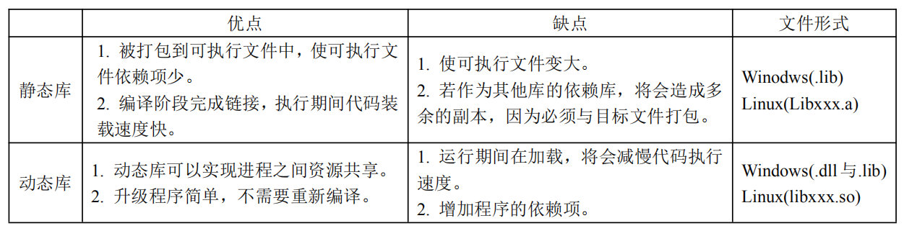
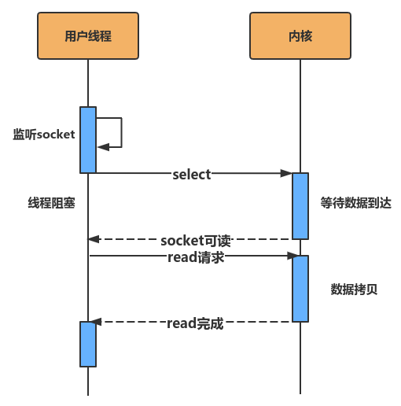
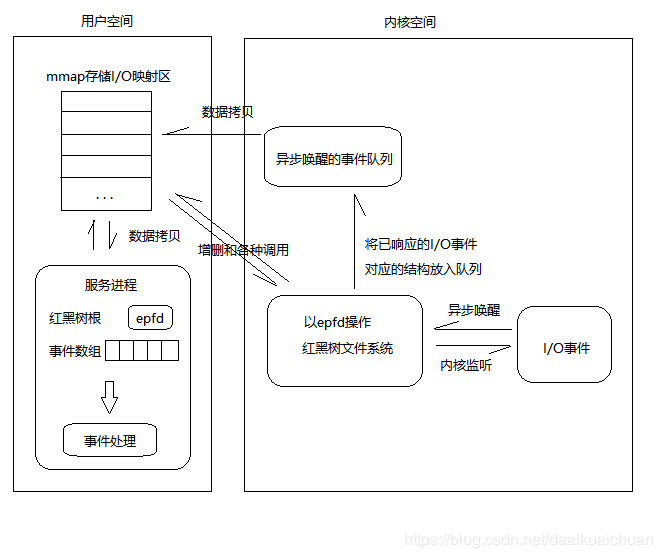

# C++学习笔记

# 基本知识与思想

## 编译器与编辑器以及IDE的区别

### 编译器

编译器就是将“一种语言（通常为高级语言）”翻译为“另一种语言（通常为低级语言）”的程序。一个现代编译器的主要工作流程：源代码 (source code) → 预处理器 (preprocessor) → 编译器 (compiler) → 目标代码 (object code) → 链接器 (Linker) → 可执行程序 (executables)。

对于Java语言来说，它最常用的编译器就是javac指令，可以在DOS（Disk Operating System）窗口中使用，该指令包含在由sun公司（目前已被Oracle公司收购）开发的JDK（Java Development Kit，目前最高版本是JDK12.0）目录中，使用javac指令可以将.java源文件翻译成.class字节码文件，.class文件可以装载到JVM（Java Virtual Machine）的类加载器中运行，可以跨平台运行。

对于C语言来说，编译程序自动将源程序转化为二进制形式的目标程序（在Visual C++中后缀名为.obj）。

GCC（GNU Compiler Collection，GNU编译器套件），是由 GNU 开发的编程语言编译器。它是以GPL许可证所发行的自由软件，也是 GNU计划的关键部分。GCC原本作为GNU操作系统的官方编译器，现已被大多数类Unix操作系统（如Linux、BSD、Mac OS X等）采纳为标准的编译器，GCC同样适用于微软的Windows。GCC 原名为 GNU C 语言编译器（GNU C Compiler），因为它原本只能处理 C语言。GCC 很快地扩展，变得可处理 C++。后来又扩展能够支持更多编程语言，如Fortran、Pascal、Objective-C、Java、Ada、Go以及各类处理器架构上的汇编语言等，所以改名GNU编译器套件（GNU Compiler Collection）。

### 编辑器

文本编辑器（或称文字编辑器）是用作编写普通文字的[应用软件](https://baike.baidu.com/item/应用软件/216367)，它与文档编辑器（或称文字处理器）不同之处在于它并非用作[桌面排版](https://baike.baidu.com/item/桌面排版/7724402)（例如文档格式处理），它常用来编写程序的[源代码](https://baike.baidu.com/item/源代码/3969)。

几种常用的编辑器如：Notepad++、EditPuls、Vim、GNU Emacs、Atom、Windows记事本等等。

### IDE

集成开发环境（IDE，Integrated Development Environment ）是用于提供程序开发环境的应用程序，一般包括代码编辑器、编译器、调试器和图形用户界面等工具。集成了代码编写功能、分析功能、编译功能、调试功能等一体化的开发软件服务套。所有具备这一特性的软件或者软件套（组）都可以叫集成开发环境。如微软的Visual Studio系列，Borland的C++ Builder、Delphi系列等。该程序可以独立运行，也可以和其它程序并用。

## 静态库与动态库

库是写好的，现有的，成熟的，可以复用的代码。本质上来说，库是一种可执行代码的二进制形式，可以被操作系统载入内存执行。库有两种：静态库（.a、.lib）和动态库（.so、.dll）。



## 内联函数

## 封装、继承与多态

**继承（Inheritance）**可以理解为一个类从另一个类获取成员变量和成员函数的过程。例如类 B 继承于类 A，那么 B 就拥有 A 的成员变量和成员函数。

被继承的类称为父类或基类，继承的类称为子类或派生类。“子类”和“父类”通常放在一起称呼，“基类”和“派生类”通常放在一起称呼。

## public、protected、private 指定继承方式

基类成员在派生类中的访问权限不得高于继承方式中指定的权限。继承方式中的 public、protected、private 是用来指明基类成员在派生类中的最高访问权限。不管继承方式如何，基类中的 private 成员在派生类中始终不能使用（不能在派生类的成员函数中访问或调用）。

| 继承方式/基类成员 | public成员 | protected成员 | private成员 |
| ----------------- | ---------- | ------------- | ----------- |
| public继承        | public     | protected     | 不可见      |
| protected继承     | protected  | protected     | 不可见      |
| private继承       | private    | private       | 不可见      |

使用 using 关键字可以改变基类成员在派生类中的访问权限。using 只能改变基类中 public 和 protected 成员的访问权限，不能改变 private 成员的访问权限，因为基类中 private 成员在派生类中是不可见的，根本不能使用，所以基类中的 private 成员在派生类中无论如何都不能访问。

“多态（polymorphism）”指的是同一名字的事物可以完成不同的功能。多态可以分为编译时的多态和运行时的多态。前者主要是指函数的重载（包括运算符的重载）、对重载函数的调用，在编译时就能根据实参确定应该调用哪个函数，因此叫编译时的多态；而后者则和继承、虚函数等概念有关。

## 虚函数与纯虚函数

通过基类指针只能访问派生类的成员变量，但是不能访问派生类的成员函数。让基类指针能够访问派生类的成员函数，C++增加了**虚函数（Virtual Function）**。使用虚函数只需要在函数声明前面增加 virtual 关键字。

通过虚函数，基类指针指向基类对象时就使用基类的成员（包括成员函数和成员变量），指向派生类对象时就使用派生类的成员。换句话说，基类指针可以按照基类的方式来做事，也可以按照派生类的方式来做事，它有多种形态，或者说有多种表现方式，我们将这种现象称为**多态（Polymorphism）**。多态是面向对象编程的主要特征之一，C++中虚函数的唯一用处就是构成多态。

C++提供多态的目的是：可以通过基类指针对所有派生类（包括直接派生和间接派生）的成员变量和成员函数进行“全方位”的访问，尤其是成员函数。如果没有多态，我们只能访问成员变量。

使用虚函数的注意事项C++提供多态的目的是：可以通过基类指针对所有派生类（包括直接派生和间接派生）的成员变量和成员函数进行“全方位”的访问，尤其是成员函数。如果没有多态，我们只能访问成员变量。

使用虚函数的注意事项：

- 只需要在虚函数的声明处加上 virtual 关键字，函数定义处可以加也可以不加。
- 可以只将基类中的函数声明为虚函数，这样所有派生类中具有遮蔽关系的同名函数都将自动成为虚函数。
- 当在基类中定义了虚函数时，如果派生类没有定义新的函数来遮蔽此函数，那么将使用基类的虚函数。
- 只有派生类的虚函数覆盖基类的虚函数（函数原型相同）才能构成多态（通过基类[指针](http://c.biancheng.net/c/80/)访问派生类函数）。
- 构造函数不能是虚函数。对于基类的构造函数，它仅仅是在派生类构造函数中被调用，这种机制不同于继承。
- 析构函数可以声明为虚函数，而且有时候必须要声明为虚函数。

构成多态的条件：

- 必须存在继承关系；
- 继承关系中必须有同名的虚函数，并且它们是覆盖关系（函数原型相同）。
- 存在基类的指针，通过该指针调用虚函数。

在C++中，可以将虚函数声明为纯虚函数，语法格式为：

​	virtual 返回值类型 函数名 (函数参数) = 0;

纯虚函数没有函数体，只有函数声明，在虚函数声明的结尾加上`=0`，表明此函数为纯虚函数。包含纯虚函数的类称为抽象类（Abstract Class）。之所以说它抽象，是因为它无法实例化，也就是无法创建对象。原因很明显，纯虚函数没有函数体，不是完整的函数，无法调用，也无法为其分配内存空间。

抽象类通常是作为基类，让派生类去实现纯虚函数。派生类必须实现纯虚函数才能被实例化。抽象基类除了约束派生类的功能，还可以实现多态。

- 一个纯虚函数就可以使类成为抽象基类，但是抽象基类中除了包含纯虚函数外，还可以包含其它的成员函数（虚函数或普通函数）和成员变量。
- 只有类中的虚函数才能被声明为纯虚函数，普通成员函数和顶层函数均不能声明为纯虚函数。

## 左值与右值，左值引用与右值引用（C++11）

### 左值与右值

所有的具名变量或对象都是左值，而匿名变量则是右值。左值可以取地址，而右值不能。

在C++11中，将右值又划分为纯右值（prvalue）与将亡值，C++11中所有的值必属于左值、将亡值、纯右值三者之一。比如，非引用返回的临时变量、运算表达式产生的临时变量、原始字面量和lambda表达式等都是纯右值。而将亡值是C++11新增的、与右值引用相关的表达式，比如，将要被移动的对象、T&&函数返回值、std::move返回值和转换为T&&的类型的转换函数的返回值等。

```C++
// i为左值，getVar()函数返回的临时值为右值。
int i = getVar();
```

### 引用

C++中的引用通过**const指针实现**，**分配额外的内存空间**。

```C++
int b = 0;
int &a = b;
//等价于
int *const c = &b;

//const 引用。先在数据区开辟一个值为1的无名整型量，再将引用d与这个整型量进行绑定。
//常量左值引用是一个“万能”的引用类型，可以接受左值、右值、常量左值和常量右值。需要注意的是普通的左值引用不能接受右值
const int &d = 1; // ok
int &e = 1; // error
```

###  右值引用（C++11）

右值引用是对右值的引用。通过右值引用的声明，右值又“重获新生”，其生命周期与右值引用类型变量的生命周期一样长，只要该变量还活着，该右值临时量将会一直存活下去。

```c++
T&& k = getVar();
```

右值引用（&&）与左值引用（&）的区别：

1. 绑定的对象（引用的对象）不同，左值引用绑定的是返回左值引用的函数、赋值、下标、解引用、前置递增递减。
2. 左值持久，右值短暂，右值只能绑定到临时对象，所引用的对象将要销毁或该对象没有其他用户。
3. 使用右值引用的代码可以自由的接管所引用对象的内容。

```C++
 //初始化时，右值引用要用一个右值表达式绑定。和const int &a=1；相同的操作。
int &&a = 1;
int b = 2;
a = b; // 可以用左值表达式修改右值引用的所引用临时对象的值，即rebind。rebind是传值过程，对a的操作不影响b。
a--; // 此时a为1，b为2。
// 右值引用a是一个左值，右值引用c初始化时不能引用左值a
int &&c = a; // error
```

右值引用是C++11中新增加的一个很重要的特性，其主是要用来解决C++98/03中遇到的两个问题，第一个问题就是临时对象非必要的昂贵的拷贝操作（移动语义），第二个问题是在模板函数中如何按照参数的实际类型进行转发（完美转发）。

右值引用独立于左值和右值。即右值引用类型的变量可能是左值也可能是右值。如T&&？

```C++
template<typename T>
void f(T&& t){}
 
f(10); //t是右值
 
int x = 10;
f(x); //t是左值
```

T&& t在发生自动类型推断（如函数模板的类型自动推导，或auto关键字）的时候，它是未定的引用类型（universal references），如果被一个左值初始化，它就是一个左值；如果它被一个右值初始化，它就是一个右值，它是左值还是右值取决于它的初始化。

引用折叠：

- 所有的右值引用叠加到右值引用上仍然还是一个右值引用；
- 所有的其他引用类型之间的叠加都将变成左值引用。

## 浅拷贝与深拷贝

浅拷贝：如果复制的对象中引用了一个外部内容（例如分配在堆上的数据），那么在复制这个对象的时候，让新旧两个对象指向同一个外部内容，就是浅拷贝。（指针虽然复制了，但所指向的空间内容并没有复制，而是由两个对象共用，两个对象不独立，删除空间存在）**默认构造函数为浅拷贝**。

深拷贝：如果在复制这个对象的时候为新对象制作了外部对象的独立复制，就是深拷贝。

## 构造函数、拷贝构造函数、移动构造函数、赋值操作符、移动赋值操作符

### 构造函数、拷贝构造函数与赋值操作符

C++中一般创建对象，拷贝或赋值的方式有构造函数，拷贝构造函数，赋值函数这三种方法。

一个C++的空类，编译器会加入哪些默认的成员函数：

- 默认构造函数和拷贝构造函数
- 析构函数
- 赋值函数（赋值运算符）
- 取值函数

构造函数可以被重载，可以多个，可以带参数；析构函数只有一个，不能被重载，不带参数。

构造函数是一种特殊的类成员函数，是当创建一个类的对象时，它被调用来对类的数据成员进行初始化和分配内存。（构造函数的命名必须和类名完全相同）。

拷贝构造函数是C++独有的，它是一种特殊的构造函数，用基于同一类的一个对象构造和初始化另一个对象。

在C++中以下两种情况拷贝构造函数会被调用：

1. 一个对象以值传递的方式传入函数体
3. 一个对象需要通过另一个对象进行初始化

当一个类的对象向该类的另一个对象赋值时，就会用到该类的赋值操作符。

拷贝构造函数和赋值操作符的区别：

1. 拷贝构造函数是一个对象初始化一块内存区域，这块内存就是新对象的内存区，而赋值操作符是对于一个已经被初始化的对象来进行赋值操作。
2. 一般来说在数据成员包含指针对象的时候，需要考虑两种不同的处理需求：一种是复制指针对象，另一种是引用指针对象。拷贝构造函数大多数情况下是复制（深拷贝），而赋值操作符是引用对象（浅拷贝）。
3. 实现不一样。拷贝构造函数首先是一个构造函数，它调用时候是通过参数的对象初始化产生一个对象。赋值操作符则是把一个新的对象赋值给一个原有的对象，所以如果原来的对象中有内存分配要先把内存释放掉，而且还要检察一下两个对象是不是同一个对象，如果是，不做任何操作，直接返回。

总结：

- 对象不存在，且没用别的对象来初始化，就是调用了构造函数；
- 对象不存在，且用别的对象来初始化，就是拷贝构造函数。
- 对象存在，用别的对象来给它赋值，就是赋值函数。

### 移动构造函数与移动赋值操作符（C++11）

**移动构造函数使用右值引用来避免临时对象的拷贝构造（深拷贝）**，将资源（堆、系统对象等）通过浅拷贝方式从一个对象转移到另一个对象，这样能减少不必要的临时对象的创建、拷贝以及销毁，可以大幅度提高C++应用程序的性能，消除临时对象的维护(创建和销毁)对性能的影响。移动赋值操作符同理。

```c++
//
// Created by vincent on 19-12-17.
//

#include <iostream>
#include <cstring>

using namespace std;

class Foo
{
public:
    Foo()   // 无参构造函数
    {
        v_   = NULL;
        len_ = 0;
        cout << "Constructor" << endl;
    }

    Foo(const char *p)  // 有参构造函数
    {
        len_ = strlen(p);
        setV(p);
        cout << "Constructor, v_:" << getV() << endl;
    }

    Foo(const Foo& a) // 拷贝构造函数
    {
        len_ = a.len_;
        setV(a.v_);
        cout << "Copy Constructor, v_:" << getV() << endl;
    }

    Foo& operator=(const Foo& a)    // 赋值操作符
    {
        if (this != &a){
            len_ = a.len_;
            setV(a.v_);
        }
        cout << " = func, v_" << getV() << endl;
        return *this;
    }

    Foo(Foo&& a) // 移动构造函数
    {
        len_   = a.len_;
        v_     = a.v_;
        a.len_ = 0;
        a.v_   = NULL;
        cout << "Move Constructor, v_:" << getV() << endl;
    }

    Foo& operator=(Foo&& a)    // 移动赋值操作符
    {
        if (this != &a){
            len_   = a.len_;
            v_     = a.v_;
            a.len_ = 0;
            a.v_   = NULL;
        }
        cout << " Move = func, v_:" << getV() << endl;
        return *this;
    }

    virtual ~Foo(){ // 析构函数
        if (v_ != NULL){
            cout << "Deconstructor" << endl;
            free(v_);
            return;
        }
        else{
            cout << "v_ == NULL" << endl;
        }

    }

    void setV(const char *s)
    {
        v_ = new char[len_ + 1];
        memcpy(v_, s, len_);
        v_[len_] = '\0';
    }

    char* getV() const
    {
        return v_;
    }

private:
    char*  v_;
    size_t len_;
};

Foo& getA1(Foo* b)
{
    return *b;
}

Foo getA2(const char* str)
{
    Foo a(str);
    return a;
}

void printV1(const Foo a)
{
    cout << a.getV() << endl;
}

void printV2(const Foo& a)
{
    cout << a.getV() << endl;
}

void printV3(const Foo&& a)
{
    cout << a.getV() << endl;
}

void printV4(const Foo* a)
{
    cout << a->getV() << endl;
}

int main()
{
    // 调用有参构造函数一次
    Foo a("vincent");
    // 不调用构造函数
    Foo &b = getA1(&a);
    /* 调用有参构造函数一次，移动构造函数两次。分别为返回临时对象和构造c时调用。
     * 若移动构造函数不存在则调用拷贝构造函数。
     * 编译器的返回值优化会将临时对象优化掉，使其只调用一次有参构造函数。
     * 等价于Foo c(getA2("vincent"));。
     */
    Foo c  = getA2("bug");

    /* 调用有参构造函数一次，移动构造函数一次。
     * 原因在于右值引用绑定了右值，使临时右值的生命周期得以延长。
     * */
    Foo &&d = getA2("vincent");

    //c为左值， 调用拷贝构造函数一次。等价于 Foo f(c);
    Foo e = c;

    // 调用赋值操作符
    a = e;
    // 调用移动赋值操作符，此时e.v_ == NULL;
    c = std::move(e);

    // 值传递，调用拷贝构造函数
    printV1(c);
    // 左值引用传递，不调用构造函数
    printV2(c);
    // 右值引用传递，不调用构造函数
    printV3(std::move(c));
    // 指针传递，不调用构造函数
    printV4(&c);

    // 判断左值引用与右值引用，b为左值引用，d为右值引用。
    cout << std::is_lvalue_reference<decltype(b)>::value << endl;
    cout << std::is_rvalue_reference<decltype(d)>::value << endl;

    return 0;
}

/**************Output******************/
// 在编译时设置编译选项-fno-elide-constructors用来关闭返回值优化效果。
Constructor, v_:vincent
Constructor, v_:bug
Move Constructor, v_:bug
v_ == NULL
Move Constructor, v_:bug
v_ == NULL
Constructor, v_:vincent
Move Constructor, v_:vincent
v_ == NULL
Copy Constructor, v_:bug
 = func, v_bug
 Move = func, v_:bug
Copy Constructor, v_:bug
bug
Deconstructor
bug
bug
bug
1
1
v_ == NULL
Deconstructor
Deconstructor
Deconstructor
```

## C++单例模式的实现

## 不完全类型

## SFINAE特性

## RAII与Scoped Locking思想

## C++中的四种智能指针

## volatile

## static_assert与assert

## size_type，size_t，ssize_t，与int的区别

## malloc、calloc 、realloc及new

C语言的标准内存分配函数：malloc，calloc，realloc，free等。

```C++
// 在内存的动态存储区中分配一块长度为“size”字节的连续区域，返回该区域的首地址。
void* malloc(unsigned size);	
// 在内存的动态存储区中分配n块长度为“size”字节的连续区域，返回首地址。
void* calloc(size_t numElements, size_t sizeOfElement);
// 给已分配地址的指针ptr重新分配空间，将ptr内存大小增大到size。
void* realloc(void* ptr, unsigned newsize);
// 释放ptr所指向的一块内存空间。
void free(void*ptr);
```

C++中为new/delete运算符。

函数malloc()和函数calloc() 的主要区别是前者不能初始化所分配的内存空间，而后者能。如果由malloc()函数分配的内存空间原来没有被使用过，则其中的每一位可能都是0；反之，如果这部分内存曾经被分配过，则其中可能遗留有各种各样的数据。即使用malloc()函数的程序开始时(内存空间还没有被重新分配)能正常进行，但经过一段时间(内存空间还已经被重新分配)可能会出现问题。函数calloc() 会将所分配的内存空间中的每一位都初始化为零，即如果是为字符类型或整数类型的元素分配内存，那麽这些元素将保证会被初始化为0；如果你是为指针类型的元素分配内存，那麽这些元素通常会被初始化为空指针；如果你为实型数据分配内存，则这些元素会被初始化为浮点型的零。

malloc 向系统申请分配指定size个字节的内存空间。返回类型是 void* 类型。void* 表示未确定类型的指针。C/C++规定，void* 类型可以强制转换为任何其它类型的指针。 而new 返回指定类型的指针，并执行其构造函数，同时自动计算所需大小。

## typedef 、#define和const

### typedef

在C/C++语言中，typedef常用来定义一个标识符及关键字的别名，它是语言编译过程的一部分，但它并不实际分配内存空间。typedef可以增强程序的可读性，以及标识符的灵活性，但它也有“非直观性”等缺点。

四个用途：

1. 定义一种类型的别名，而不只是简单的宏替换。可以用作同时声明指针型的多个对象。

   ```C++
   typedef char* PCHAR;     //   一般用大写
   PCHAR pa, pb;            //   可行，同时声明了两个指向字符变量的指针
   ```

2. 用在旧的C代码中，帮助struct。

   ```c++
   typedef   struct   tagPOINT
   {
           int   x;
           int   y;
   }POINT;
    
   POINT   p1; 
   ```

3. 用typedef来定义与平台无关的类型，如 size_t。

4.  为复杂的声明定义一个新的简单的别名。

   ```c++
   int *(*a[5])(int, char*);	// 原声明
   typedef int *(*pFun)(int,   char*); 
   pFun a[5];
   
   void (*b[10]) (void (*)());	// 原声明
   typedef void (*pFunParam)();
   typedef void (*pFunx)(pFunParam);
   pFunx b[10];
   
   doube(*)() (*e)[9];			// 原声明
   typedef void (*pFunParam)();
   typedef void (*pFunx)(pFunParam);
   pFunx b[10];
   
   doube(*)() (*e)[9];			// 原声明
   typedef double(*pFuny)();
   typedef pFuny(*pFunParamy)[9];
   pFunParamy e;
   ```

理解复杂声明可用的“右左法则”：从变量名看起，先往右，再往左，碰到一个圆括号就调转阅读的方向；括号内分析完就跳出括号，还是按先右后左的顺序，如此循环，直到整个声明分析完。

注意：

1. typedef是定义了一种类型的新别名，不同于宏，它不是简单的字符串替换。

   ```C++
   typedef char* PSTR;
   int mystrcmp(const PSTR, const PSTR);
   // const PSTR实际上相当于char* const。原因在于const给予了整个指针本身以常量性，也就是形成了指针常量char* const。因此当const和typedef一起出现时，typedef不会是简单的字符串替换。
   ```

2.  typedef在语法上是一个存储类的关键字（如auto、extern、mutable、static、register等一样），虽然它并不真正影响对象的存储特性。

   ```C++
   typedef static int INT2;   //不可行，编译将失败，会提示“指定了一个以上的存储类”。
   ```

### #define

\#define为一宏定义语句，通常用它来定义常量(包括无参量与带参量)，以及用来实现一些较为复杂的宏，它本身并不在编译过程中进行，而是在预处理过程就已经完成了，但也因此难以发现潜在的错误及其它代码维护问题。

**宏作用在预处理阶段，因此只是简单的文本替换，宏没有分配内存空间，宏没有类型检查，不能调试。**

### const

宏发生在预处理阶段，属于直接替换，没有分配内存空间，const分配空间；宏没有类型检查，而且不能调试，所以c++中常用const替换。

## explicit与implicit

默认情况下，类构造函数默认情况下即声明为implicit(隐式)。当需要表明构造函数为显式的时，需要使用explicit关键字，只能用于修饰只有一个参数（或多个参数，其它参数有默认值）的类构造函数。**explicit关键字的作用就是防止类构造函数的隐式自动转换。**

```C++
class CxString  // 没有使用explicit关键字的类声明, 即默认为隐式声明  
{  
public:  
    char *_pstr;  
    int _size;  
    CxString(int size)  
    {  
        _size = size;                // string的预设大小  
        _pstr = malloc(size + 1);    // 分配string的内存  
        memset(_pstr, 0, size + 1);  
    }  
    CxString(const char *p)  
    {  
        int size = strlen(p);  
        _pstr = malloc(size + 1);    // 分配string的内存  
        strcpy(_pstr, p);            // 复制字符串  
        _size = strlen(_pstr);  
    }  
    // 析构函数这里不讨论, 省略...  
};  
  
    // 下面是调用:  
    CxString string1(24);     // OK, 为CxString预分配24字节的大小的内存  
    CxString string2 = 10;    // OK, 为CxString预分配10字节的大小的内存  
    CxString string3;         // error, 因为没有默认构造函数, 错误为: “CxString”: 没有合适的默认构造函数可用
    CxString string4("aaaa"); // OK  
    CxString string5 = "bbb"; // OK, 调用的是CxString(const char *p)  
    CxString string6 = 'c';   // OK, 其实调用的是CxString(int size), 且size等于'c'的ascii码  
    string1 = 2;              // OK, 为CxString预分配2字节的大小的内存  
    string2 = 3;              // OK, 为CxString预分配3字节的大小的内存  
    string3 = string1;        // OK, 至少编译是没问题的, 但是如果析构函数里用free释放_pstr内存指针的时候可能会报错, 完整的代码必须重载运算符"=", 并在其中处理内存释放


class CxString  // 使用关键字explicit的类声明, 显示转换  
{  
public:  
    char *_pstr;  
    int _size;  
    explicit CxString(int size)  
    {  
        _size = size;  
        // 代码同上, 省略...  
    }  
    CxString(const char *p)  
    {  
        // 代码同上, 省略...  
    }  
};  
  
    // 下面是调用:  
    CxString string1(24);     // OK  
    CxString string2 = 10;    // error, 因为explicit关键字取消了隐式转换  
    CxString string3;         // error, 因为没有默认构造函数  
    CxString string4("aaaa"); // OK  
    CxString string5 = "bbb"; // OK, 调用的是CxString(const char *p)  
    CxString string6 = 'c';   // error, 调用CxString(int size), 且size等于'c'的ascii码, 但explicit关键字取消了隐式转换
    string1 = 2;              // error, 因为取消了隐式转换  
    string2 = 3;              // error, 因为取消了隐式转换  
    string3 = string1;        // error, 因为取消了隐式转换, 除非类实现操作符"="的重载 
```

## struct，union及enum

## auto 与 decltype（C++11）的联系与区别

1. decltype对一个具名的、非引用类型的变量，会推导为类型T（i.e. 一个非引用类型），在相同条件下，模板和auto会推导出T&。

2. decltype进行类型推导只依赖于decltype的表达式：用来对变量进行初始化的表达式类型（若有）会被忽略。而模板和auto为根据表达式类型进行推导。

   ```C++
   A a, aa, a1, a2;
   auto v = a; // v 推导为 A&
   decltype(a) vv = aa; // vv 推导为A
   auto&& v1 = a1;	// a1 为左值，v1推导为左值引用 A&
   decltype(a1)&& v2 = a2;	// decltype(a1)推导为A，则v2推导为右值引用A&&，而a2为左值，编译出错。
   ```

## sizeof()计算结构体的大小

结构体成员按照定义时的顺序依次存储在连续的内存空间，但是结构体的大小并不是简单的把所有成员大小相加，而是遵循一定的规则，需要考虑到系统在存储结构体变量时的地址对齐问题。

没有成员的结构体占用1个字节的空间。每个实例在内存中都有一个独一无二的地址，为了达到这个目的，编译器往往会给一个空类或空结构体（C++中结构体也可看为类）隐含的加一个字节，这样空类或空结构体在实例化后在内存得到了独一无二的地址，所以空类所占的内存大小是1个字节。

偏移量： 偏移量指的是结构体变量中成员的地址和结构体变量地址的差。结构体大小等于最后一个成员的偏移量加上最后一个成员的大小。显然，结构体变量中第一个成员的地址就是结构体变量的首地址。

```C++
struct stru 
{  
int a;  	//start address is 0
char b;  	//start address is 4
int c;   	//start address is 8
};
```

在实际中，存储变量时地址要求对齐，编译器在编译程序时会遵循两条原则：

1. 结构体变量中成员的偏移量必须是成员大小的整数倍（0被认为是任何数的整数倍） 。

2. 结构体大小必须是所有成员大小的整数倍，也即所有成员大小的公倍数。

   ```c++
   struct stru1  
   {  
        int a;  //start address is 0
        char b;  //start address is 4
        int c;  //start address is 8
   };
   // sizeof(stru1) = 12;
   
   struct stru2  
   {  
         int i;  //start address is 0
         short m;  //start address is 4
   };
   // sizeof(stru2) = 8;
   
    struct stru3  
   {   
          char i;  //start address is 0 
          int m;   //start address is 4
          char n;  //start address is 8
   };  
   // sizeof(stru3) = 12;
   
   struct stru4  
   {  
          char i;  //start address is 0
          char n;  //start address is 1
          int m;  //start address is 4
    }; 
   // sizeof(stru4) = 8;
   ```

由此可见，结构体类型需要考虑到字节对齐的情况，不同的顺序会影响结构体的大小。

对于嵌套的结构体，需要将其展开。对结构体求sizeof时，上述两种原则变为：

1. 展开后的结构体的第一个成员的偏移量应当是被展开的结构体中最大的成员的整数倍。

2. 结构体大小必须是所有成员大小的整数倍，这里所有成员计算的是展开后的成员，而不是将嵌套的结构体当做一个整体。

   ```C++
   struct stru5  
   {  
         short i;  
         struct   
         {  
              char c;  
              int j;  
         } tt;   
         int k;  
   };
   // sizeof(stru5) = 16;
   
   struct stru6  
   {  
         char i;  
         struct   
         {  
              char c;  
              int j;  
         } tt;   
         char a;  
         char b;  
         char d;  
         char e;  
         int f;  
   };
   // sizeof(stru6) = 20;
   
   // 结构体中包含数组，其sizeof应当和处理嵌套结构体一样，将其展开
   struct array  
   {  
       float f;  
       char p;  
       int  arr[3];  
   };
   // sizeof(array) = 20;
   ```


# STD标准库

## std::chrono

## std::function与std::bind（C++11）

## std::ref和std::cref

## std::atomic_flag与atd::atomic

### memory order

## std::move（移动语义）与std::forward（完美转发）（C++11）

## C++四种强制类型转换 

### static_cast

static_cast相当于传统的C语言里的强制转换，该运算符把expression转换为new_type类型，用来强迫隐式转换如non-const对象转为const对象，编译时检查，用于非多态的转换，可以转换指针及其他，但没有运行时类型检查来保证转换的安全性。它主要有如下几种用法：

1. **用于类层次结构中基类（父类）和派生类（子类）之间指针或引用的转换**。进行**上行**转换（把派生类的指针或引用转换成基类表示）是**安全**的；进行**下行**转换（把基类指针或引用转换成派生类表示）时，由于没有动态类型检查，所以是**不安全**的。
2. **用于基本数据类型之间的转换，如把int转换成char，把int转换成enum**。
3. **把空指针转换成目标类型的空指针**。
4. **把任何类型的表达式转换成void类型**。

static_cast不能转换掉expression的const、volatile、或者__unaligned属性。

```C++
// static_cast基本类型数据转换
char a = 'a';
int b = static_cast<char>(a);//正确，将char型数据转换成int型数据

double *c = new double;
void *d = static_cast<void*>(c);//正确，将double指针转换成void指针

int e = 10;
const int f = static_cast<const int>(e);//正确，将int型数据转换成const int型数据

const int g = 20;
int *h = static_cast<int*>(&g);//编译错误，static_cast不能转换掉g的const属性

// 类上行和下行转换
class Base
{};

class Derived : public Base
{}

Base* pB = new Base();
if(Derived* pD = static_cast<Derived*>(pB))
{}//下行转换是不安全的(坚决抵制这种方法)

Derived* pD = new Derived();
if(Base* pB = static_cast<Base*>(pD))
{}//上行转换是安全的
```

### dynamic_cast

```C++
T1 obj;
T2* pObj = dynamic_cast<T2*>(&obj);		//转换为T2指针，失败返回NULL
T2& refObj = dynamic_cast<T2&>(obj);	//转换为T2左值引用，失败抛出bad_cast异常
T2&& rrefObj = dynamic_cast<T2&>(obj); 	//转换为T2右值引用，失败抛出bad_cast异常
```

e的类型必须符合以下三个条件中的任何一个：

		1. e的类型是目标类型type的公有派生类。
  		2. e的类型是目标type的共有基类。
                		3. e的类型就是目标type的类型。

**被转换对象obj的类型T1必须是多态类型**，即T1必须公有继承自其它类，或者T1拥有虚函数（继承或自定义）。若T1为非多态类型，使用dynamic_cast会报编译错误。

dynamic_cast主要用于类层次间的**上行转换**和**下行转换**，还可以用于**类之间的交叉转换**（cross cast）。

在类层次间进行**上行转换**时，dynamic_cast和static_cast的效果是一样的；在进行**下行转换**时，dynamic_cast具有**类型检查的功能**，比static_cast更安全。dynamic_cast是唯一无法由旧式语法执行的动作，也是唯一**可能耗费重大运行成本**的转型动作。

### reinterpret_cast

reinterpret_cast 用于进行各种不同类型的指针之间、不同类型的引用之间以及指针和能容纳指针的整数类型之间的转换。转换时，执行的是逐个比特复制的操作。

### const_cast

const_cast 运算符仅用于进行去除 const 属性的转换，也是四个强制类型转换运算符中唯一能够去除 const 属性的运算符。

## std::thread

## std::mutex与std::condition_variable

## std::unique_lock与std::lock_guard

## std::this_thread::sleep_for 与std::this_thread::yield

- std::this_thread::yield：当前线程放弃执行，操作系统调度另一线程继续执行。即当前线程将未使用完的“CPU时间片”让给其他线程使用，等其他线程使用完后再与其他线程一起竞争"CPU"。
- std::this_thread::sleep_for：表示当前线程休眠一段时间，休眠期间不与其他线程竞争CPU，根据线程需求，等待若干时间。

# STL

STL六大模块：容器(Container)、迭代器(Iterator)、算法(Algorithm)、仿函数(Function Object)、适配器(Adaptor)和配置器(Allocator)。

## stl中的value_type

## Vector

### Vector的底层实现

vector底层实现是一段连续的线性内存空间。

```C++
//_Alloc 表示内存分配器
template <class _Ty, class _Alloc = allocator<_Ty>>
class vector{
    ...
protected:
    pointer _Myfirst;	// 指向vector容器对象的起始字节位置；
    pointer _Mylast;	// 指向当前最后一个元素的末尾字节；
    pointer _Myend;		// 指向整个 vector 容器所占用内存空间的末尾字节。
};
```

### capacity与size

capacity : 该值在容器初始化时赋值，指的是容器能够容纳的最大的元素的个数。还不能通过下标等访问，因为此时容器中还没有创建任何对象。

size : 指的是此时容器中实际的元素个数。可以通过下标访问0-(size-1)范围内的对象。

### resize与reserve

reserve是容器预留空间，但并不真正创建元素对象，在创建对象之前，不能引用容器内的元素，因此当加入新的元素时，需要用push_back()/insert()函数。

resize是改变容器的大小，并且创建对象，因此，调用这个函数之后，就可以引用容器内的对象了，因此当加入新的元素时，用operator[]操作符，或者用迭代器来引用元素对象。

**resize既分配了空间，也创建了对象，可以通过下标访问。reserve只修改capacity大小，不修改size大小，resize既修改capacity大小，也修改size大小。**

为实现resize的语义，resize保证区间[0, new_size)范围内数据有效，保证其范围以外的数据无效。当参数n大于当前的容器的容量(capacity，非size)，将会引起自动内存分配。所以现有的pointer,references,iterators将会失效。而内存的重新配置会很耗时间。因此为了避免内存的重新配置，可以用reserve预留出足够的空间或者利用构造函数构造足够的空间。
		reserve只是保证vector的空间大小(capacity)最少达到它的参数所指定的大小n。在区间[0, n)范围内，如果下标是index，vector[index]这种访问有可能是合法的，也有可能是非法的，视具体情况而定。
		resize和reserve接口的共同点是它们都保证了vector的空间大小(capacity)最少达到它的参数所指定的大小。

### push_back与emplace_back

在引入右值引用，转移构造函数，转移复制运算符之前，通常使用push_back()向容器中加入一个右值元素(临时对象)时，首先会调用构造函数构造这个临时对象，然后需要调用拷贝构造函数将这个临时对象放入容器中。原来的临时变量释放。这样造成的问题就是临时变量申请资源的浪费。 引入了右值引用，转移构造函数后，push_back()右值时就会调用构造函数和转移构造函数，而**对于emplace_back()，在容器尾部添加一个元素，这个元素原地构造，不需要触发拷贝构造和转移构造。**

### Vector扩容原理

当 vector 的大小和容量相等（size==capacity）也就是满载时，如果再向其添加元素，那么 vector 就需要扩容。vector 容器扩容的过程需要经历以下 3 步：

1. 完全弃用现有的内存空间，重新申请更大的内存空间；
2. 将旧内存空间中的数据，按原有顺序移动到新的内存空间中；
3. 最后将旧的内存空间释放。

vector 容器在进行扩容后，与其相关的指针、引用以及迭代器可能会失效。

vector 扩容时以倍数增加，在 VS 下是 1.5倍，在 GCC 下是 2 倍。那么会产生两个问题：

 	1. 为什么是成倍增长，而不是每次增长一个固定大小的容量？
 	2. 为什么是以 2 倍或者 1.5 倍增长，而不是以 3 倍或者 4 倍等增长？

以成倍增长时，vector 中 push_back 操作的时间复杂度为常量时间；而如果增加固定值大小，每次push_back 操作的均摊时间复杂度为O(n)。

确定扩容因子的大小，主要从时间和空间的角度来分析。

从空间上来分析，扩容因子越大，意味着预留空间越大，浪费的空间也越多，所以从空间考虑，扩容因子因越小越好。从时间上来分析，如果预留空间不足的话，就需要重新开辟一段空间，把原有的数据复制到新空间，如果扩容因子无限大的话，那显然就不再需要额外开辟空间了。所以时间角度看，扩容因子越大越好。

显然，增长的倍数不可能很大，也不会比 1 小。如果以大于等于2倍的方式扩容，下一次申请的内存会大于之前分配内存的总和，导致之前分配的内存不能再被使用。所以，最好的增长因子在 （1,2）之间。当以1.5倍的方式扩容时，可以实现内存空间复用。可以计算出最佳扩容点为黄金分割率1.618。

## C++ limits头文件的用法

## numeric_limits

# C/C++函数

## gmtime和gmtime_r函数

```c
struct tm *gmtime(const time_t *timep);
struct tm *gmtime_r(const time_t *timep, struct tm *result);
```

gmtime(线程不安全的)是把日期和时间转换为格林威治(GMT)时间的函数。将参数timep 所指的time_t 结构中的信息转换成真实世界所使用的时间日期表示方法，然后将结果由结构tm返回。使用gmtime后要立即处理结果，否则返回的指针指向的内容可能会被覆盖。gmtime_r()函数功能与此相同，但是它可以将数据存储到用户提供的结构体中，由于使用了用户分配的内存，是不会出错的。

## strerror与strerror_r函数

```c
#include <string.h>
char *strerror(int errnum);
int strerror_r(int errnum, char *buf, size_t n);
```

strerror()用来依参数errnum的错误代码来查询其错误原因的描述字符串，然后将该字符串指针返回。对于函数strerror_r，第一个参数errnum是错误代码，第二个参数buf是用户提供的存储错误描述的缓存，第三个参数n是缓存的大小。strerror()不是线程安全的，strerror_r()是线程安全的。
	在单线程的程序中，errno是全局变量。然后，在多线程程序中，errno会按照每个线程来储存，因此具有线程安全性。

## atexit登记函数

## syscall系统调用

# 多线程与网络编程

## 观察者模式

## 生产者-消费者

## LockFree思想

## 网络编程模型

### Reactor模式

## 多线程编程中的fork()函数

## IO模型

### 阻塞 I/O（blocking IO）

### 非阻塞 I/O（nonblocking IO）

### I/O 多路复用（ IO multiplexing）

#### select

select系统调用的的用途是：在一段指定的时间内，监听用户感兴趣的文件描述符上可读、可写和异常等事件。



如上所示，用户首先将需要进行IO操作的socket添加到select中，然后阻塞等待select系统调用返回。当数据到达时，socket被激活，select函数返回。用户线程正式发起read请求，读取数据并继续执行。

从流程上来看，使用select函数进行IO请求和同步阻塞模型没有太大的区别，甚至还多了添加监视socket，以及调用select函数的额外操作，效率更差。但是，使用select以后最大的优势是用户可以在一个线程内同时处理多个socket的IO请求。用户可以注册多个socket，然后不断地调用select读取被激活的socket，即可达到在同一个线程内同时处理多个IO请求的目的。而在同步阻塞模型中，必须通过多线程的方式才能达到这个目的。

select相关API介绍与使用：

```c
#include <sys/select.h>
#include <sys/time.h>
#include <sys/types.h>
#include <unistd.h>
int select(int maxfdp, fd_set *readset, fd_set *writeset, fd_set *exceptset,struct timeval *timeout);
```

参数说明：

- maxfdp：被监听的文件描述符的总数，它比所有文件描述符集合中的文件描述符的最大值大1，因为文件描述符是从0开始计数的；
- readfds、writefds、exceptset：分别指向可读、可写和异常等事件对应的描述符集合。
- timeout:用于设置select函数的超时时间，即告诉内核select等待多长时间之后就放弃等待。timeout == NULL 表示等待无限长的时间。

timeval结构体定义如下：

```c
struct timeval
{      
    long tv_sec;   /*秒 */
    long tv_usec;  /*微秒 */   
};
```

返回值：超时返回0；失败返回-1；成功返回大于0的整数，这个整数表示就绪描述符的数目。

与select函数相关的常见的几个宏：

```c
#include <sys/select.h>   
int FD_ZERO(int fd, fd_set *fdset);   //一个fd_set类型变量的所有位都设为0
int FD_CLR(int fd, fd_set *fdset);  //清除某个位时可以使用
int FD_SET(int fd, fd_set *fd_set);   //设置变量的某个位置位
int FD_ISSET(int fd, fd_set *fdset); //测试某个位是否被置位
```

**select使用范例：**

当声明了一个文件描述符集后，必须用FD_ZERO将所有位置零。之后将我们所感兴趣的描述符所对应的位置位，操作如下：

```c
fd_set rset;   
int fd;   
FD_ZERO(&rset);   
FD_SET(fd, &rset);   
FD_SET(stdin, &rset);
```

然后调用select函数，拥塞等待文件描述符事件的到来；如果超过设定的时间，则不再等待，继续往下执行。

```c
select(fd+1, &rset, NULL, NULL, NULL);
```

select返回后，用FD_ISSET测试给定位是否置位：

```c
if(FD_ISSET(fd, &rset)   
{ 
    ... 
    //do something  
}
```

**深入理解select模型：**

理解select模型的关键在于理解fd_set,为说明方便，取fd_set长度为1字节，fd_set中的每一bit可以对应一个文件描述符fd。则1字节长的fd_set最大可以对应8个fd。

1. 执行fd_set set; FD_ZERO(&set); 则set用位表示是0000,0000。
2. 若fd＝5,执行FD_SET(fd,&set);后set变为0001,0000(第5位置为1)
3. 若再加入fd＝2，fd=1,则set变为0001,0011
4. 执行select(6,&set,0,0,0)阻塞等待
5. 若fd=1,fd=2上都发生可读事件，则select返回，此时set变为0000,0011。注意：没有事件发生的fd=5被清空。

基于上面的讨论，可得出select模型的特点：

1. 可监控的文件描述符个数取决与sizeof(fd_set)的值。若服务器上sizeof(fd_set)＝512，每bit表示一个文件描述符，则其支持的最大文件描述符是512*8=4096。据说可调，另有说虽然可调，但调整上限受于编译内核时的变量值。
2. 将fd加入select监控集的同时，还要再使用一个数据结构array保存放到select监控集中的fd，一是用于再select返回后，array作为源数据和fd_set进行FD_ISSET判断。二是select返回后会把以前加入的但并无事件发生的fd清空，则每次开始select前都要重新从array取得fd逐一加入（FD_ZERO最先），扫描array的同时取得fd最大值maxfd，用于select的第一个参数。
3. 可见select模型必须在select前循环加fd，取maxfd，select返回后利用FD_ISSET判断是否有事件发生。

select总结：

select本质上是通过设置或者检查存放fd标志位的数据结构来进行下一步处理。这样所带来的缺点是：

1. 单个进程可监视的fd数量被限制，即**能监听端口的大小有限**。一般来说这个数目和系统内存关系很大，具体数目可以cat/proc/sys/fs/file-max察看。32位机默认是1024个。64位机默认是2048。
2. 对socket进行扫描时是线性扫描，即**采用轮询的方法，效率较低**：当套接字比较多的时候，每次select()都要通过遍历FD_SETSIZE个Socket来完成调度,不管哪个Socket是活跃的，都遍历一遍。这会浪费很多CPU时间。如果能给套接字注册某个回调函数，当他们活跃时，自动完成相关操作，那就避免了轮询，这正是epoll与kqueue做的。
3. 需要维护一个用来存放大量fd的数据结构，这样会**使得用户空间和内核空间在传递该结构时复制开销大。**

#### poll

poll的机制与select类似，与select在本质上没有多大差别，管理多个描述符也是进行轮询，根据描述符的状态进行处理，但是poll没有最大文件描述符数量的限制。poll和select同样存在一个缺点就是，包含大量文件描述符的数组被整体复制于用户态和内核的地址空间之间，而不论这些文件描述符是否就绪，它的开销随着文件描述符数量的增加而线性增大。

poll函数如下：

```c
# include <poll.h>
int poll ( struct pollfd * fds, unsigned int nfds, int timeout);
```

pollfd结构体定义如下：

```c
struct pollfd {

int fd;         /* 文件描述符 */
short events;   /* 等待的事件 */
short revents;  /* 实际发生的事件 */
} ; 
```

每一个pollfd结构体指定了一个被监视的文件描述符，可以传递多个结构体，指示poll()监视多个文件描述符。每个结构体的events域是监视该文件描述符的事件掩码，由用户来设置这个域。revents域是文件描述符的操作结果事件掩码，内核在调用返回时设置这个域。events域中请求的任何事件都可能在revents域中返回。合法的事件如下：

- POLLIN 　　　　　　   有数据可读。
- POLLRDNORM 　　　 有普通数据可读。
- POLLRDBAND　　　　有优先数据可读。
- POLLPRI　　　　　　  有紧迫数据可读。
- POLLOUT　　　　　　 写数据不会导致阻塞。
- POLLWRNORM　　　   写普通数据不会导致阻塞。
- POLLWRBAND　　　　 写优先数据不会导致阻塞。
- POLLMSGSIGPOLL 　   消息可用。

此外，revents域中还可能返回下列事件：

- POLLER　　  指定的文件描述符发生错误。
- POLLHUP　　 指定的文件描述符挂起事件。
- POLLNVAL　　指定的文件描述符非法。

这些事件在events域中无意义，因为它们在合适的时候总是会从revents中返回。

使用poll()和select()不一样，你不需要显式地请求异常情况报告。
　　POLLIN | POLLPRI等价于select()的读事件，POLLOUT |POLLWRBAND等价于select()的写事件。POLLIN等价于POLLRDNORM |POLLRDBAND，而POLLOUT则等价于POLLWRNORM。例如，要同时监视一个文件描述符是否可读和可写，我们可以设置 events为POLLIN |POLLOUT。在poll返回时，我们可以检查revents中的标志，对应于文件描述符请求的events结构体。如果POLLIN事件被设置，则文件描述符可以被读取而不阻塞。如果POLLOUT被设置，则文件描述符可以写入而不导致阻塞。这些标志并不是互斥的：它们可能被同时设置，表示这个文件描述符的读取和写入操作都会正常返回而不阻塞。

timeout参数指定等待的毫秒数，无论I/O是否准备好，poll都会返回。timeout指定为负数值表示无限超时，使poll()一直挂起直到一个指定事件发生；timeout为0指示poll调用立即返回并列出准备好I/O的文件描述符，但并不等待其它的事件。这种情况下，poll()就像它的名字那样，一旦选举出来，立即返回。

返回值和错误代码：
　　成功时，poll()返回结构体中revents域不为0的文件描述符个数；如果在超时前没有任何事件发生，poll()返回0；失败时，poll()返回-1，并设置errno为下列值之一：

- EBADF　　    一个或多个结构体中指定的文件描述符无效。
- EFAULTfds　　 指针指向的地址超出进程的地址空间。
- EINTR　　　　  请求的事件之前产生一个信号，调用可以重新发起。
- EINVALnfds　　参数超出PLIMIT_NOFILE值。
- ENOMEM　　   可用内存不足，无法完成请求。

#### epoll

##### epoll原理

对于存在大量（百万）连接的进程，当进程收集有事件的连接时，连接中的大部分都是没有事件发生的。因此如果每次收集事件时，都把全部连接的套接字传给操作系统(这首先是用户态内存到内核态内存的大量复制)，而由操作系统内核寻找这些连接上有没有未处理的事件，将会是巨大的资源浪费（select和poll，因此它们最多只能处理几千个并发连接）。而epoll在Linux内核中申请了一个简易的文件系统，把原先的一个select或poll调用分成了3部分：

```c
int epoll_create(int size);  
int epoll_ctl(int epfd, int op, int fd, struct epoll_event *event);  
int epoll_wait(int epfd, struct epoll_event *events,int maxevents, int timeout);  
```

1. 调用epoll_create建立一个epoll对象(在epoll文件系统中给这个句柄分配资源)；
2. 调用epoll_ctl向epoll对象中添加套接字；
3. 调用epoll_wait收集发生事件的连接。

这样只需要在进程启动时建立1个epoll对象，并在需要的时候向它添加或删除连接即可。因此，在实际收集事件时，epoll_wait的效率就会非常高，因为调用epoll_wait时只向它传递发生事件的连接，内核也不需要去遍历全部连接。

当某一进程调用epoll_create方法时，Linux内核会创建一个eventpoll结构体，这个结构体中有两个成员与epoll的使用方式密切相关，如下所示：

```c
struct eventpoll {
　　...
　　/*红黑树的根节点，这棵树中存储着所有添加到epoll中的事件，也就是这个epoll监控的事件*/
　　struct rb_root rbr;
　　/*双向链表rdllist保存着将要通过epoll_wait返回给用户的、满足条件的事件*/
　　struct list_head rdllist;
　　...
};
```

在调用epoll_create时，内核除了在epoll文件系统里建了个file结点，在内核cache里建了个红黑树用于存储以后epoll_ctl传来的socket外，还会再建立一个rdllist双向链表，用于存储准备就绪的事件。当epoll_wait调用时，仅仅观察这个rdllist双向链表里有没有数据即可。有数据就返回，没有数据就sleep，等到timeout时间到后即使链表没数据也返回。所以，epoll_wait非常高效。

所有添加到epoll中的事件都会与设备(如网卡)驱动程序**建立回调关系**，也就是说相应事件的发生时会调用这里的回调方法。这个回调方法在内核中叫做**ep_poll_callback**，它会把这样的事件放到上面的rdllist双向链表中。

在epoll中对于每一个事件都会建立一个epitem结构体，如下所示：

```c
struct epitem {
　　...
　　//红黑树节点
　　struct rb_node rbn;
　　//双向链表节点
　　struct list_head rdllink;
　　//事件句柄等信息
　　struct epoll_filefd ffd;
　　//指向其所属的eventepoll对象
　　struct eventpoll *ep;
　　//期待的事件类型
　　struct epoll_event event;
　　...
}; // 这里包含每一个事件对应着的信息。
```

当调用epoll_wait检查是否有发生事件的连接时，只是检查eventpoll对象中的rdllist双向链表是否有epitem元素而已，如果rdllist链表不为空，则这里的事件复制到用户态内存（使用共享内存提高效率）中，同时将事件数量返回给用户。因此epoll_waitx效率非常高。epoll_ctl在向epoll对象中添加、修改、删除事件时，从rbr红黑树中查找事件也非常快，也就是说epoll是非常高效的，它可以轻易地处理百万级别的并发连接。


一颗红黑树，一张准备就绪句柄链表，少量的内核cache，就解决了大并发下的socket处理问题。

- 执行epoll_create()时，创建了红黑树和就绪链表；
- 执行epoll_ctl()时，如果增加socket句柄，则检查在红黑树中是否存在，存在立即返回，不存在则添加到树干上，然后向内核注册回调函数，用于当中断事件来临时向准备就绪链表中插入数据；
- 执行epoll_wait()时立刻返回准备就绪链表里的数据即可。



##### epoll的两种触发模式

- ET模式（边缘触发）**只有数据到来才触发**，**不管缓存区中是否还有数据**，缓冲区剩余未读尽的数据不会导致epoll_wait返回；
- LT 模式（水平触发，默认）**只要有数据都会触发**，缓冲区剩余未读尽的数据会导致epoll_wait返回。

如果采用EPOLLLT模式的话，系统中一旦有大量不需要读写的就绪文件描述符，它们每次调用epoll_wait都会返回，这样会大大降低处理程序检索自己关心的就绪文件描述符的效率.。而如果采用EPOLLET这种边缘触发模式，当被监控的文件描述符上有可读写事件发生时，epoll_wait()会通知处理程序去读写。如果这次没有把数据全部读写完(如读写缓冲区太小)，那么下次调用epoll_wait()时，则不会通知，即只会通知一次，直到该文件描述符上出现第二次可读写事件才会通知，因此边缘触发效率较高。

### 异步 I/O（asynchronous IO）

### 信号驱动 I/O（ signal driven IO）

