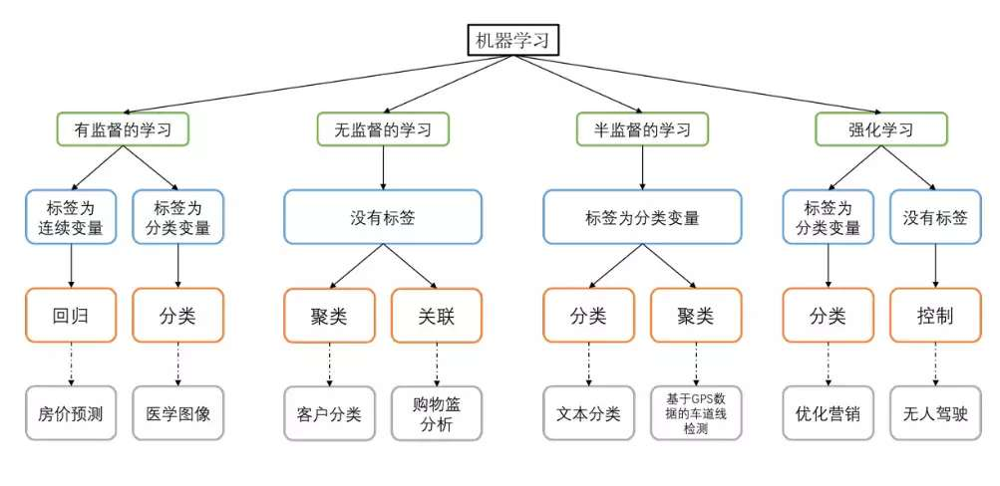
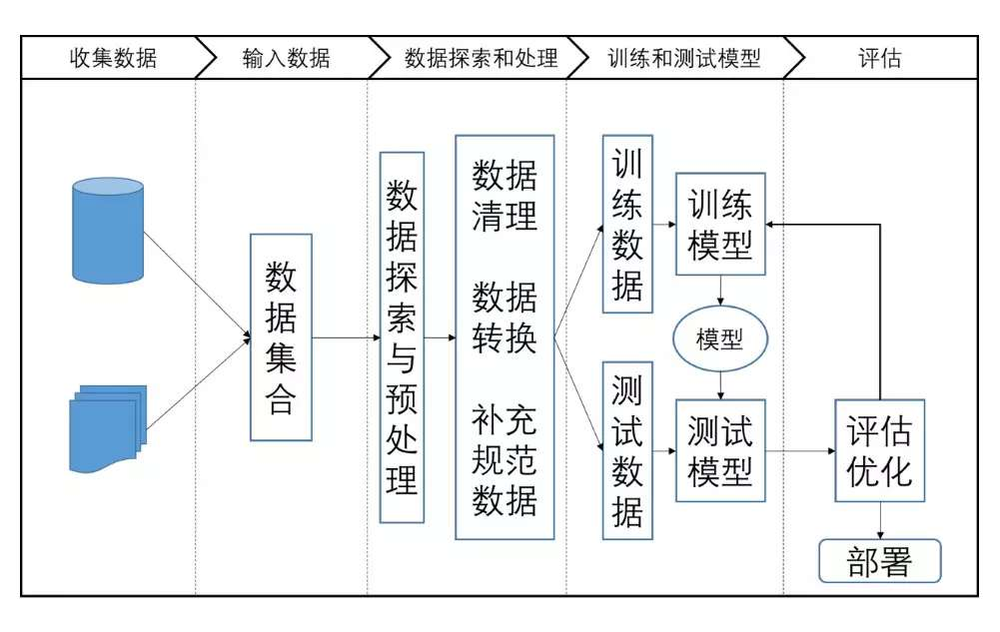

[TOC]

# 机器学习

## 机器学习简介

​	机器学习（Machine Learning）是让计算机能够自动地从某种数据中总结出规律，并得出某种预测模型，进而利用该模型对位置数据进行预测的一种方法。其研究和应用主要集中于以下一些领域：

​	目前机器学习大致可分为以下几类：

- 有监督学习（Supervised learning）：已知一些数据和正确的输出结果（训练集），通过这些数据训练出一个模型，再利用这个模型预测新数据的输出结果。具体可分为两类：

  - 分类：预测结果为离散值
  - 回归：预测结果为连续值

  常见的有监督学习算法有：线性回归，逻辑回归，kNN，朴素贝叶斯，决策树，随机森林，支持向量机等。

- 无监督学习（Unsupervised learning）：训练样本没有给定类标签，需要对给定的数据直接进行建模。

  常见无监督学习算法有：聚类，EM算法。

- 半监督学习（Semi-supervised learning）：给定数据集中既包括有类标签的数据，也包括没有类标签的数据。

- 强化学习（Reinforcement learning）：计算机从什么都不懂，到通过不断学习，总结规律，最终学会的过程。强化学习很依赖于学习的“周围环境”，强调如何基于“周围环境”而作出相应的动作。

​	解决机器学习问题的一般流程：

- 数据收集：“数据和特征决定了机器学习的上界，而模型和算法只是去逼近这个上界。”
- 数据预处理
- 特征工程
- 模型选择
- 模型评估
  - 正确率和错误率
  - 查准率、查全率和F1-score
  - ROC和AUC

## 机器学习基础

### 数据预处理

#### 归一化

​	对数据集进行区间缩放，缩放到[0,1]的区间内，把有单位的数据转化为没有单位的数据，即统一衡量标准，消除单位的影响。归一化后的数据处理起来更方便，同时能加快算法收敛速度。

#### 标准化

​	在不改变原数据分布的前提下，将数据按比例缩放，使之落入一个限定的区间，使数据之间具有可比性。标准化的目的是为了方便数据的下一步处理，如进行数据的缩放等变换。常用的标准化方法有z-score标准化、Min-Max标准化等。

#### 离散化

​	把连续的数值型数据进行分段，将落在每一个分段内的数据赋予一个新的统一的符号或数值。可采用相等步长或相等频率等方式进行离散化。离散化有时是为了适应模型的需要，同时离散化也有助于消除一些异常数据，以及提高算法的效率等。

#### 二值化

​	将数值型数据转换为0和1两个值。二值化的目的在于简化数据，有些时候还可以消除数据中的“杂音”。

#### 哑编码

​	又称独热编码（One-Hot Encoding），其作用是将特征进行量化。例如某个特征有三个类别：“大”、“中”和“小”，必须将其数值化。若编号为“1”、“2”和“3”会引入额外的关系（数值间的大小关系），可能会”误导“模型的优化方向。更好的方式是使用哑编码，将其分别编码为”100“、”010“和”001“。其对应坐标的欧式距离相等，均为 $\sqrt 2$。

### 特征工程

​	特征工程的主要目的是把原始的数据转化为模型可以使用的数据，其主要包括三个子问题：

- 特征构造：在原有特征的基础上做一些”组合“操作，从而得到新的特征。
- 特征提取：使用映射或变换的方法将维数较大的原始特征转换为维数较低的新的特征。
- 特征选择：从原始特征中挑选出一些具有代表性，使得模型效果最好的特征。

#### 特征提取

##### 主成分分析（PCA）

​	一种经典的无监督降维方法，其主要思想是在降维的过程中实现”减少噪声“和”去冗余“从而达到降维的目的。具体来说，”减少噪声“是指在将维数较高的原始特征转换为维数较低的新特征的过程中保留维度间相关性尽可能小的特征维度，这一操作实际上是通过借助协方差矩阵的原理实现的。”去冗余“是指把”减少噪声“后的维数再进一步筛选，去掉含有较小”特征值“的维度，使得保留下来的特征维度含有的”特征值“尽可能大。特征值越大方差即越大，进而所包含的信息量就越大。

​	PCA是完全无参数限制的，其结果只与数据有关。这是其优点同时也是缺点。于是PCA核方法kernel-PCA后来被提出，使得用户可以根据先验知识预先对数据进行非线性变换。

##### 线性判别分析（LDA）

​	一种经典的有监督降维算法，其主要思想是借助协方差矩阵、广义瑞利熵等原理实现数据类别间距离的最大化和类别内距离的最小化。

​	以二分类LDA为例，二维特征通过一系列矩阵运算实现从二维平面到一条直线的投影，期间同时通过借助协方差矩阵、广义瑞利熵等实现类间数据的最大化与类内数据的最小化。从二分类推广到多分类是在二分类的基础上增加了”全局散度矩阵“来实现最终目标优化函数的设定。由于它是针对各个类别做的降维，所以数据经过LDA降维后，最多只能降到原来的类别数减一的维度。

​	LDA还可以实现分类。

##### 独立成分分析（ICA）

​	ICA的主要思想是在降维的过程中保留相互独立的特征维度。在保证特征维度之间不相关的同时保证相互独立。不相关知识保证了没有线性关系，并不能保证是独立的。因此ICA往往会比PCA有更好的降维效果。

#### 特征选择

​	不同的特征对模型的影响程度不同，要选择出重要的一些特征，移除与问题相关性不是很大的特征。这个过程叫做特征选择。其最终目的是通过减少冗余特征以达到减少过拟合、提高模型准确度和在一定程度上减少训练时间的效果。特征选择是对原始特征取特征子集的一个操作。常用特征选择方法有：过滤式（filter）、包裹式（wrapper）以及嵌入式（embeding）。

##### 过滤式

​	通过统计度量的方法评估每个特征和结果的相关性，来对特征进行筛选，留下相关性较强的特征。其核心思想是：先对数据集进行特征选择，然后再进行模型的训练。即过滤式特征选择是独立于特定的学习算法的。因此其拥有较高的通用性，可适用于大规模数据集，同时也造成了其在分类准确率方面可能会表现欠佳。常用过滤式特征选择方法有：Pearson相关系数法、方差选择法、假设检验、互信息法等。这些方法通常是单变量的。

##### 包裹式

​	通常是把最终机器学习模型的表现作为特征选择的重要依据，一步步筛选特征。这种一步步筛选特征的过程可以看作是目标特征组合的搜索过程，这种搜索过程可以是最佳优先搜索、随即爬山算法等。目前常用的一种方法为递归特征消除法。

​	包裹式特征选择比过滤式有着更好的模型表现。但由于其训练过程时间久，系统开销也更大，一般来说不太适用于大规模数据。

##### 嵌入式

​	根据机器学习算法、模型来分析特征的重要性，从而选择比较重要的N个特征。它将特征选择过程和模型训练过程结合为一体。与包裹式不同，它将全部的数据一起输入模型中进行训练和评测。常用嵌入式特征选择方法有基于正则化项的特征选择法（如：Lasso，ridge）和基于树模型的特征选择法（如：GBDT）。

#### 模型评估方法

##### 留出法

​	直接将数据集划分为训练集和验证集。为了确保”训练集“和”验证集“中的数据分布的一致性，需要使用”分层采样“的方式划分数据集。一般为多次划分数据集并训练模型，并取多次实验结果的平均值作为最终模型评估的结果。

##### 交叉验证法

​	将数据集划分为k个大小相同，但互斥的子集。为确保数据分布的一致性，同样采用”分层采样“的方式划分数据集。

​	对于划分得到的数据集，每次使用其中一个作为”验证集“，剩下的k-1个作为”训练集“，将得到的结果去平均值，作为最终模型评估的结果，这种方法称为”k折交叉验证“。与留出法一样，为了排除数据集划分的影响，通常对数据集进行多次划分，对每次划分后得到的k个子集进行”k折交叉验证“。这种方法称为”n次k折交叉验证“。常见的n=5和10。（当k=数据集样本数时，称为留一法）

##### 自助采样法

​	通过m次对样本数为m的数据集进行随机的且有放回的采样，得到一个和原始数据集大小相同的数据集，以其作为”训练集“。该采样后数据集中仍有36.8%的样本没有被抽取到，并将这些样本作为”验证集“。

​	”自主采样法“再样本数量较小时比较适用。

#### 

## 参数估计

### 损失函数与风险函数

#### 损失函数（loss function）

- 在参数估计问题中，评价估计的好坏就是看估计出来的参数与真值的**差距**有多小。估计出来的参数通常用 $\hat{\theta}$ 表示，参数的真值用 $\theta $ 表示。这个差距定义为损失函数。损失函数用于度量模型一次预测的好坏。

机器学习常用的损失函数：（其中 $f(X)$ 为预测值，$Y$ 为真实值，损失函数记作 $L(Y,f(X)$。）

- 0-1损失函数
  $$
  L(Y,f(X))=
  \begin{cases}
  1,\qquad Y\ne f(X) \\
  0,\qquad Y= f(x)
  \end{cases}
  $$

- 平方损失函数
  $$
  L(Y,f(X))=(Y-f(X))^2
  $$

- 绝对损失函数
  $$
  L(Y,f(X))=|Y-f(X)|
  $$

- 对数损失函数或对数似然损失函数
  $$
  L(Y,P(Y|X))=-\log P(Y|X)
  $$
  损失函数越小，表明模型越好。

#### 风险函数（risk function）

##### 期望风险

​	由于模型的输入、输出 $(X,Y)$ 是随机变量，遵循联合分布 $P(X,Y)$ ，所以损失函数的期望值是
$$
R_{exp}(f)=E_p[L(Y,f(X))]=\int_{x*y}L(Y,f(X))P(x,y)dxdy
$$
​	这是理论上模型 $f(x)$ 关于联合分布 $P(X,Y)$ 的平均意义下的损失，称为**风险函数**或**期望损失**。损失函数度量模型一次预测的好坏，风险函数度量平均意义下模型的好坏。

​	学习的目标就是选择期望风险最小的模型。由于联合分布 $P(X,Y)$ 是未知的，$R_{exp}(f)$ 不能直接计算。

##### 经验风险

​	给定一个训练数据集 $T=\{(x_1,y_1),(x_2,y_2),...,(x_n,y_n)\}$ ,模型 $f(x)$ 关于训练数据集的平均损失称为经验风险或者经验损失，记作 $R_{emp}$ ：
$$
R_{emp}(f)=\frac{1}{n}\sum_{i=1}^nL(y_i,f(x_i))
$$
期望风险 $R_{exp}(f)$ 是模型关于联合分布的期望损失，经验风险 $R_{emp}(f)$ 是模型关于训练样本集的平均损失。根据大数定律，当样本容量 $N$ 趋于无穷时，经验风险 $R_{emp}(f)$ 趋于期望风险 $R_{exp}(f)$。实际中通常用经验风险估计期望风险，但由于现实中的训练样本有限，甚至很小，所以用经验风险估计期望风险常常并不理想，要对经验风险进行一定的矫正。

##### 经验风险最小化和结构风险最小化

###### 经验风险最小化

​	经验风险最小化的策略认为，经验风险最小的模型是最优的模型。根据这一策略，按照经验风险最小化求解最优模型就是求解最优化问题：
$$
\min \frac{1}{N}\sum_{i=1}^N L(y_i,f(x_i))
$$
​	当样本容量足够大时，经验风险最小化能保证很好的学习结果。当样本空间很小时，经验风险最小化学习的效果的未必很好，会产生“过拟合”现象。

###### 结构风险最小化

​	结构风险最小化(structural risk minimization,SPM)是为了防止过拟合而提出来的策略。结构风险最小化等价于正则化(regularization)。结构风险在经验风险上加上表示模型复杂度的正则项(regularizer)或者罚项(penalty term)。在假设空间、损失函数以及训练数据集确定的情况下，结构风险的定义为：
$$
R_{srm}(f)=\frac{1}{N}\sum_{i=1}^NL(y_i,f(x_i))+\lambda J(f)
$$
​	其中 $J(f)$ 为模型的复杂度，是定义在假设空间 $F$ 上的泛函。模型 $f$ 越复杂，复杂度 $J(f)$ 就越大；反之，模型 $f$ 越简单，复杂度 $J(f)$ 就越小。也就是说，复杂度表示了对复杂模型的惩罚。是系数，用于权衡经验风险和模型的复杂度。结构风险小需要经验风险与模型复杂度同时小。结构风险小的模型往往对训练数据以及未知的测试数据都有较好的预测。

​	贝叶斯估计中的最大后验概率估计(maximum posterior probability,MAP)就是结构风险最小化的一个例子。当模型是条件概率分布、损失函数是对数损失函数、模型复杂度由模型的先验概率表示时，结构风险最小化等价于最大后验概率估计。

### 极大似然估计（MLE）

- 参数化模型（paramentric model）是指有限个参数表示的概率密度函数集合，用 $q(x;\boldsymbol \theta)$ 表示，$\boldsymbol \theta$ 是位于整个参数空间 $\Theta$ 中的参数向量，维度为 $b$ ：
  $$
  \boldsymbol \theta = (\theta^{(1)},\theta^{(2)},...,\theta^{(b)})^T
  $$

上式中分号前的 $x$ 表示随机变量，分号后的 $\boldsymbol \theta$ 表示参数。

极大似然估计通过最大化当前训练样本 $\{x\}_{i=1}^n$ 的概率来确定 $\boldsymbol \theta$ 值。因此在指定的参数$\boldsymbol \theta$ 下产生训练样本  $\{x\}_{i=1}^n$ 的概率可以看作是参数 $\boldsymbol \theta$ 的函数，称为**似然函数（likelihood）**,用 $L(\theta)$ 表示。在独立同分布（IID）的假设下，可表示为：
$$
L(\theta)=\prod_{i=1}^nq(\boldsymbol x_i;\boldsymbol \theta)
$$
MLE要最大化似然函数：
$$
\hat{\boldsymbol \theta}_{ML}=\arg\max_{\boldsymbol\theta \in \Theta}L(\boldsymbol\theta)
$$
同时对应的密度估计为
$$
\hat{p}(\boldsymbol x)=q(\boldsymbol x;\hat{\boldsymbol \theta}_{ML})
$$
如果参数模型 $q(x;\boldsymbol \theta)$ 关于 $\boldsymbol \theta$ 可微，则 $\hat{\boldsymbol \theta}_{ML}$ 满足：
$$
\left.\frac{\partial}{\partial\boldsymbol\theta}L(\boldsymbol\theta)\right|_
{\boldsymbol\theta=\hat{\boldsymbol \theta}_{ML}}=\boldsymbol 0_b
$$
上式被称为**似然方程**。它是求解极大似然的*必要条件*。其中，$\boldsymbol 0_b$ 表示 $b$- 维的零向量。对 $\boldsymbol \theta$ 的偏微分是一个 $b$- 维向量，其中 $i$ 个元素为 $\frac{\partial}{\partial\boldsymbol\theta^{i}}$ ：
$$
\frac{\partial}{\partial\boldsymbol\theta}=(\frac{\partial}{\partial\theta^{(1)}},...,\frac{\partial}{\partial\theta^{(b)}})^T
$$
由于 $\log$ 函数的单调递增性质，似然函数的最大值通常通过**最大化 $\log$- 似然函数**来获得：
$$
\hat{\boldsymbol \theta}_{ML}=\arg\max_{\boldsymbol\theta \in \Theta}\log L(\boldsymbol\theta)=\arg\max_{\boldsymbol\theta \in \Theta}[\sum_{i=1}^n\log q(\boldsymbol x_i;\boldsymbol \theta)]
$$
由此原函数中的概率密度的乘积就变为了 $\log$ 似然函数中的概率密度之和，简化了计算，$\log$- 似然的似然方程为
$$
\left.\frac{\partial}{\partial\boldsymbol\theta}\log L(\boldsymbol\theta)\right|_
{\boldsymbol\theta=\hat{\boldsymbol \theta}_{ML}}=\boldsymbol 0_b
$$

### 贝叶斯推理

#### 贝叶斯预测分布

​	在MLE框架下，将参数模型 $q(\boldsymbol x;\boldsymbol \theta)$ 中的参数 $ \boldsymbol \theta$ 视为定量。在贝叶斯框架下，$\boldsymbol \theta$ 被当作随机变量，参数模型被认为是一个条件概率 $q(\boldsymbol x|\boldsymbol \theta)$。

如果 $\boldsymbol \theta$ 被认为是一个随机变量，对于训练样本 $\mathcal D$，可以确定下列概率：

- $p(\boldsymbol\theta)$： 在观察训练样本 $\mathcal D$ 之前参数 $\boldsymbol\theta$ 的**先验概率**。
- $p(\boldsymbol\theta|\mathcal D)$：在给定训练样本 $\mathcal D$ 下参数 $\boldsymbol\theta$ 的**后验概率**。
- $p(\mathcal D|\boldsymbol\theta)$：表示**可能性**，它和MLE中的 在数值上相同，在贝叶斯框架里，它被认为是一个条件概率：

$$
p(\mathcal D|\boldsymbol\theta)=\prod_{i=1}^nq(\boldsymbol x_i|\boldsymbol \theta)
$$

- $p(\mathcal D，\boldsymbol \theta)$：**联合概率**，可表示成 $p(\mathcal D，\boldsymbol \theta)p=(\mathcal D|\boldsymbol \theta)p(\boldsymbol\theta)$。

  它在 $\boldsymbol \theta$ 的边缘化可以得到：
  $$
  \int p(\mathcal D,\boldsymbol\theta)d\boldsymbol\theta=p(\mathcal D)
  $$
  因此 $p(\mathcal D)$ 的边际概率可表示成：
  $$
  p(\mathcal D)=\int (\prod_{i=1}^nq(\boldsymbol x_i|\boldsymbol \theta))p(\boldsymbol\theta)d\boldsymbol\theta
  $$
  贝叶斯推理的解 $\hat{p}_{Bayes}(\boldsymbol x)$ 称为贝叶斯预测分布，可以由基于后验概率 $p(\boldsymbol \theta|\mathcal D)$ 的模型 $q(\boldsymbol x|\boldsymbol \theta)$ 的期望来表示：
  $$
  \hat{p}_{Bayes}(\boldsymbol x)=\int q(\boldsymbol x|\boldsymbol \theta)p(\boldsymbol \theta|\mathcal D)d\boldsymbol \theta
  $$
  其中后验概率 $p(\boldsymbol \theta|\mathcal D)$ 可以用**贝叶斯定理**来表示：
  $$
  p(\boldsymbol \theta|\mathcal D)=\frac{p(\mathcal D|\boldsymbol \theta)p(\boldsymbol \theta)}{p(\mathcal D)}=\frac{\prod_{i=1}^n q(\boldsymbol x_i|\boldsymbol \theta) p(\boldsymbol\theta)}{\int \prod_{i=1}^nq(\boldsymbol x_i|\boldsymbol \theta^\prime)p(\boldsymbol\theta^\prime)d\boldsymbol\theta^\prime}
  $$
  如果参数模型 $q(\boldsymbol x|\boldsymbol \theta)$ 和先验概率 $p(\boldsymbol\theta)$ 是给定的，那么贝叶斯推测分布原理上可以不通过任何学习就可以计算出来。然而若 $\boldsymbol \theta$ 的维数过高，那么上两式中的积分计算会很复杂，为了简单的处理积分项，可以解析地获得后验概率 $p(\boldsymbol \theta|\mathcal D)$ 。一种方式是手动选择先验概率 $p(\boldsymbol \theta)$ ，然后可以根据**共轭先验**得到后验概率 $p(\boldsymbol \theta|\mathcal D)$ 的参数形式。对于非共轭先验概率的选择，通常使用积分式的解析近似。

  为了处理贝叶斯的解 $\hat{p}_{Bayes}(\boldsymbol x)$，最简单的近似方案是使用从后验概率得出的单点 $\hat{\boldsymbol\theta}$，这种使用**单点近似**的方法称为**最大后验估计**。

#### 共轭先验

- 设随机变量 $X$ 有概率密度函数$F：X∼F(x|θ)$。$θ$ 的先验分布 $π(θ)$ 属于某个分布族$P：π(θ)∈P$。如果对任意 $\theta$， $\theta$ 的后验分布 $π(θ|x)$ 也属于分布族 $P$，那么 $P$ 就叫做 $F$ 的共轭先验。

|   名称   |   $f(x|\theta)$   |              $\pi(\theta)$               |
| :------: | :---------------: | :--------------------------------------: |
| 正态分布 | $N(\mu,\sigma^2)$ |       $\pi(\mu) \sim N(\eta,\tau)$       |
| 正态分布 | $N(\mu,\sigma^2)$ |   $\pi(\sigma^2) \sim inverse \ Gamma$   |
| 指数分布 |   $Exp(\theta)$   |   $\pi(\sigma^2) \sim inverse \ Gamma$   |
| 二项分布 |    $Bin(n,p)$     |    $\pi(p) \sim Beta(\alpha, \beta)$     |
| 泊松分布 |  $Poi(\lambda)$   | $\pi(\lambda) \sim \Gamma(\alpha,\beta)$ |

### 最大后验估计（MAP）

- 最大后验估计通过单点 $\hat{\theta}_{MAP}$ 来近似 $\hat{p}_{Bayes}(\boldsymbol x)$ 的积分式：
  $$
  \hat{p}_{MAP}(x)=q(\boldsymbol x|\hat{\boldsymbol \theta}_{MAP})
  $$
  这里 $p(\boldsymbol \theta | \mathcal D)$ 在 $\hat{\theta}_{MAP}$ 处达到极大值：
  $$
  \hat{\theta}_{MAP}=\arg \max_\theta p(\boldsymbol \theta| \mathcal D)
  $$
  

因为MAP通过单一点  $\hat{\theta}_{MAP}$ 来近似目标密度，所以其性质与MLE相似，进一步说，MAP的解 $\hat{\theta}_{MAP}$ 可以表示为：
$$
\hat{\theta}_{MAP}=\arg \max_\theta (\sum_{i=1}^n\log q(\boldsymbol x_i|\boldsymbol \theta)+\log p(\boldsymbol \theta))
$$
当样本体积很小时，MLE倾向于过拟合训练样本。添加项 $\log p(\boldsymbol \theta)$ 作为修正项可以减少过拟合。因此， MAP被称为修正化的极大似然估计。MAP尝试着增大先验概率和可能性，因此为了让参数有一个更大的先验概率，MAP的解会倾向于由偏差。

### 贝叶斯估计

​	贝叶斯框架将参数模型 $q(\boldsymbol x|\boldsymbol \theta) $ 中的 $\boldsymbol \theta $ 看作随机变量，**贝叶斯估计的目的是结合参数的先验知识，使得估计出来的参数能令贝叶斯风险达到最小。**

​	令损失函数为 $L(\hat{\boldsymbol \theta},\boldsymbol \theta)$，则风险函数为损失函数 $L(\hat{\boldsymbol \theta},\boldsymbol \theta)$ 关于 $\hat{\boldsymbol \theta}$ 的期望：
$$
R(\hat{\boldsymbol \theta},\boldsymbol \theta)=E_{\hat{\theta}}[L(\hat{\boldsymbol \theta},\boldsymbol \theta)]=\int L(\hat{\boldsymbol \theta},\boldsymbol \theta) q(\boldsymbol x|\boldsymbol \theta) d\boldsymbol x
$$
​	因为 $\hat{\boldsymbol\theta}$ 是 $\boldsymbol x$ 的函数，所以对 $\hat{\boldsymbol\theta}$ 求期望就是在 $\boldsymbol x$ 上求期望，进而转换为对 $\boldsymbol x$ 求积分。

​	上式中的风险函数求出了一个具体的值，但很多情况下求出的风险是一个函数表达式，而不是值。如果求出来的风险是一个值，则可以不用贝叶斯估计。贝叶斯估计通常用于风险不可以直接比较的情况。

#### 贝叶斯风险

​	由于 $\boldsymbol \theta $ 为随机变量，满足一个先验分布 $\pi(\boldsymbol\theta)$，则风险函数可以看作是 $\boldsymbol\theta$ 的函数。为了使风险函数的求解不依赖于 $\boldsymbol\theta$ ，引入了贝叶斯风险：**贝叶斯风险是风险函数在 $\boldsymbol\theta$ 上的期望。**
$$
B(\boldsymbol\theta)=E_{\theta}[R(\hat{\boldsymbol \theta},\boldsymbol \theta)]=\int R(\hat{\boldsymbol \theta},\boldsymbol \theta)\pi(\boldsymbol\theta)d\theta
$$

#### 最小化贝叶斯风险

​	贝叶斯估计的目的：**求出$\hat{\boldsymbol \theta }$，使得贝叶斯风险 $B(\boldsymbol\theta)$ 最小。**

​	由条件概率可知 $\boldsymbol x$ 的边缘概率密度函数为：
$$
p(x)=\int q(\boldsymbol x|\boldsymbol \theta)\pi(\boldsymbol\theta)d\boldsymbol\theta
$$
​	则有：
$$
\begin{align}
B(\boldsymbol\theta) & =\int R(\hat{\boldsymbol \theta},\boldsymbol \theta)\pi(\boldsymbol\theta)d\theta \\
& = \int_{\theta} \left[\int_x L(\hat{\boldsymbol \theta},\boldsymbol \theta) q(\boldsymbol x|\boldsymbol \theta) d\boldsymbol x \right] \pi(\boldsymbol\theta) d\boldsymbol\theta \\
& = \int_{\theta} \int_x L(\hat{\boldsymbol \theta},\boldsymbol \theta) \frac{q(\boldsymbol x|\boldsymbol \theta) \pi(\boldsymbol\theta)}{p(\boldsymbol x)}  p(\boldsymbol x) d\boldsymbol x \ d\boldsymbol\theta \\
& =  \int_{\theta} \int_x L(\hat{\boldsymbol \theta},\boldsymbol \theta) \pi(\boldsymbol\theta|\boldsymbol x)  p(\boldsymbol x) d\boldsymbol x \ d\boldsymbol\theta \\
& = \int_x \left[ \int_{\theta} L(\hat{\boldsymbol \theta},\boldsymbol \theta) \pi(\boldsymbol\theta|\boldsymbol x) d\boldsymbol\theta \right] \ p(\boldsymbol x) d\boldsymbol x
\end{align}
$$
​	上式中先对 $\boldsymbol \theta$ 积分然后对 $\boldsymbol x$ 积分，$\boldsymbol x$ 并不是此处需要关心的，因此只需使得中括号中的积分最小。而中括号中的积分是一个期望：在 $\boldsymbol \theta$ 的后验分布 $\pi(\boldsymbol\theta|\boldsymbol x)$ 上求损失函数$L(\hat{\boldsymbol \theta},\boldsymbol \theta)$ 期望。
$$
\int_{\theta} L(\hat{\boldsymbol \theta},\boldsymbol \theta) \pi(\boldsymbol\theta|\boldsymbol x) d\boldsymbol\theta=E_\pi L(\hat{\boldsymbol \theta},\boldsymbol \theta)
$$
那么贝叶斯估计就是：**求出$\hat{\boldsymbol \theta }$，使得损失函数 $ L(\hat{\boldsymbol \theta},\boldsymbol \theta) $ 在 $\boldsymbol\theta $ 的后验分布 $\pi(\boldsymbol\theta|\boldsymbol x)$ 上的期望最小。**

贝叶斯参数估计的步骤：

1. 拿到数据，知道数据的分布，记为 $q(\boldsymbol x|\boldsymbol \theta )$，要估计的参数记为 $\boldsymbol \theta $。
2. 定义损失函数 $ L(\hat{\boldsymbol \theta},\boldsymbol \theta) $。
3. 定义 $\boldsymbol \theta $ 的先验知识或先验分布 $\pi(\boldsymbol \theta)$。
4. 根据贝叶斯定理求出后验分布 $\pi(\boldsymbol \theta |\boldsymbol x)=\frac{q(\boldsymbol x|\boldsymbol \theta)\pi(\boldsymbol \theta)}{p(\boldsymbol x)}$。
5. 最小化下式：$\arg \min \int  L(\hat{\boldsymbol \theta},\boldsymbol \theta) \pi(\boldsymbol \theta |\boldsymbol x)d\boldsymbol\theta = E_\pi L(\hat{\boldsymbol \theta},\boldsymbol \theta)$ 

#### 常用损失函数的贝叶斯估计

- 平方损失函数

  结论：若损失函数是平方损失函数，那么当 $\hat{\boldsymbol \theta} $ 等于 $\boldsymbol \theta $ 在 $\pi(\boldsymbol \theta |\boldsymbol x)$ 上的期望时，贝叶斯风险最小。

  上述结论说明，如果知道 $\pi(\boldsymbol \theta |\boldsymbol x)$ 的形式，那么只需求 $\arg \min \int \boldsymbol \theta \ \pi(\boldsymbol \theta |\boldsymbol x)d\boldsymbol\theta$ 就可以了，实际上就是期望。例如，如果 $\pi(\theta |x)$ 正态分布， $\pi(\theta |x) \sim N(\eta,\tau)$，那么 $\hat{\theta}=\eta$，$\eta$ 就是参数 $\theta$ 的估计。

- 绝对损失函数

  结论：若损失函数是绝对损失函数，那么当 $ \hat{\boldsymbol \theta}$ 等于数据 $\boldsymbol X$ 的中位数时，贝叶斯风险最小。

- Uniform Error：$L(\hat{\boldsymbol \theta},\boldsymbol \theta )=\begin{cases}0, \quad if \ |\boldsymbol\theta-\hat{\boldsymbol\theta}| \le \Delta \\ 1, \quad if \ |\boldsymbol\theta-\hat{\boldsymbol\theta}|>\Delta\ \end{cases}$

  结论：若损失函数是uniform error且 $\Delta$ 很小，当 $\hat{\boldsymbol\theta}=\arg\max\pi(\boldsymbol\theta|\boldsymbol x)$ 时，即 $ \hat{\boldsymbol \theta}$ 等于 $\boldsymbol \theta$ 后验分布的最大值时，贝叶斯风险最小。

## 贝叶斯分类器

### 分类器训练的准则

#### 最大后验概率规则

​	在确定一个给定样本属于哪个类时，会选择概率最大的那个类，即最大化类后验-概率 $p(y|\boldsymbol x)$ (样本 $\boldsymbol x $ 分类到 $\hat{y} $ 的概率)的类。其中
$$
\hat{y}=\arg \max_y p(y|\boldsymbol x)
$$
​	上述规则称之为MAP规则。其等价于将决策域做如下设置：
$$
\mathcal X_y = \{\boldsymbol x|p(y|\boldsymbol x) \ge p(y^\prime|\boldsymbol x)\ 且 \ y^\prime \ne y \}
$$

#### 最小误分类率准则

​	该准则选择具有分类错误率最小的类。设 $p_e(y \to y^\prime)$ 为类 $y$ 中的样本被错误分类到类 $y^\prime$ 中的概率，其等效于类 $y$ 中的样本落入决策区域 $\mathcal X_{ y^\prime}$ 的概率，即
$$
p_e(y \to y^\prime)=\int_{x \in \mathcal X_{y^\prime}}p(\boldsymbol x|y)d\boldsymbol x
$$
则将类 $y$ 中的样本归类为一个错误的类的概率 $p_e(y)$ 由下式表示，即
$$
\begin{align}
p_e(y) &= \sum_{y^\prime \ne y}p_e(y \to y^\prime)=\sum_{y^\prime \ne y}\int_{x \in \mathcal X_{y^\prime}}p(\boldsymbol x|y)d\boldsymbol x \\
&= \sum_{y^\prime \ne y}\int_{x \in \mathcal X_{y^\prime}}p(\boldsymbol x|y)d\boldsymbol x + \int_{x \in \mathcal X_{y}}p(\boldsymbol x|y)d\boldsymbol x - \int_{x \in \mathcal X_{y}}p(\boldsymbol x|y)d\boldsymbol x \\
&=1 - \int_{x \in \mathcal X_{y}}p(\boldsymbol x|y)d\boldsymbol x
\end{align}
$$
其中 $\int_{x \in \mathcal X_{y^\prime}}p(\boldsymbol x|y)d\boldsymbol x$ 表示类 $y$ 中的样本分类到类 $y$ 的概率，即正确的分类率。

整体的错误分类率由 $p_e(y)$ 对所有类的期望给出：
$$
\begin{align}
p_e &= \sum_{y=1}^c p_e(y)p(y) \\
&= \sum_{y=1}^c (1-\int_{x \in \mathcal X_{y}}p(\boldsymbol x|y)d\boldsymbol x)p(y) \\
&= \sum_{y=1}^c p(y)-\sum_{y=1}^c\int_{x \in \mathcal X_{y}}p(\boldsymbol x|y)p(y) \\
&= 1 - \sum_{y=1}^c\int_{x \in \mathcal X_{y}}p(\boldsymbol x,y)d\boldsymbol x \\
&= 1 - \sum_{y=1}^c\int_{x \in \mathcal X_{y}}p(y|\boldsymbol x)p(\boldsymbol x) d\boldsymbol x
\end{align}
$$
由上式可知，使 $p_e$ 最小化等价于确定一个决策域 $\{\mathcal X_y\}_{y=1}^c$ 使得 $\sum_{y=1}^c\int_{x \in \mathcal X_{y}}p(y|\boldsymbol x)p(\boldsymbol x) d\boldsymbol x$ 最大化。这可以通过将 $\mathcal X_y$ 设置为所有的 $\boldsymbol x$ 的集合来实现。则当 $y^\prime \ne y$ 时，$p(y|\boldsymbol x) \ge p(y^\prime|\boldsymbol x)$。这等效于类后验概率最小化的过程。

#### 贝叶斯决策规则

​	贝叶斯决策论考虑如何基于相关概率和误判损失来选择最优的类别标记。用 $\lambda_{y,y^\prime}$ 表示类 $y$ 中的样本被误分到类 $y^\prime$ 中的损失。由于样本 $\boldsymbol x$ 属于类 $y$ 的概率为 $p(y|\boldsymbol x)$ ,因此样本 $\boldsymbol x$ 属于类 $y^\prime$ 的损失为
$$
R(y^\prime|\boldsymbol x)=\sum_{y=1}^{c}\lambda_{y,y^\prime}p(y|\boldsymbol x)
$$
​	上式称之为样本 $\boldsymbol x$ 的*条件风险*。

​	样本 $\boldsymbol x$ 应该被分到最小条件风险的类中，即
$$
\hat{y}=\arg \min_y R(y|\boldsymbol x)
$$
​	这等价于将决策 $\{\mathcal X_y\}_{y=1}^c$ 确定为
$$
\mathcal X_y=\{\boldsymbol x|R(y|\boldsymbol x) \le R(y^\prime|\boldsymbol x) \ 对所有\ y^\prime \ne y\}
$$
所有的 $\boldsymbol x$ 的条件风险的期望，被称为*总风险*：
$$
R=\int_\mathcal X R(\hat{y}|\boldsymbol x)p(\boldsymbol x)d\boldsymbol x
$$
其中，$\hat{y}$ 是一个分类器的输出。满足贝叶斯决策规则的总风险被称为*贝叶斯风险*。一般情况下贝叶斯风险不会为 0，说明即使训练出了最优分类器，该风险都不会是 0。

​	假设正确分类的损失为 0，错误分类的损失为一个大于 0 的常数 $\lambda$ ：
$$
\lambda_{y,y^\prime}=
\begin{cases}
0, \qquad y=y^\prime \\
\lambda, \qquad y \ne y^\prime
\end{cases}
$$
于是，条件风险可表示为：
$$
R(y|\boldsymbol x)=\lambda\sum_{y^\prime \ne y} p(y^\prime|\boldsymbol x)=\lambda \left[ \sum_{y^\prime=1}^cp(y^\prime|\boldsymbol x)-p(y|\boldsymbol x)\right]=\lambda(1-p(y|\boldsymbol x))
$$
上式最小化等价于类先验概率 $p(y|\boldsymbol x)$ 的最大化。因此，当损失 $\lambda_{y,y^\prime}$ 由上式（49）给定时，贝叶斯决策规则会退化成MAP规则（同样也是最小无分类率规则）。

### 生成式方法和判别式方法

#### 判别式方法

​	判别式方法基于MAP规则学习分类器，需要找到类-后验概率 $p(y|\boldsymbol x)$ 的最大值。

#### 生成式方法

​	生成式方法基于贝叶斯定理，将类-后验概率表示为
$$
p(y|\boldsymbol x)=\frac{p(\boldsymbol x|y)p(y)}{p(\boldsymbol x)}
$$
其中 $p(\boldsymbol x )$ 独立于类 $y$，最大化类-后验概率使可忽略：
$$
p(y|\boldsymbol x)\propto p(\boldsymbol x|y)p(y)=p(\boldsymbol x,y)
$$
通过估计类-条件概率密度 $p(\boldsymbol x|y)$ 和 类-后验概率 $p(y|\boldsymbol x)$ 的方法叫做生成式方法。

### 朴素贝叶斯分类器

​	基于贝叶斯公式来估计后验概率 $p(y|\boldsymbol x)$ 的主要困难在于：类-条件概率 $p(\boldsymbol x|y)$ 是样本所有属性上的联合概率，难以从有限的样本中直接估计而得。为朴素贝叶斯分类器采取了“属性条件独立假设”：对已知类别，假设所有属性相互独立。则有
$$
p(y|\boldsymbol x)=\frac{p(\boldsymbol x|y)p(y)}{p(\boldsymbol x)}=\frac{p(y)}{p(\boldsymbol x)}\prod_{i=1}^d p(x_i|y)
$$
其中 $d$ 为属性数目，$x_i$ 为 $\boldsymbol x$ 在第 $i$ 个属性上的取值。

对于所有类别来说，$p(\boldsymbol x)$ 相同，则根据贝叶斯判定准则有
$$
h_{nb}(\boldsymbol x)=\arg \max_{c \in \mathcal Y} p(c)\prod_{i=1}^d p(x_i|c)
$$
显然，朴素贝叶斯分类器的训练过程就是基于训练集 $\mathcal D$ 来估计类-先验概率 $p(c)$ ,并为每个属性估计条件概率 $p(x_i|c)$。

### 半朴素贝叶斯分类器

### 贝叶斯网

## Fisher线性判别分析(LDA)

​	给定训练样例集，设法将样例投影到一条直线上，使得同类样例的投影点尽可能接近，异类样例的投影点尽可能远离；在对新样本进行分类时，将其投影到同样的这条直线上，再根据投影点的位置来确定新样本的类别。

​	对于二分类，给定数据集 $D=\{(\boldsymbol x_i,y_i)\}_{i=1}^m,\ y_i \in {0,1}$ ，令 $X_i, \ \boldsymbol\mu_i, \ \boldsymbol \Sigma_i$ 分别表示第 $i \in \{0,1\}$ 类示例的集合、均值向量、协方差矩阵。若将数据投影到直线 $\boldsymbol \omega $ 上，则两类样本中心在直线上的投影分别为 $\boldsymbol \omega^T \boldsymbol \mu_0$ 和 $\boldsymbol \omega^T \boldsymbol \mu_1$；若将所有样本点都投影到直线上，则两类样本的协方差分别为 $\boldsymbol \omega^T \boldsymbol \Sigma_0 \boldsymbol \omega$ 和 $\boldsymbol \omega^T \boldsymbol \Sigma_1 \boldsymbol \omega$。欲使同类样例的投影点尽可能接近，可以让同类样例投影点的协方差尽可能小，即 $\boldsymbol \omega^T \boldsymbol \Sigma_0 \boldsymbol \omega + \boldsymbol \omega^T \boldsymbol \Sigma_1 \boldsymbol \omega$ 尽可能小；而欲使异类样例的投影点尽可能远离，可以让类中心之间的距离尽可能大，即 $||\boldsymbol \omega^T \boldsymbol \Sigma_0 \boldsymbol \omega-\boldsymbol \omega^T \boldsymbol \Sigma_1 \boldsymbol \omega||_2^2$ 尽可能大，同时考虑二者，则可得到欲最大化的目标
$$
\begin{align}
J &= \frac{||\boldsymbol \omega^T \boldsymbol \Sigma_0 \boldsymbol \omega-\boldsymbol \omega^T \boldsymbol \Sigma_1 \boldsymbol \omega||_2^2}{\boldsymbol \omega^T \boldsymbol \Sigma_0 \boldsymbol \omega + \boldsymbol \omega^T \boldsymbol \Sigma_1 \boldsymbol \omega} \\
&= \frac{\boldsymbol \omega^T(\boldsymbol \mu_0-\boldsymbol \mu_1)(\boldsymbol \mu_0-\boldsymbol \mu_1)^T \boldsymbol \omega}{\boldsymbol \omega^T (\boldsymbol \Sigma_0+\boldsymbol \Sigma_1) \boldsymbol \omega}
\end{align}
$$
定义“类内散度矩阵”
$$
\begin{align}
\boldsymbol S_\omega &= \boldsymbol \Sigma_0+\boldsymbol \Sigma_1 \\
&= \sum_{\boldsymbol x\in X_0}(\boldsymbol x-\boldsymbol \mu_0)(\boldsymbol x-\boldsymbol \mu_0)^T+\sum_{\boldsymbol x\in X_1}(\boldsymbol x-\boldsymbol \mu_1)(\boldsymbol x-\boldsymbol \mu_1)^T
\end{align}
$$
以及“类间散度矩阵”
$$
\boldsymbol S_b=(\boldsymbol \mu_0-\boldsymbol \mu_1)(\boldsymbol \mu_0-\boldsymbol \mu_1)^T
$$
则有
$$
J=\frac{\boldsymbol \omega^T\boldsymbol S_b \boldsymbol \omega}{\boldsymbol \omega^T \boldsymbol S_w \boldsymbol \omega}
$$
于是LDA的最大化目标即 $\boldsymbol S_b$ 与 $\boldsymbol S_\omega$ 的“广义瑞利商”。

​	由于 $J$ 的分子与分母都是关于 $\boldsymbol \omega$ 的二次项，因此上式得解与 $\boldsymbol \omega$ 无关，只与其方向有关。则可令 $\boldsymbol \omega^T \boldsymbol S_w \boldsymbol \omega=1$，则上式等价于
$$
\min_{\boldsymbol \omega} \quad -\boldsymbol \omega^T\boldsymbol S_b \boldsymbol \omega \\
s.t. \quad \boldsymbol \omega^T \boldsymbol S_w \boldsymbol \omega=1.
$$
 	由拉格朗日乘子法，上式等价于
$$
\boldsymbol S_b \boldsymbol \omega=\lambda \boldsymbol S_\omega \boldsymbol \omega
$$
​	其中 $\lambda$ 是拉格朗日乘子，注意到 $\boldsymbol S_b \boldsymbol \omega$ 的方向恒为 $\boldsymbol \mu_0-\boldsymbol \mu_1$，（$(\boldsymbol \mu_0-\boldsymbol \mu_1)^T\boldsymbol \omega$ 是标量），可令
$$
\boldsymbol S_b \boldsymbol \omega=\lambda(\boldsymbol \mu_0-\boldsymbol \mu_1)
$$
​	代入可得
$$
\boldsymbol \omega= \boldsymbol S_\omega^{-1}(\boldsymbol \mu_0-\boldsymbol \mu_1)
$$
​	考虑到数值解的稳定性，通常对 $\boldsymbol S_w$ 进行奇异值分解。LDA可从贝叶斯决策理论的角度禅师并可证明，当两类的数据同先验，满足高斯分布且协方差相等时，LDA可达最优分类。

​	对于多分类任务，假设存在 $N$ 个类，且第 $i$ 类示例数位 $m_i$ ，可定义“全局散度矩阵”
$$
\begin{align}
\boldsymbol S_t &= \boldsymbol S_b+\boldsymbol S_\omega \\
&= \sum_{i=1}^m(\boldsymbol x_i- \boldsymbol \mu)(\boldsymbol x_i- \boldsymbol \mu)^T
\end{align}
$$
​		将类内散度矩阵重定义为每个类别的散度矩阵之和
$$
\boldsymbol S_\omega=\sum_{i=1}^N \boldsymbol S_{\omega_i}
$$
​	其中
$$
\boldsymbol S_{\omega_i}=\sum_{\boldsymbol x\in X_i}(\boldsymbol x-\boldsymbol \mu_i)(\boldsymbol x-\boldsymbol \mu_i)^T
$$
​	由此可得
$$
\begin{align}
\boldsymbol S_b &= \boldsymbol S_t-\boldsymbol S_\omega  \\
&= \sum_{i=1}^N m_i(\boldsymbol \mu_i-\boldsymbol \mu)(\boldsymbol \mu_i-\boldsymbol \mu)^T
\end{align}
$$
​	由上可知多分类LDA可以有多种实现方法：使用 $\boldsymbol S_b, \ \boldsymbol S_\omega, \ \boldsymbol S_t$ 三者中的任何两者即可。一种常见的实现时采用以下优化目标
$$
\max_W \frac{tr(\boldsymbol W^T \boldsymbol S_b \boldsymbol W)}{tr(\boldsymbol W^T \boldsymbol S_\omega \boldsymbol W)}
$$
​	其中 $W \in \mathbb R^{d \times (N-1)}$，$tr(\cdot)$ 表示矩阵的迹，上式可通过如下广义特征值问题求解：
$$
\boldsymbol S_b \boldsymbol W=\lambda \boldsymbol S_\omega \boldsymbol W
$$
​	$\boldsymbol W$ 的闭式解则是 $\boldsymbol S_\omega^{-1}\boldsymbol S_b$ 的 $d^\prime$ 个最大非零广义特征值所对应的特征向量组成的矩阵，$d^\prime \le N-1$。因此LDA也常被视为一种经典的监督降维技术。  

## 高斯混合模型（聚类）

​	高斯混合聚类采用概率图模型来表达原型聚类。适合近似多峰模型分布 。

​	定义*高斯混合模型* 为：
$$
q(\boldsymbol x;\boldsymbol \theta)=\sum_{i=1}^m \omega_i N(\boldsymbol x; \boldsymbol \mu_i, \boldsymbol \Sigma_i)
$$
​	其中，$N(\boldsymbol x; \boldsymbol \mu_i, \boldsymbol \Sigma_i)$ 表示一个期望为 $\boldsymbol \mu$ 和 方差协方差矩阵为 $\boldsymbol \Sigma$ 的高斯模型：
$$
N(\boldsymbol x; \boldsymbol \mu_i, \boldsymbol \Sigma_i)=\frac{1}{(2\pi)^{d/2}det(\boldsymbol\Sigma)^{1/2}}e^{-\frac{1}{2}(\boldsymbol x-\boldsymbol \mu)^T \boldsymbol \Sigma^{-1} (\boldsymbol x-\boldsymbol \mu)}
$$
 	高斯混合模型是 $m$ 个高斯模型根据 $\{\omega_i\}_{i=1}^m$ 加权线性组合而成，其参数 $\boldsymbol \theta$ 为：
$$
\boldsymbol \theta = (\omega_1,...,\omega_m,\boldsymbol \mu_1,...,\boldsymbol \mu_m, \boldsymbol \Sigma_1,...,\boldsymbol \Sigma_m)
$$
​	且 $\{\omega_i\}_{i=1}^m$ 需要满足：
$$
\omega_1,...,\omega_m \ge 0 \ and \ \sum_{i=1}^m \omega_i=1
$$

## EM算法

## K-means算法

## 线性回归

## 最小二乘分类器

## Logistic回归

## 支持向量机

## 集成学习

## k均值聚类

## 主成分分析