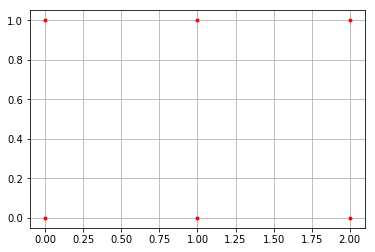
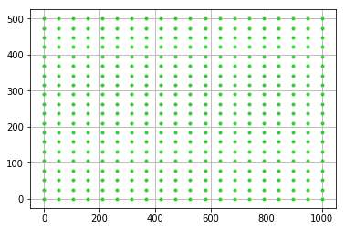

## Numpy学习笔记

#### 1. ravel()、flatten()、squeeze()的用法和区别

- numpy中的ravel()、flatten()、squeeze()都有将多维数组转换为一维数组的功能。
  1. ravel(): 如果没有必要，不会产生源数据的副本。	
  2. flatten()：返回源数据的副本。
  3. squeeze()：只能对维数为1的维度降维。
- 另外，reshape(-1)也可以“拉平”多维数组。

***eg*:**

---


```python
>>> x=np.array([[1,2],[3,4]])

# flattenh函数和ravel函数在降维时默认是行序优先
>>> x.flatten()
>>> array([1, 2, 3, 4])

>>> x.ravel()
array([1, 2, 3, 4])

# 传入'F'参数表示列序优先
>>> x.flatten('F')
array([1, 3, 2, 4])

>>> x.ravel('F')
array([1, 3, 2, 4])

#reshape函数当参数只有一个-1时表示将数组降为一维
>>> x.reshape(-1)
array([1, 2, 3, 4])
#x.T表示x的转置
>>> x.T.reshape(-1)
array([1, 3, 2, 4])

# 两者区别
>>> x = np.array([[1, 2], [3, 4]])
>>> x.flatten()[1] = 100
>>> x
array([[1, 2],
       [3, 4]])            
>>> x.ravel()[1] = 100
>>> x
array([[  1, 100],
       [  3,   4]])
```

---

#### 2. meshgird()的作用

- 生成网格点坐标矩阵

***eg1:***

---


```python
import numpy as np 
import matplotlib.pyplot as plt 
x = np.array([0, 1, 2]) 
y = np.array([0, 1]) 
X, Y = np.meshgrid(x, y) 
print(X) 
print(Y) 
plt.plot(X, Y, color='red', # 全部点设置为红色 
         marker='.', # 点的形状为圆点 
         linestyle='') # 线型为空，也即点与点之间不用线连接 
plt.grid(True) 
plt.show()

#Output:
[[0 1 2]
 [0 1 2]]
[[0 0 0]
 [1 1 1]]


```



---

***eg2:***

```python
import numpy as np 
import matplotlib.pyplot as plt 
x = np.linspace(0,1000,20) 
y = np.linspace(0,500,20) 
X,Y = np.meshgrid(x, y) 
plt.plot(X, Y, color='limegreen', # 设置颜色为limegreen 
         marker='.', # 设置点类型为圆点 
         linestyle='') # 设置线型为空，也即没有线连接点 
plt.grid(True) 
plt.show()

#Output:
```




---

#### 3. numpy.r_ 与 numpy.c_的作用

- np.r_是按**行**连接两个矩阵，就是把两矩阵上下相加，要求**列数相等**，类似于pandas中的concat()
- np.c_是按**列**连接两个矩阵，就是把两矩阵左右相加，要求**行数相等**，类似于pandas中的merge()
- 在numpy中，一个列表是一个列向量，即一个列表表示一列。

***eg：***

---


```python
import numpy as np
a = np.array([1, 2, 3])
b = np.array([4, 5, 6])
c = np.c_[a,b]

print(a.shape)
print(np.r_[a,b])
print(c)
print(np.c_[c,a])

#Output:
[1 2 3 4 5 6]
[[1 4]
 [2 5]
 [3 6]]
[[1 4 1]
 [2 5 2]
 [3 6 3]]
```

---

#### 4.random.seed()与random.RandomState用法

- 伪随机数生成器
  ​	伪随机数是用确定性的算法计算出来的似来自[0,1]均匀分布的随机数序列。并不真正的随机，但具有类似于随机数的统计特征，如均匀性、独立性等。(摘自《百度百科》)

  - random.seed()：设置随机数种子，从同一个seed值中取出的随机数相同

    ```python
    import numpy as np
    
    np.random.seed(0)
    np.random.rand(5)
    
    Out[12]: array([0.5488135 , 0.71518937, 0.60276338, 0.54488318, 0.4236548 ])
    
    np.random.seed(0)
    np.random.rand(5)
    
    Out[12]: array([0.5488135 , 0.71518937, 0.60276338, 0.54488318, 0.4236548 ])  
      
    np.random.rand(5)
    
    Out[13]: array([0.64589411, 0.43758721, 0.891773  , 0.96366276, 0.38344152])
    ```

    ​	上述程序中，第一次与第二次的输出设置都的seed(0)，第二次的输出没有设置，默认为随机值。

  - random.RandomState()：生成随机数数组

  ```python
  import numpy as np
  
  rdm = np.random.RandomState(0)
  rdm.rand(4)
  
  Out[17]: array([0.5488135 , 0.71518937, 0.60276338, 0.54488318])
    
  rdm = np.random.RandomState(0)
  rdm.rand(4)
  
  Out[18]: array([0.5488135 , 0.71518937, 0.60276338, 0.54488318])
    
  rdm.rand(4)
  Out[19]: array([0.4236548 , 0.64589411, 0.43758721, 0.891773  ])
  ```

  ​	与random.send()类似，第一次与第二次的输出设置都的RandomState(0)，第二次的输出没有设置，默认为随机值。

- `numpy.random.RandomState()`更为复杂，完全可以代替`numpy.random.seed()`这条语句。 随机数种子`seed`只有一次有效，在下一次调用产生随机数函数前没有设置`seed`，则还是产生随机数。

  1. 如果需要不产生随机数，则需要每次设置`numpy.random.seed()`。
  2. 如果需要每次都产生随机数，则可以将随机数`seed`设置成`None`，或者不设置。

#### Numpy中的广播机制

##### 广播的作用

​	numpy中两个数组的相加、相减以及相乘都是对应元素之间的操作。当两个数组的形状并不相同的时候，可以通过扩展数组的方法来实现相加、相减、相乘等操作，这种机制叫做**广播（broadcasting）**。

 	比如，一个二维数组减去列平均值，来对数组的每一列进行距平化处理：

```python
import numpy as np

arr = np.random.randn(4,3)  #shape(4,3)
arr_mean = arr.mean(0)      #shape(3,)
demeaned = arr - arr_mean
```

​	上式arr和arr_mean维度并不形同，但是它们可以进行相减操作，这就是通过广播机制来实现的。

##### 广播的原则

​	如果两个数组的后缘维度（trailing dimension，即从末尾开始算起的维度）的轴长度相符，或其中的一方的长度为1，则认为它们是广播兼容的。广播会在缺失和（或）长度为1的维度上进行。

1. 数组维度不同，后缘维度的轴长相符。

   ```python
   import numpy as np
   #arr1.shape = (4,3)
   arr1 = np.array([[0, 0, 0],[1, 1, 1],[2, 2, 2], [3, 3, 3]]) 
   #arr2.shape = (3,)
   arr2 = np.array([1, 2, 3])    
   arr_sum = arr1 + arr2
   print(arr_sum)
   
   #########
   Output:
   [[1 2 3]
    [2 3 4]
   [3 4 5]
   [4 5 6]]
   ```

   ​	上例中arr1的shape为（4,3），arr2的shape为（3，）。可以说前者是二维的，而后者是一维的。但是它们的后缘维度相等，arr1的第二维长度为3，和arr2的维度相同。arr1和arr2的shape并不一样，但是它们可以执行相加操作，这就是通过广播完成的，在这个例子当中是将arr2沿着0轴进行扩展。

   ​	上面程序当中的广播如下图所示：

   同样的例子还有：

   [](https://images2018.cnblogs.com/blog/890640/201805/890640-20180510210455959-133658483.png)

   ​	从上面的图可以看到，（3,4,2）和（4,2）的维度是不相同的，前者为3维，后者为2维。但是它们后缘维度的轴长相同，都为（4,2），所以可以沿着0轴进行广播。

   ​	同样，还有一些例子：（4,2,3）和（2,3）是兼容的，（4,2,3）还和（3）是兼容的，后者需要在两个轴上面进行扩展。

2. 数组维度相同，其中有个轴为1。

   如下例：

```python
import numpy as np
#arr1.shape = (4,3)
arr1 = np.array([[0, 0, 0],[1, 1, 1],[2, 2, 2], [3, 3, 3]])
#arr2.shape = (4, 1)
arr2 = np.array([[1],[2],[3],[4]])    

arr_sum = arr1 + arr2
print(arr_sum)
##########
Output：
[[1 1 1]
 [3 3 3]
 [5 5 5]
 [7 7 7]]
```

​	arr1的shape为（4,3），arr2的shape为（4,1），它们都是二维的，但是第二个数组在1轴上的长度为1，所以，可以在1轴上面进行广播，如下图所示：

​	上例中arr1的shape为（4,3），arr2的shape为（3，）。可以说前者是二维的，而后者是一维的。但是它们的后缘维度相等，arr1的第二维长度为3，和arr2的维度相同。arr1和arr2的shape并不一样，但是它们可以执行相加操作，这就是通过广播完成的，在这个例子当中是将arr2沿着0轴进行扩展。

​	上面程序当中的广播如下图所示：

同样的例子还有：

[](https://images2018.cnblogs.com/blog/890640/201805/890640-20180510210455959-133658483.png)

​	从上面的图可以看到，（3,4,2）和（4,2）的维度是不相同的，前者为3维，后者为2维。但是它们后缘维度的轴长相同，都为（4,2），所以可以沿着0轴进行广播。

​	同样，还有一些例子：（4,2,3）和（2,3）是兼容的，（4,2,3）还和（3）是兼容的，后者需要在两个轴上面进行扩展。

[](https://images2018.cnblogs.com/blog/890640/201805/890640-20180510210457745-2014752656.png)

​	在这种情况下，两个数组的维度要保证相等，其中有一个轴的长度为1，这样就会沿着长度为1的轴进行扩展。这样的例子还有：（4,6）和（1,6） 。（3,5,6）和（1,5,6）、（3,1,6）、（3,5,1），后面三个分别会沿着0轴，1轴，2轴进行广播。

 	结合两种情况，如（3,5,6）和（1,6）是可以相加的。在TensorFlow当中计算张量的时候也是用广播机制，并且和numpy的广播机制是一样的。