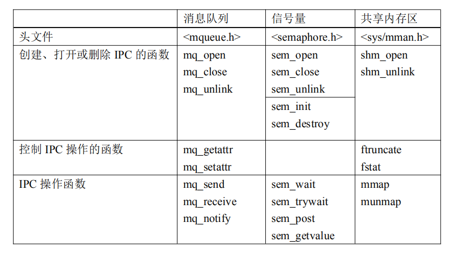
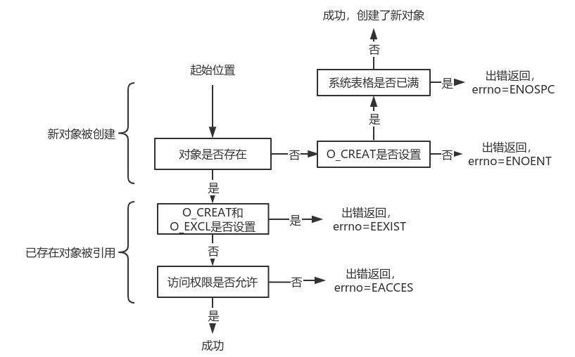

# UNP2学习笔记

## 1. 简介

### Unix 的System V、BSD、Posix概念

#### System V和BSD

linux下的进程通信手段基本上是从Unix平台上的进程通信手段继承而来的。而对Unix发展做出重大贡献的两大主力AT&T的贝尔实验室及BSD（加州大学伯克利分校的伯克利软件发布中心）在进程间通信方面的侧重点有所不同。前者对Unix早期的进程间通信手段进行了系统的改进和扩充，形成了“System V IPC”，通信进程局限在单个计算机内；后者则跳过了该限制，形成了基于套接口（socket）的进程间通信机制。Linux则把两者继承了下来，如图示：

其中，最初

- Unix IPC包括：管道、FIFO、信号；

- System V IPC包括：System V消息队列、System V信号量、System V共享内存区；

- Posix IPC包括： Posix消息队列、Posix信号量、Posix共享内存区。

其中需要说明的是：

1. 由于Unix版本的多样性，电子电气工程协会（IEEE）开发了一个独立的Unix标准，这个新的ANSI Unix标准被称为计算机环境的可移植性操作系统界面（POSIX）。现有大部分Unix和流行版本都是遵循POSIX标准的，而Linux从一开始就遵循POSIX标准；
2. BSD并不是没有涉足单机内的进程间通信（socket本身就可以用于单机内的进程间通信）。事实上，很多Unix版本的单机IPC留有BSD的痕迹，如4.4BSD支持的匿名内存映射、4.3+BSD对可靠信号语义的实现等等。

#### Poxis和System V

Posix是Portable Operating System Interface(可移植性操作系统接口)的简称，是一个电气与电子工程学会即IEEE开发的一系列标准，目的是为运行在不同操作系统的应用程序提供统一的接口，实现者是不同的操作系统内核。

在Linux的进程间通信中，如在信号量编程中，有Posix信号量和System V信号量。它们都可以用于进程或者线程间的同步。然而，Posix信号量是基于内存的，即信号量值是放在共享内存中的，它使与文件系统中的路径名对应的名字来标识。当谈论“Posix 信号量”时，所指的是单个计数信号量。在Linux操作系统中，Posix信号量(共享内存、消息队列)可以通过ipcs命令查看。Posix信号量多用于进程间通信。

System v信号量是基于内核的，它放在内核里面，要使用System V信号量需要进入内核态，所以在多线程编程中一般不建议使用System V信号量，因为线程相对于进程是轻量级的，从操作系统的调度开销角度看，如果使用System V信号量会使得每次调用都要进入内核态，丧失了线程的轻量优势。当讨论“System v信号量”时，所指的是计数信号量集。

### IPC简介

IPC是进程间通信（interprocess communication）的简称。指运行在某个操作系统之上的不同进程间的各种消息传递及同步的方式。

#### IPC类型

消息传递发展阶段：

- **管道**（pipe）是第一个广泛使用的IPC形式。也可从shell中使用。其只能在具有共同祖先的进程间使用。该问题后来随有名管道（FIFO）的引入而解决。
- **System V 消息队列**（System V message queue）在20世纪80年代早期加到System V内核中。其可用于同一主机上有亲缘关系的或无亲缘关系的进程之间。
- **Posix 消息队列**（Posix message queue）由Posix标准加入，可用于同一主机上有亲缘关系的或无亲缘关系的进程之间。
- **远程过程调用**（Remote Procedure Call, RPC）出现在20世纪80年代中期，它是从一个系统（客户主机）上某个程序调用另一个系统（服务器主机）上某个函数的一种方法，是一种显式网络编程的替代方法。同样可用于同一主机上的客户和服务器之间。

同步形式发展阶段：

- **记录上锁**（record locking）于20世纪80年代早期加入Unix内核中，在1988年由Posix.1标准化。
- **System V信号量**（System V semaphore）和System V 消息队列同时加入内核。
- **Posix信号量**（Posix semapore）和Posix共享内存区同时加入。
- **互斥锁**（mutex）和条件变量（condition variable）是由Posix线程标准定义的两种同步形式。
- **读写锁**（read-write lock）是另外一种形式的同步。

#### 进程间信息共享的三种方式


1. 多个进程共享存留于文件系统中的某个文件上的某些信息。为访问这些信息，每个进程都得穿过内核。需要某种形式的同步。
2. 多个进程共享驻留于内核的某些信息。这种方式包括管道、System V消息队列和System V信号量。访问共享信息的每次操作涉及对内核的一次系统调用。
3. 多个进程有一个互相都能访问的共享内存区。可以不涉及内核访问其中的数据。需要某种形式的同步。

#### IPC对象的持续性

把任意类型的IPC的持续性（persistence）定义成该类型的一个对象一直存在多长时间。


1. 随进程持续的IPC：如管道、FIFO。
2. 随内核持续的IPC：如System V的消息队列、信号量和共享内存区。Posix的消息队列、信号量和共享内存区必须至少是随内核持续的，但也可以是随文件系统持续的，具体取决于实现。
3. 随文件系统持续的IPC：Posix消息队列、信号量和共享内存区如果是使用映射文件实现的，那么它们就是随文件系统持续的。


#### 名字空间

当两个或多个无亲缘关系的进程使用某种类型的IPC对象来彼此交换信息时，该IPC对象必须有一个某种形式的名字（name）或标识符（identitier），这样其中一个进程可以创建该对象，其余进程则可以指定同一个对象。下图汇总了不同形式的IPC所用的命名约定。


#### fork，exec和exit对IPC对象的影响

下图总结了fork、exec和\_exit函数（_exit是由exit调用的一个函数）对于各种形式的IPC对象的影响。


考虑到无名同步变量（互斥锁、条件变量、读写锁、基于内存的信号量），从一个具有多个线程的进程中调用fork将变得胡乱不堪。System V IPC的三种形式没有打开或关闭的说法。访问这三种形式的IPC所需知道的只是一个标识符，因此知道该标识符的任何进程都能访问它们，尽管信号量和共享内存区可附带提出某种特殊处理要求。

#### Unix errno值

每当在一个Unix函数中发生错误时，全局变量errno将被设置成一个指示错误类型的正数，函数本身则通常返回-1。error_sys函数检查errno的值并输出相应的出错消息。

errno值只在某个函数发生错误时设置。如果该函数不返回错误，errno的值就无法定义。所有正的错误值都是常值，具有以E开头的全部为大写字母的名字。通常定义在头文件<sys/errno.h>中。没有错误为0的值。

在多线程环境中，每个线程必须有自己的errno值变量。提供一个局限于线程的errno变量的隐式请求是自动处理的，不过通常需要告诉编译器所编译的程序是可重入的。

#### 三种交互模式

1. 文件服务器：客户-服务器应用程序，客户向服务器发送一个路径名，服务器把该文件的内容返回给客户。
2. 生产者-消费者：一个或多个线程或进程（生产者）把数据放到一个共享缓冲区中，另有一个或多个线程或进程（消费者）对该共享缓冲区中的数据进行操作。
3. 序列号持续增1：一个或多个线程或进程给一个共享的序列号持续增1。该序列号有时在一个共享文件中，有时在共享内存区中。

## 2. Posix IPC

Posix IPC 包括Posix 消息队列、Posix 信号量和Posix 共享内存区。

下图汇总了所有Posix IPC 函数。



### 创建与打开IPC通道

mq_open、sem_open和shm_open这三个为创建或打开IPC对象的函数，其第一个参数为IPC名字，第二个名为 *oflag* 参数指定怎样打开所请求而的对象。 各种 *oflag* 常值如下图所示。


图中前三行指定如何打开对象。消息队列能以其中任何一种模式打开，信号量的打开不指定任何模式（任意信号量操作，都需要读写访问权），共享内存区对象则不能以只写模式打开。

余下四行标志是可选的。

- O_CREAT：若不存在则创建由函数第一个参数所指定的名字的消息队列、信号量或共享内存区对象。创建一个新的消息队列、信号量或共享内存区对象时，至少需要另外一个成为mode的参数。该参数指定权限位，由下图中所示常值按位或形成。这些常值定义在头文件<sys/stat.h>中，所指定的权限位受当前进程的文件模式创建掩码（file  mode creation mask）修正，而该掩码可以通过调用umask函数或使用shell的umask命令来设置。


- O_EXCL：若该标志与O_CREAT一起指定，则IPC函数只在指定名字的消息队列、信号量或共享内存区对象不存在时才创建新的对象。如果该对象已经存在，且指定了O_CREAT | O_EXCL，那么返回一个EEXIST错误。考虑到其他进程的存在，检查其是否存在及创建它这两步必须是原子的。
- O_NONBLOCK：该标志使得一个消息队列在队列为空时的读或队列填满时的写不被阻塞。
- O_TRUNC：若以读写模式打开了一个已存在的共享内存区对象，则该标志使得该对象的长度被截断为0。

下图展示了打开一个IPC对象的逻辑流程。



### IPC权限

当同样由这三个函数打开一个一存在的消息队列、信号量或共享内存区对象时，将基于如下信息执行权限测试。

	1. 创建时赋予该IPC对象的权限位；
 	2. 所请求的访问类型（O_RDONLY，O_WRONLY，O_RDWR）；
 	3. 调用进程的有效用户ID、有效组ID以及各个辅助组ID（若支持）。

权限测试步骤如下：

1. 若当前进程的有效用户ID为0（超级用户），则允许访问。
2. 在当前进程的有效用户ID等于该IPC对象的属主ID的前提下，若相应的用户访问权限位已设置，则允许访问，否则拒绝访问。
3. 在当前进程的有效组ID或其某个辅助组ID等于该IPC对象的组ID的前提下，若相应的用户访问权限位已设置，则允许访问，否则拒绝访问。
4. 若相应的其他用户访问权限位已设置，则允许访问，否则拒绝访问。

## System IPC

System V 消息队列、信号量和共享内存区合称为System V IPC。下图汇总了所有System V IPC函数。


### key_t键和ftok函数

三种类型的System V IPC使用key_t值作为它们的名字。头文件<sys/types.h> 把key_t值这个数据类型定义为一个整数，其通常表示为一个至少32位的整数。该整数值通常由ftok函数赋予。函数ftok函数把一个已存在的路径名和一个整数标识符转换成一个key_t值，成为IPC键。该函数把从pathname导出的信息与id的低序8位组合成一个整数IPC键。

```c
// svipc/ftok.c
#include	"unpipc.h"
int
main(int argc, char **argv)
{
	struct stat	stat;

	if (argc != 2)
		err_quit("usage: ftok <pathname>");

	Stat(argv[1], &stat);
	printf("st_dev: %lx, st_ino: %lx, key: %x\n",
		   (u_long) stat.st_dev, (u_long) stat.st_ino,
		   Ftok(argv[1], 0x57));

	exit(0);
}

key_t
Ftok(const char *pathname, int id)
{
	key_t	key;

	if ( (key = ftok(pathname, id)) == -1)
		err_sys("ftok error for pathname \"%s\" and id %d", pathname, id);
	return(key);
}
```

ftok调用stat函数，然后组合以下三个值。

1. pathname所在的文件系统的信息（stat结构的st_dev成员）。
2. 该文件在本文件系统内的索引节点号（stat结构的st_ino成员）。
3. id的低序8位（不能为0）。

这三个值的组合通常会产生一个32位键。不能保证两个不同的路径名与同一个id的组合产生不同的键。如果pathname不存在，或者对于调用进程不可访问，ftok就返回-1。

索引节点不会是0。

stat结构体用于记录文件信息。

```c
struct stat
{
    dev_t     st_dev;     /* ID of device containing file */文件使用的设备号
    ino_t     st_ino;     /* inode number */    索引节点号 
    mode_t    st_mode;    /* protection */  文件对应的模式，文件，目录等
    nlink_t   st_nlink;   /* number of hard links */    文件的硬连接数  
    uid_t     st_uid;     /* user ID of owner */    所有者用户识别号
    gid_t     st_gid;     /* group ID of owner */   组识别号  
    dev_t     st_rdev;    /* device ID (if special file) */ 设备文件的设备号
    off_t     st_size;    /* total size, in bytes */ 以字节为单位的文件容量   
    blksize_t st_blksize; /* blocksize for file system I/O */ 包含该文件的磁盘块的大小   
    blkcnt_t  st_blocks;  /* number of 512B blocks allocated */ 该文件所占的磁盘块  
    time_t    st_atime;   /* time of last access */ 最后一次访问该文件的时间   
    time_t    st_mtime;   /* time of last modification */ /最后一次修改该文件的时间   
    time_t    st_ctime;   /* time of last status change */ 最后一次改变该文件状态的时间   
};
```

### ipc_perm结构

内核给每个IPC对象维护一个信息结构，其内容跟内核给文件维护的信息类似。

```c
/* Data structure used to pass permission information to IPC operations.  */
struct ipc_perm
  {
    __key_t __key;			/* Key.  */
    __uid_t uid;			/* Owner's user ID.  */
    __gid_t gid;			/* Owner's group ID.  */
    __uid_t cuid;			/* Creator's user ID.  */
    __gid_t cgid;			/* Creator's group ID.  */
    unsigned short int mode;		/* Read/write permission.  */
    unsigned short int __pad1;
    unsigned short int __seq;		/* Sequence number.  */
    unsigned short int __pad2;
    __syscall_ulong_t __glibc_reserved1;
    __syscall_ulong_t __glibc_reserved2;
  };
```

### 创建与打开IPC通道

创建或打开一个IPC对象的三个getXXX函数的第一个参数key是类型为key_t的IPC键，返回值identifier是一个整数标识符，该标识符不同于ftok函数的id参数。对于key值，应用程序有两种选择。

1. 调用ftok，给它传递pathname和id。
2. 指定key为IPC_PRIVATE（定义为0），这将保证会创建一个新的、唯一的对象。

有关步骤顺序如下图所示。


所有三个getXXX函数都有一个名为oflag的参数，它指定IPC对象的读写权限位（ipc_perm结构的mode成员），并选择是创建一个新的IPC对象还是访问一个已存在的IPC对象。规则如下：

1. 指定key为IPC_PRIVATE能保证创建一个唯一的IPC对象。
2. 设置oflag参数的IPC_CREAT位但不设置它的IPC_EXCL位时，若指定键的IPC的对象不存在，则创建一个新的对象，否则返回该对象。
3. 同时设置oflag的IPC_CREAT和IPC_EXCL位时，若所指定键的IPC对象不存在，则创建一个新的对象，否则返回一个EEXIST错误，因为该对象已存在。设置IPC_EXCL位而不设置IPC_CREAT位是没有意义的。

下图显示了打开一个IPC对象的逻辑流程。


###  IPC权限

每当使用某个getXXX函数创建一个新的IPC对象时，以下信息就保存到该对象的ipc_perm结构中。

1. oflag参数中某些位初始化ipc_perm结构的mode成员。下图展示System V三种不同IPC机制的权限位。

   

2. cuid和cgid成员分别设置为调用进程的有效用户ID和有效组ID。两者合称创建者ID（creater ID）。

3. ipc_perm结构的uid和gid成员也分别设置为调用进程的有效用户ID和有效组ID。两者合称属主ID（owner ID）。

一个进程可通过调用相应IPC机制，ctlXXX函数（所用命令为IPC_SET）修改属主ID，创建者ID却从不改变。这三个ctlXXX函数还允许一个进程修改某个IPC对象的mode成员。

每当有一个进程访问某个IPC对象时，IPC就执行两级检查，该IPC对象被打开时（getXXX函数）执行一次，以后每次使用该对象时执行一次。

权限测试过程：

1. 超级用户总是赋予访问权。
2. 若当前进程的有效用户ID等于该IPC对象的uid值或cuid值，且相应的访问位在IPC对象的mode成员中打开，则赋予访问权。
3. 若当前进程的有效组ID等于该IPC对象的gid值或cgid值，且相应的访问位在IPC对象的mode成员中打开，则赋予访问权。
4. 若以上测试都不为真，则相应的“其他用户”访问位在该IPC对象的mode位中必须是打开的才能赋予访问权。

### 标识符重用

ipc_perm结构中还含有一个名为seq的变量，它是一个槽位使用情况的序列号。该变量是一个由内核为系统中每个潜在的IPC对象维护的计数器。每当删除一个IPC对象时，内核就递增相应的槽位号，若溢出则循环为0。

该计数器的存在有两个原因。

1. 由内核维护的用于打开文件的文件描述符是一些小整数，且是进程特定的值。而从某个get函数获得的IPC标识符适用于所有进程。若该标识符的取值是小整数，则某个恶意的进程很有可能找到一个其他进程的有效标识符。为了避免上述问题，IPC机制把标识符的可能范围扩大到所有整数：每次重用一个IPC表项时，把返回的调用进程的标识符值增加一个IPC表项数，这样重用的次数大大增加，若溢出则循环为0。
2. 避免短时间内重用System V IPC标识符。这有助于确保过早终止的服务器重新启动后不会重用标识符。

```c
#include	"unpipc.h"

int
main(int argc, char **argv)
{
	int		i, msqid;

	for (i = 0; i < 10; i++) {
		msqid = Msgget(IPC_PRIVATE, SVMSG_MODE | IPC_CREAT);
		printf("msqid = %d\n", msqid);

		Msgctl(msqid, IPC_RMID, NULL);
	}
	exit(0);
}
```


### ipcs和ipcrm程序

ipcs程序（命令）用于输出有关System V IPC特性的各种信息。ipcrm 则删除一个System V IPC对象。

