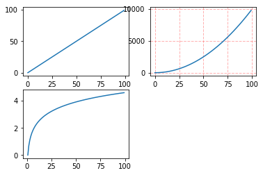

## matplotlob学习笔记

#### 1. plt.figure()、plt.subplot()、plt.subplots()、add_subplots以及add_axes的使用

- **plt.figure()：**在plt中绘制一张图片。

  `figure(num=None, figsize=None, dpi=None, facecolor=None, edgecolor=None, frameon=True)`

  - num：图像编号或名称，数字为编号 ，字符串为名称；

  - figsize：指定figure的宽和高，单位为英寸；

  - dpi：指定绘图对象的分辨率，即每英寸多少个像素，缺省值为80。1英寸等于2.5cm,A4纸是 21*30cm的纸张；
  -  facecolor：背景颜色；
  - edgecolor：边框颜色；
  - frameon：是否显示边框；

- **plt.subplot()：**创建单个子图。

  `subplot(nrows, ncols, index, **kwargs)`

  - nrows：subplots的行数；
  - ncols：subplots的列数；
  - index：subplot位置索引；
  - **kwargs：用于创建subplot的关键字字典；

  ---

  

  ***eg1：***

  ```python
  import numpy as np
  import matplotlib.pyplot as plt
  x = np.arange(0, 100)
  
  plt.subplot(221)
  plt.plot(x, x)
  #作图2
  plt.subplot(222)
  plt.plot(x, -x)
  #作图3
  plt.subplot(223)
  plt.plot(x, x ** 2)
  plt.grid(color='r', linestyle='--', linewidth=1, alpha=0.3) #添加网格
  #作图4
  plt.subplot(224)
  plt.plot(x, np.log(x))
  plt.show()
  
  #Output:
  ```

  


---

- **plt.subplots()：**创建多个子图

  ​	subplots参数与subplots相似。两者都可以规划figure划分为n个子图，但每条subplot命令只会创建一个子图，而一条subplots就可以将所有子图创建好。

  `subplots(nrows=1, ncols=1, sharex=False, sharey=False, squeeze=True, subplot_kw=None, gridspec_kw=None, **fig_kw)`

  - nrows：subplots的行数；
  - ncols：subplots的列数；
  - sharex：所有subplot应该使用相同的X轴刻度（调节xlim将会影响所有subplot）
  - sharey：同sharex;
  - subplot_kw：用于创建各subplot的关键字字典；
  - **fig_kw：创建figure时的其他关键字，如`plt.subplots(2,2,figsize=(8,6))`；

---

***eg2：***

```python
import numpy as np
import matplotlib.pyplot as plt
 
x = np.arange(0, 100)
#划分子图
fig,axes=plt.subplots(2,2)
ax1=axes[0,0]
ax2=axes[0,1]
ax3=axes[1,0]
ax4=axes[1,1]
 
#作图1
ax1.plot(x, x)
#作图2
ax2.plot(x, -x)
#作图3
ax3.plot(x, x ** 2)
ax3.grid(color='r', linestyle='--', linewidth=1,alpha=0.3)
#作图4
ax4.plot(x, np.log(x))
plt.show()

#Output:
```


---

- **fig.add_subplot()：**给figure新增子图

  ​	add_subplot()的作用与subplot一样，用于新增子图。

  ​	`add_subplot(nrows, ncols, index, **kwargs)`

  ​	`add_subplot(pos, **kwargs)`

  ---

  ***eg3：***

  ```python
  import numpy as np
  import matplotlib.pyplot as plt
  
  x = np.arange(0, 100)
  #新建figure对象
  fig=plt.figure()
  #新建子图1
  ax1=fig.add_subplot(2,2,1)
  ax1.plot(x, x)
  #新建子图2
  ax3=fig.add_subplot(222)
  ax3.plot(x, x ** 2)
  ax3.grid(color='r', linestyle='--', linewidth=1, alpha=0.3)
  #新建子图3
  ax4=fig.add_subplot(2,2,3)
  ax4.plot(x, np.log(x))
  plt.show()
  
  #Output:
  ```

  

---

- **fig.add_axes()：**新增子区域

  add_axes为新增子区域，该区域可以坐落在figure内任意位置，且该区域可任意设置大小。

  `add_axes(rect, projection=None, polar=False, **kwargs)`

  - rect：新区域的[left, bottom, width, height]；
  - projection
  - polar

  ---

  ***eg4：***

  ```python
  import matplotlib.pyplot as plt
   
  #新建figure
  fig = plt.figure()
  # 定义数据
  x = [1, 2, 3, 4, 5, 6, 7]
  y = [1, 3, 4, 2, 5, 8, 6]
  #新建区域ax1
  #figure的百分比,从figure 10%的位置开始绘制, 宽高是figure的80%
  left, bottom, width, height = 0.1, 0.1, 0.8, 0.8
  # 获得绘制的句柄
  ax1 = fig.add_axes([left, bottom, width, height])
  ax1.plot(x, y, 'r')
  ax1.set_title('area1')
   
  #新增区域ax2,嵌套在ax1内
  left, bottom, width, height = 0.2, 0.6, 0.25, 0.25
  # 获得绘制的句柄
  ax2 = fig.add_axes([left, bottom, width, height])
  ax2.plot(x,y, 'b')
  ax2.set_title('area2')
  plt.show()
  
  #Output:
  ```

  

---

#### 2. 散点图，柱状图，等高线图，3D数据的绘制

- **Scatter散点图**

  `scatter(x, y, s=None, c=None, marker=None, cmap=None, norm=None, vmin=None, vmax=None, alpha=None, linewidths=None, verts=None, edgecolors=None, hold=None, data=None, **kwargs)`

  - x, y：点的坐标；
  - s：点的大小；
  - c：点的颜色；
  - marker：点的类型；
  - cmap：colormap(cm)的颜色映射，具体见例一；
  - norm
  - vmin, vmax
  - alpha：点的透明度；
  - linewidths:点的轮廓线的宽度；
  - verts
  - edgecolors：边框颜色；

---

***eg1：***

```python
import matplotlib.pyplot as plt

x = list(range(1,1001))
y = [i**2 for i in x]#使用列表解析

plt.scatter(x,y,c=y,cmap=plt.cm.gist_rainbow,s=20)#cm即colormap，c=y表示颜色随y变化
plt.xlabel('number',fontsize=10)
plt.ylabel('number square',fontsize=10)
plt.title('figure 1',fontsize =20)
plt.axis([0,1100,0,1100000])
plt.show()

#Output:
```


---

***eg2：***

```python
import matplotlib.pyplot as plt
import numpy as np

#数据大小
n=1024   

#每一个点的X,Y值,以正态分布（均值为0，方差为1）随机产生.
X=np.random.normal(0,1,n)   
Y=np.random.normal(0,1,n)

# 用T表示某点的颜色
T=np.arctan2(Y,X)

plt.scatter(X, Y, s=75, c=T, alpha=.5)

plt.xlim(-1.5,1.5)
plt.xticks(())
plt.ylim(-1.5,1.5)
plt.yticks(())

plt.show()

#Output:
```


---

- **Bar柱状图**

  `bar(x, height, *, align='center', **kwargs)`

  `bar(x, height, width, *, align='center', **kwargs)`

  `bar(x, height, width, bottom, *, align='center', **kwargs)`

  ---

  ***eg3：***

  ```python
  import matplotlib.pyplot as plt
  import numpy as np
  
  # 向上向下分别生成12个数据，X为0到11的整数，Y是相应的均匀分布的随机数据。
  n=12
  print(help(plt.bar))
  X=np.arange(n)
  Y1=(1 - X / float(n)) * np.random.uniform(0.5,1.0,n)
  Y2=(1 - X / float(n)) * np.random.uniform(0.5,1.0,n)
  
  # facecolor设置主题颜色，edgecolor设置边框颜色。
  plt.bar(X,+Y1,facecolor='#9999ff',edgecolor='white')
  plt.bar(X,-Y2,facecolor='#ff9999',edgecolor='white')
  
  """
  用函数plt.text分别在柱体上方（下方）加上数值;
  用%.2f 保留两位小数;
  横向居中对齐ha='center';
  纵向底部（顶部）对齐va='bottom';
  """
  for x,y in zip(X,Y1):
      plt.text(x+0.1,y+0.1,'%.2f' % y,ha='center',va='bottom')
  
  for x,y in zip(X,Y2):
      plt.text(x+0.1,-y-0.2,'%.2f' % y,ha='center',va='bottom')
  
  plt.bar(X,+Y1)
  plt.bar(X,-Y2)
  plt.xlim(-1,n)
  plt.xticks(())
  plt.ylim(-1.25,1.25)
  plt.yticks(())
  
  plt.show()
  
  # Output:
  ```

  

---

- **Contourf等高线图**

  `contour([X, Y,] Z, [levels], **kwargs)`

  - X，Y：坐标
  - Z：高度值
  - levels：等高线个数和区域

---

***eg4：***

```python
import matplotlib.pyplot as plt
import numpy as np

# 在生成等高线中，需要三维的数据点：（x，y）和对应的高度，函数f()生成高度。
def f(x,y):
    return (1 - x/2 + x**5 + y**3) * np.exp(-x**2,-y**2)

# x，y分别是在区间[-3,3]中均匀分布的256个值
n=256
x=np.linspace(-3,3,n)
y=np.linspace(-3,3,n)
# 用meshgrid在二维平面中将每一个x和每一个y分别对应起来，编织成栅格。
X,Y=np.meshgrid(x,y)
"""
颜色填充。使用函数plt.contourf把颜色加进去，位置参数分别为:X，Y，f(X,Y)。
透明度0.75，并将f(X,Y)的值对应到color map的暖色组中寻找对应颜色。
"""
plt.contourf(X,Y,f(X,Y),8,alpha=0.75,cmap=plt.cm.hot)

"""
等高线绘制。使用plt.contour函数划线。位置参数为 X，Y，f(X,Y)。
此处将颜色选为黑色，线条宽度为0.5。
现在的结果如下图所示：只有颜色和线条，没有数值Label。
"""
C=plt.contour(X,Y,f(X,Y),8,colors='black',linewidth=0.5)
print(help(plt.contour))
#　添加高度数字。加入label，inline控制是否在label画在线里面，字体大小为10；并将坐标轴隐藏。
plt.clabel(C,inline=True,fontsize=10)
plt.xticks(())
plt.yticks(())

plt.show()

#Output:
```


